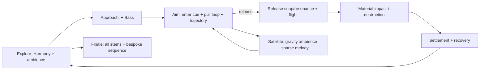

# AngryBirdsToSpace 音乐与音效设计稿

> 状态：2026-08-15，首版 UE 运行时代码、核心事件与当前可接 P0 音效已完成；四轨音乐、鸟叫、脚步/落地、拾取、首批物理/UI 音效、Looping 属性、四个 Sound Class 与空 Sound Mix 均已就绪，待按第 7.3 节完成新增部分的可听 PIE 验收。
> 目标：用轻快、可读、具有空间感的声音，把「小队探索 → 采集制作 → 弹弓瞄准 → 物理连锁破坏 → 引力弹弓 → 救援终局」串成清晰的情绪曲线；音效优先提供操作和物理结果的信息，而不是持续堆叠噪声。

## 1. 当前玩法依据

项目已有四轨音乐与 57 个首批 SoundWave。`UABTSAudioWorldSubsystem` 在每个 Game/PIE World 自动创建，统一持有音乐轨、弹弓循环、3D 单发与 2D UI 音效；默认资产路径集中在 `UABTSAudioSettings`，无需在地图、GameMode 或蓝图上挂组件。当前接线以下列已实现玩法为准：

- 红、蓝、黄、黑四鸟的小队移动、跳跃、切换、跟随与自动归队；
- 在球面小行星上探索，拾取树枝/石料，使用工作台和熔炉制作；
- 搭桥跨越河道；
- 在 Twig、Simple、Reinforced 弹弓上瞄准、调节力量、发射、落地回收；
- 木、石、铁、玻璃建筑以及弹簧、爆炸桶的物理碰撞、损伤与连锁破坏；
- 强化弹弓阶段的卫星引力练习、青鸟侦察；以及钢铁太空弹弓的最终四鸟发射。

声音不应模仿《愤怒的小鸟》既有的鸟叫、弹弓或 UI 音色；所有效果需原创或持有可商用授权。

## 2. 总体混音与分组

采用 Unreal Audio Mixer 的四个 Sound Class / Sound Mix 总线，均以游戏设置中的独立滑杆控制：

| 总线 | 内容 | 默认相对响度 | 关键规则 |
| --- | --- | ---: | --- |
| Music | 四轨自适应音乐 | -16 LUFS 集成 | 瞄准和叙事时让位给重要效果；不随距离衰减。 |
| SFX | 世界交互、弹弓、撞击、破坏 | -12 LUFS 集成 | 物理音效按优先级限声；同一材质的连续碰撞合并。 |
| UI | HUD、背包、制作、失败提示 | -18 LUFS 集成 | 2D、短、不过分抢耳；界面关闭时立刻停止循环。 |
| Ambience | 风、植被、河流、卫星与环境生物 | -22 LUFS 集成 | 3D 衰减，按区域交叉淡入；不得掩盖落点、碰撞和警告。 |

首版建议：SFX 同时最多 24 声、同类撞击每 80 ms 最多一次；爆炸、弹弓释放、关键建筑断裂、终局事件拥有较高并发优先级。所有随机变体在音量 ±2 dB、音高 ±3% 内，避免机关枪式重复。

## 3. 已有四轨音乐的编排

来源为用户从 [16 RPG-like procedural generated music tracks](https://opengameart.org/content/16-rpg-like-procedural-generated-music-tracks) 经 MIDI 重编曲混音得到的四条轨道。本地许可证 `C:\workspace\Media\License.txt` 记录作者为 `messersm`、发布日期为 2015-04-18、许可为 `CC0`。CC0 可用于商业发行且不强制署名；仍建议在项目 `CREDITS` / 关于页保留原始来源、作者、CC0 标记和用户重编曲署名，方便素材溯源与致谢。

源文件均为立体声、44.1 kHz、24-bit WAV、约 37.3 MB：`C:\workspace\Media\Bass.wav`、`Harmony.wav`、`Melody.wav`、`Percussion.wav`；现已分别导入 `/Game/Audio/Music/Bass`、`Harmony`、`Melody`、`Percussion`。用户已确认四轨等长、同一采样起点、循环边界一致。运行时按 Bass、Harmony、Melody、Percussion 的固定顺序在同帧启动，后续状态只淡变音量、不重启轨道。

| Stem | 情绪职责 | 默认层级 | 何时加入 / 移除 |
| --- | --- | --- | --- |
| Harmony | 世界的温暖和探索感 | 常驻底层 | 进地图淡入；暂停/终局转场淡出。 |
| Bass | 前进感、力量和风险 | 中层 | 靠近建筑目标、进入弹弓模式、资源不足或危险区域时加入。 |
| Percussion | 操作节奏、行动感 | 高能层 | 建筑战斗区、拉弓超过 35%、桥梁/制作完成的短暂庆祝；不在安静探索区常驻。 |
| Melody | 发现、成功和希望 | 叙事层 | 新区域/资源发现、关键回收、卫星走廊理解、终局成功；普通失败时退出。 |

音乐状态为 `Explore`（Harmony）、`Approach`（+Bass）、`Aim`（+Bass，Percussion 视蓄力而定）、`Destruction`（四轨）、`Satellite`（Harmony+Bass，Melody 稀疏）、`Finale`（四轨并以独立结局段收束）。每次状态变更在下一个小节边界量化执行，正常交叉淡化 1–2 小节；弹弓释放不能等待量化，音效必须即时播放。若首版不使用 Quartz，也可先以统一同时开始的 Audio Component + 250 ms 淡变实现，但所有 stem 必须同帧启动以保持相位同步。

## 4. 需准备的音效资产清单

### P0：首个可玩闭环必须有

| 事件 | 资产 / 变体 | 播放规则 |
| --- | --- | --- |
| 移动、起跳、落地 | 软土脚步 4、跳跃、轻/重落地各 3 | 跟随当前主控；飞行中禁用脚步，落地按径向速度选轻重。 |
| 鸟角色 | 四鸟各 3 个非语言短叫、受击、归队 | 只在切换、起跳、撞击/回收、终局等稀疏时机播放；不要每次移动播放。 |
| 拾取 / 背包 | 拾取、库存增加、物品选中、背包开/关、拒绝 | 拾取为温和木质/晶体音；失败音低调且不与成功音相似。 |
| 工作台 / 熔炉 / 制作 | 打开、循环工作、完成、材料不足 | 循环由界面或加工状态持有；完成声是清晰的短上行提示。 |
| 弹弓基本 | 进入/退出、抓住弓兜、持续拉伸、释放、弦回弹、空射失败 | 见第 5 节；释放由两层组成：瞬态「啪」和可变音高的共鸣。 |
| 飞行与落点 | 近场飞掠、风切、地面/建筑撞击、停稳 | 飞掠用速度驱动音量与滤波；只给当前发射鸟，落地后停止。 |
| 材质破坏 | 木/石/铁/玻璃：轻撞、重撞、断裂各 3 | 由 `EABTSM6ImpactMaterial` 和法向速度选择；玻璃断裂要短而亮，铁重撞要有低频但避免持续轰鸣。 |
| 黑鸟能力 | 点燃、手动引爆、自动引爆、冲击尾响 | 手动引爆先给极短确认 tick；爆炸是唯一可明显压低音乐的普通战斗事件。 |
| 桥梁 | 对准合法桥位、放置、建成、无效放置 | 合法预览和无效提示可区分，但不要每帧播放预览声音。 |

### P1：拓展体验

| 事件簇 | 资产 |
| --- | --- |
| 环境 | 基础风、树叶、河流近/远、夜间虫鸣、远处石块滚落；卫星的低频电离嗡鸣与近场引力颤音。 |
| 侦察 | 开启/关闭侦察、扫描脉冲、发现目标、小地图 ping。 |
| 建筑机关 | 弹簧蓄压/释放、绳索拉紧/断裂、活塞、爆炸桶点火。 |
| 结构连锁 | 支撑开裂、重量转移、倒塌碎块、稀有资源暴露、自动回收。 |
| 终局 | 太空弹弓装配、四鸟入兜、倒计时、四重发射、近星掠过、命中 UFO、救援、结局。 |

所有单发 SFX 以 48 kHz、24-bit WAV 保存；短 UI 音效为 mono，3D 世界音效优先 mono，只有明确宽度价值（大型爆炸、终局、音乐）才用 stereo。提供干声版本，空间混响由 Unreal 的环境/子混音完成。

## 5. 特别设计：按固有弦长定音、按拉力定响

### 5.1 听感目标

音高与力度是两条独立控制轴：**一把弹弓在未拉动时的固有弦长决定音高，弦越短音高越高；本次拉动功率只决定响度，拉得越用力越响。**同一把弹弓从轻拉到满拉不得滑音；换到固有弦长不同的弹弓时，持续拉伸声和释放共鸣才改变音高。音高不再由动态拉距、飞行速度、命中结果或实时位置决定，因此回放稳定。

推荐把效果拆成三层：

1. `ReleaseSnap`：固定音高的短瞬态，说明“已放手”；
2. `ReleaseResonance`：0.35–0.8 秒、有明确音高的木弦/金属弦拨奏，是固有弦长映射层；
3. `ReleaseAir`：很轻的风切，只按发射速度调音量，不承担音高信息。

弹弓等级可以改变共鸣音色和尾音：Twig 为木质拨弦，Simple 为弹性弦与木共鸣，Reinforced 为更饱满的复合弦，Space 为带清亮泛音的合成/晶体共鸣；但当前首版共用采样，音高的唯一数值输入仍是该实例的固有弦长。不要因为等级名称额外叠加音高偏移。

### 5.2 当前代码的准确数据源

`AABTSM51SlingshotCord` 根据真实 Stake/Pouch 连接点计算未拉动时两段可见弦的总长度：

```text
RestCordLengthCM = Distance(StakeAnchorA, RestPouchAnchorA)
                 + Distance(StakeAnchorB, RestPouchAnchorB)
PullPowerAlpha   = Clamp(PullAlpha, 0, 1)
```

`RestCordLengthCM` 是弹弓实例的静止几何属性，持续拉弓与释放都读取同一个值；动态袋体位置不参与计算。`PullPowerAlpha` 是本次操作力度，持续拉伸和 `ReleaseLaunch()` 都只用它控制音量。

### 5.3 映射公式与调音

以 120 cm（接近普通弹弓静止姿态的两段弦总长）为原始采样参考，按弦长反比计算音高，并限制极端资产尺寸的变调范围：

```text
pitchMultiplier = Clamp(120 / RestCordLengthCM, 0.67, 1.50)
pullLoopVolume  = Lerp(0.10, 0.32, PullPowerAlpha)
releaseSnap     = Lerp(0.72, 1.00, PullPowerAlpha)
releaseResonance= Lerp(0.55, 0.90, PullPowerAlpha)
```

普通 Twig/Simple/Reinforced 若使用相同连接几何，就应得到相同音高；更长的 Space 弦会自然更低。设计师以后调整 Stake 间距、袋体偏移或连接点时，音高会随真实静止弦长自动变化，不需要另配档位音高表。

### 5.4 当前 Unreal 实现

首版直接使用已有 SoundWave，不要求先制作 MetaSound。`UABTSAudioWorldSubsystem` 自动完成：

- `Looped_Rubber-y_Stretch` 使用启动阶段预建、后续复用的唯一持续组件；音高只由 `RestCordLengthCM` 设置，拉弓期间保持不变，`PullPowerAlpha` 只把音量从 0.10 升至 0.32；起音前写入位置、音高和目标音量并用 12 ms 淡入，释放/回收时淡出；
- `pluck_001` 是不变调的 Snap；`Elastic_band_c_note` 按同一 `RestCordLengthCM` 设置共鸣音高；两者在 `ReleaseLaunch()` 同帧触发，响度分别随本次拉力从 0.72→1.00、0.55→0.90。两层组件同样在世界启动时预建并复用，首音频块提前请求；Snap/共鸣分别用 8/12 ms 去点击淡入，避免源文件非零首样本形成尖锐瞬态，但不改变音高；
- 木、石、铁、玻璃/建筑撞击按 `EABTSM6ImpactMaterial` 选 3 个确定性轮换变体，法向速度控制触发、音量和轻微音高，并按每材质 80 ms 限声；
- 黑鸟爆炸同帧播放主体和低频尾部；背包/制作界面已接入开、关、选择、数量 tick、制作成功和失败音。
- 四个 OwlStorm CC0 鸟叫按红/蓝/黄/黑固定映射；有效切鸟后播放对应短叫，主控鸟的已接受跳跃只有真正从 Grounded 转为 Airborne 时才播放，输入失败或走下边缘不会误响；每只鸟有 180 ms 限声；
- 主控鸟脚步按实际球面切向位移累计，速度从 60→680 cm/s 时步距由 440→272 cm、响度由 0.12→0.27；相对首版频率为 25%、响度为 50%。跟随鸟、弹弓飞行、传送和控制权交接会重置累计值，不会四鸟齐响或传送补播；
- 落地记录本次空中阶段的最大向下速度，160 cm/s 以下静音，160→900 cm/s 映射到 0.30→0.95 响度，并复用当前地表脚步变体的低音高版本；
- 地表射线优先从 Physical Material、命中 Actor/Component 与材质语义识别 `wood/bridge/plank` 为木面，其余安全回退草地；当前无需新建 Physical Surface 配置；
- 拾取只在物品成功 `AddItem` 后、Pickup Actor 销毁前播放一次 3D `confirmation_001`，数量只轻微影响响度和音高。

该实现把资产目录、混音和组件生命周期留在 Audio World Subsystem，M6/M5 只在已有状态变化点调用语义事件。以后替换为 MetaSound 时，事件入口不需要改变。

## 6. 触发优先级与状态关系



混音侧链规则：释放 Snap 在 120 ms 内将 Music 降 2 dB；黑鸟爆炸降 4 dB、持续 400 ms；终局发射和 UFO 命中可降 5–6 dB。一般撞击不压音乐。进入背包或制作界面时 Music 高通/低通轻微收窄且降 2 dB，环境降 4 dB，UI 保持清晰。

## 7. 编辑器最小配置

### 7.1 已完成：5 个 SoundWave 属性

代码已经绑定所有现有资产路径；不需要改地图、GameMode、关卡蓝图或给每个 SoundWave 逐个指定 Sound Class。以下配置已完成，列在这里作为重导入后的复核基线：

1. 多选 `/Game/Audio/Music/Bass`、`Harmony`、`Melody`、`Percussion`，在 Details 中启用 `Looping`。四者保持相同导入/压缩策略，不要单独裁剪、加首尾静音或改采样起点。
2. 打开 `/Game/SoundEffects/Looped_Rubber-y_Stretch`，启用 `Looping`。不要给 `Elastic_band_c_note` 或 `pluck_001` 开循环。
3. `Save All`。鸟叫、脚步和拾取 SoundWave 不需要改 Looping、Sound Class 或其他资产属性；到此即可直接 PIE 听到音乐、弹弓、碰撞、爆炸、鸟叫、脚步/落地、拾取和已接线 UI 音效。

### 7.2 已完成：5 个空基础设施资产

Music/SFX/UI/Ambience 四类独立音量所需资产已经位于 `/Game/Audio/Infrastructure`；名称和路径如下：

| 类型 | 名称 |
| --- | --- |
| Sound Class | `SC_ABTS_Music` |
| Sound Class | `SC_ABTS_SFX` |
| Sound Class | `SC_ABTS_UI` |
| Sound Class | `SC_ABTS_Ambience` |
| Sound Mix | `SM_ABTS_Master` |

这些资产可以保持默认内容，不必把任何 SoundWave 拖进去，也不必在 Sound Mix 中手工增加 Class Adjuster。运行时代码通过 `SoundClassOverride` 分流每个 Audio Component，并自动 Push `SM_ABTS_Master`、添加四类音量 Override。若暂时不创建，声音仍正常播放，只是尚无独立总线控制。

四条音乐在运行时保持基础音量为 1，以各状态的初始目标直接启动；静音轨会临时使用 `Play When Silent` 继续推进播放位置，后续只用淡变揭示同一时间点，避免重新起播或失去相位。无需在 SoundWave 或空 Sound Mix 中再配置这两项。

默认路径和参数可在 `Project Settings → Game → ABTS Audio` 查看；只有资产改名/移动时才需要改这里。音乐和音效目录已加入 `DirectoriesToAlwaysCook`，不需要再配打包目录。

### 7.3 PIE 验收顺序

1. 进入 PIE 后检查启动日志含 `BirdChirps=4 Footsteps=(3,3) Pickup=1`，再停留探索态至少一个循环：应只有 Harmony 可闻；四轨均从同一时刻运行，状态淡变不重启。
2. fresh PIE 启动日志应有 `SlingshotPrepared=3 PrimeRequested=3`。进入同一把弹弓：第一次开始拉弓不能出现尖锐瞬态；日志应有 `SlingshotPull ... Preconfigured=1 Prepared=1 PrimeRequested=1 AttackMS=12.0`。0/25/50/75/100% 音高保持不变、音量单调上升；首次松开帧听到 Snap + 共鸣但不得出现额外高音，日志应有 `SlingshotRelease ... Prepared=1 PrimeRequested=1 AttackMS=(8.0,12.0)`。再比较两把固有弦长不同的弹弓：短弦的持续声和释放共鸣都应更高。
3. 分别撞木、石、铁、玻璃：材质可区分，连续倒塌不会在 80 ms 内同材质爆量；黑鸟爆炸有主体和低频尾部。
4. 打开/关闭背包，选择物品/配方，增减制作数量，并分别测试成功与材料不足；每个动作只出现一次对应 UI 音。
5. 依次切换红、蓝、黄、黑鸟：每次有效切换只播放目标鸟对应的短叫；对同一目标的无效重复切换不响。四个映射为 `404729/404725/404726/404724`。
6. 只控制当前主鸟在草地连续移动、停止、再次移动并跳跃：脚步随真实位移而不是按键播放；停止后无残留脚步；成功离地时有一次对应鸟叫，空中无脚步，落地只有一次且重落明显比轻落响。跟随鸟不得叠加脚步。
7. 走上 M8 木桥：脚步应从草地组切换为木质组；如果桥命名和材质被后续改名而回退成草地，检查命中 Actor/Component/Material 是否仍含 `Bridge/Wood/Plank`，或后续改用明确 Physical Surface。
8. 拾取树枝、石料、木材或植物纤维：只有库存实际增加时出现一次空间拾取音；站在展示物旁但未进入拾取半径时不响。
9. 若创建了 5 个基础设施资产，从调试蓝图或后续设置菜单调用 `SetCategoryVolumes`，分别把四类置 0，确认各类可独立静音。

## 8. 当前完成范围与后续接线

| 状态 | 内容 |
| --- | --- |
| 已接线 | 四轨同步启动；Explore/Aim/Destruction/Satellite 音乐状态；弹弓拉伸和释放；木石铁玻璃撞击；黑鸟爆炸；制作界面开关、选择、数量、成功/失败；四鸟切换/起跳短叫；主控鸟草/木脚步与轻重落地；成功拾取。 |
| 已提供公共入口 | `SetMusicState`、`PlayImpact`、`PlayExplosion`、`PlayBirdChirp`、`PlayFootstep`、`PlayLanding`、`PlayPickup`、`PlayUIEvent`、`SetCategoryVolumes`，可供后续稳定语义事件直接调用。 |
| 等 M7/M11 合入后接线 | M7 建筑断裂/模块机关/倒塌完成事件；M11 Rank12/终局的 `Finale`、UFO 命中与救援事件。当前不修改两棵正在运行的功能工作树。 |
| 仍需后续制作 | 发射/碰撞/回收等扩展鸟叫、飞行风切、桥梁建成提示、熔炉/工作台环境、卫星距离环境、侦察、暂停与正式设置菜单。现有 SoundWave 可复用，但对应稳定玩法事件尚未全部存在。 |

验收关键点：四条音乐任意组合无节拍漂移；同一把弹弓在 0/25/50/75/100% 拉力下音高不变、音量单调上升；不同弹弓按固有弦长满足“短弦高、长弦低”；释放恰在鼠标松开帧触发；低端机器上连续倒塌不出现音效爆量或卡顿；玩家关闭 Music/SFX/UI/Ambience 中任一类后对应声音完全静音；所有外部素材的授权和署名可追溯。
