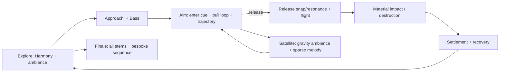

# AngryBirdsToSpace 音乐与音效设计稿

> 状态：音频首版设计，尚未接入资产或运行时代码。  
> 目标：用轻快、可读、具有空间感的声音，把「小队探索 → 采集制作 → 弹弓瞄准 → 物理连锁破坏 → 引力弹弓 → 救援终局」串成清晰的情绪曲线；音效优先提供操作和物理结果的信息，而不是持续堆叠噪声。

## 1. 当前玩法依据

项目当前没有 `SoundWave`、`SoundCue`、`MetaSound` 或音频播放代码。设计以下列已实现玩法为准：

- 红、蓝、黄、黑四鸟的小队移动、跳跃、切换、跟随与自动归队；
- 在球面小行星上探索，拾取树枝/石料，使用工作台和熔炉制作；
- 搭桥跨越河道；
- 在 Twig、Simple、Reinforced 弹弓上瞄准、调节力量、发射、落地回收；
- 木、石、铁、玻璃建筑以及弹簧、爆炸桶的物理碰撞、损伤与连锁破坏；
- 强化弹弓阶段的卫星引力练习、青鸟侦察；以及钢铁太空弹弓的最终四鸟发射。

声音不应模仿《愤怒的小鸟》既有的鸟叫、弹弓或 UI 音色；所有效果需原创或持有可商用授权。

## 2. 总体混音与分组

采用 Unreal Audio Mixer 的四个 Sound Class / Sound Mix 总线，均以游戏设置中的独立滑杆控制：

| 总线 | 内容 | 默认相对响度 | 关键规则 |
| --- | --- | ---: | --- |
| Music | 四轨自适应音乐 | -16 LUFS 集成 | 瞄准和叙事时让位给重要效果；不随距离衰减。 |
| SFX | 世界交互、弹弓、撞击、破坏 | -12 LUFS 集成 | 物理音效按优先级限声；同一材质的连续碰撞合并。 |
| UI | HUD、背包、制作、失败提示 | -18 LUFS 集成 | 2D、短、不过分抢耳；界面关闭时立刻停止循环。 |
| Ambience | 风、植被、河流、卫星与环境生物 | -22 LUFS 集成 | 3D 衰减，按区域交叉淡入；不得掩盖落点、碰撞和警告。 |

首版建议：SFX 同时最多 24 声、同类撞击每 80 ms 最多一次；爆炸、弹弓释放、关键建筑断裂、终局事件拥有较高并发优先级。所有随机变体在音量 ±2 dB、音高 ±3% 内，避免机关枪式重复。

## 3. 已有四轨音乐的编排

来源为用户从 [16 RPG-like procedural generated music tracks 的 Song12](https://opengameart.org/content/16-rpg-like-procedural-generated-music-tracks)（CC0）经 MIDI 重编曲混音得到的四条轨道。CC0 可用于商业发行且不强制署名；仍建议在项目 `CREDITS` / 关于页保留原始来源、作者、CC0 标记和用户重编曲署名，方便素材溯源与致谢。

现有文件均为立体声、44.1 kHz、24-bit WAV、约 37.3 MB：`C:\workspace\Media\Bass.wav`、`Harmony.wav`、`Melody.wav`、`Percussion.wav`。导入前建议从源工程统一确认四轨完全等长、同一采样起点、相同 BPM、相同循环边界；如果结尾不是无缝循环，先在 DAW 中修正，而不要依赖游戏运行时硬切。

| Stem | 情绪职责 | 默认层级 | 何时加入 / 移除 |
| --- | --- | --- | --- |
| Harmony | 世界的温暖和探索感 | 常驻底层 | 进地图淡入；暂停/终局转场淡出。 |
| Bass | 前进感、力量和风险 | 中层 | 靠近建筑目标、进入弹弓模式、资源不足或危险区域时加入。 |
| Percussion | 操作节奏、行动感 | 高能层 | 建筑战斗区、拉弓超过 35%、桥梁/制作完成的短暂庆祝；不在安静探索区常驻。 |
| Melody | 发现、成功和希望 | 叙事层 | 新区域/资源发现、关键回收、卫星走廊理解、终局成功；普通失败时退出。 |

音乐状态为 `Explore`（Harmony）、`Approach`（+Bass）、`Aim`（+Bass，Percussion 视蓄力而定）、`Destruction`（四轨）、`Satellite`（Harmony+Bass，Melody 稀疏）、`Finale`（四轨并以独立结局段收束）。每次状态变更在下一个小节边界量化执行，正常交叉淡化 1–2 小节；弹弓释放不能等待量化，音效必须即时播放。若首版不使用 Quartz，也可先以统一同时开始的 Audio Component + 250 ms 淡变实现，但所有 stem 必须同帧启动以保持相位同步。

## 4. 需准备的音效资产清单

### P0：首个可玩闭环必须有

| 事件 | 资产 / 变体 | 播放规则 |
| --- | --- | --- |
| 移动、起跳、落地 | 软土脚步 4、跳跃、轻/重落地各 3 | 跟随当前主控；飞行中禁用脚步，落地按径向速度选轻重。 |
| 鸟角色 | 四鸟各 3 个非语言短叫、受击、归队 | 只在切换、起跳、撞击/回收、终局等稀疏时机播放；不要每次移动播放。 |
| 拾取 / 背包 | 拾取、库存增加、物品选中、背包开/关、拒绝 | 拾取为温和木质/晶体音；失败音低调且不与成功音相似。 |
| 工作台 / 熔炉 / 制作 | 打开、循环工作、完成、材料不足 | 循环由界面或加工状态持有；完成声是清晰的短上行提示。 |
| 弹弓基本 | 进入/退出、抓住弓兜、持续拉伸、释放、弦回弹、空射失败 | 见第 5 节；释放由两层组成：瞬态「啪」和可变音高的共鸣。 |
| 飞行与落点 | 近场飞掠、风切、地面/建筑撞击、停稳 | 飞掠用速度驱动音量与滤波；只给当前发射鸟，落地后停止。 |
| 材质破坏 | 木/石/铁/玻璃：轻撞、重撞、断裂各 3 | 由 `EABTSM6ImpactMaterial` 和法向速度选择；玻璃断裂要短而亮，铁重撞要有低频但避免持续轰鸣。 |
| 黑鸟能力 | 点燃、手动引爆、自动引爆、冲击尾响 | 手动引爆先给极短确认 tick；爆炸是唯一可明显压低音乐的普通战斗事件。 |
| 桥梁 | 对准合法桥位、放置、建成、无效放置 | 合法预览和无效提示可区分，但不要每帧播放预览声音。 |

### P1：拓展体验

| 事件簇 | 资产 |
| --- | --- |
| 环境 | 基础风、树叶、河流近/远、夜间虫鸣、远处石块滚落；卫星的低频电离嗡鸣与近场引力颤音。 |
| 侦察 | 开启/关闭侦察、扫描脉冲、发现目标、小地图 ping。 |
| 建筑机关 | 弹簧蓄压/释放、绳索拉紧/断裂、活塞、爆炸桶点火。 |
| 结构连锁 | 支撑开裂、重量转移、倒塌碎块、稀有资源暴露、自动回收。 |
| 终局 | 太空弹弓装配、四鸟入兜、倒计时、四重发射、近星掠过、命中 UFO、救援、结局。 |

所有单发 SFX 以 48 kHz、24-bit WAV 保存；短 UI 音效为 mono，3D 世界音效优先 mono，只有明确宽度价值（大型爆炸、终局、音乐）才用 stereo。提供干声版本，空间混响由 Unreal 的环境/子混音完成。

## 5. 特别设计：按原始弹弓长度演奏的释放音

### 5.1 听感目标

玩家拉得越开，释放时听到越高、更明亮、稍更响的「弹弦共鸣」；它应像一件小型可演奏乐器，使蓄力量在不看 HUD 时也可判断。音高由**这次释放时的原始拉伸长度**一次性决定，而非按飞行速度、命中结果或实时位置改变，故回放稳定、没有多普勒式漂移。

推荐把效果拆成三层：

1. `ReleaseSnap`：固定音高的短瞬态，说明“已放手”；
2. `ReleaseResonance`：0.35–0.8 秒、有明确音高的木弦/金属弦拨奏，是长度映射层；
3. `ReleaseAir`：很轻的风切，只按发射速度调音量，不承担音高信息。

不同弹弓等级只改变共鸣的音色、可用音域和尾音：Twig 为木质拨弦，Simple 为弹性弦与木共鸣，Reinforced 为更饱满的复合弦，Space 为带清亮泛音的合成/晶体共鸣。不要用同一采样硬拉到超过 ±7 半音；每档准备至少 3 个根音采样或用 MetaSound/合成振荡器生成共鸣层。

### 5.2 当前代码的准确数据源

`AABTSM6SlingshotSystem` 已有：

```text
PullAlpha    = 0..1
PullDistance = Lerp(MinPullDistanceCM, MaxPullDistanceCM, PullAlpha)
Velocity     = Direction * Lerp(MinLaunchSpeedCMPerSec, MaxLaunchSpeedCMPerSec, PullAlpha)
```

当前默认长度是 120–430 cm，释放点是 `ReleaseLaunch()`，而瞄准更新则在 `UpdatePouchAndPreview()`。因此在 `ReleaseLaunch()` 的首行保存 `ReleasePullAlpha` 与 `ReleasePullDistanceCM`，并把它们传入音频事件；不要在后续 `Tick()` 再读会被重置的 `PullAlpha`。

### 5.3 映射公式与调音

为保留低蓄力时可分辨的音差，同时避免满蓄力过于尖锐，使用缓入曲线：

```text
t        = Clamp((L - Lmin) / (Lmax - Lmin), 0, 1)
curveT   = t ^ 0.72
semitone = Lerp(-5, +7, curveT)          // 默认 Simple 弹弓：共 12 半音
pitch    = 2 ^ (semitone / 12)
volumeDb = Lerp(-7 dB, 0 dB, t)
LPF      = Lerp(2800 Hz, 12000 Hz, t)
```

建议在音乐的主调上把结果量化为五声音阶，既像演奏，也避免与 Harmony/Melody 打架：`C, D, E, G, A` 跨两个八度。`quantizedSemitone` 替换上式的 `semitone`，并加入最多 ±5 cents 的随机失谐。若希望“连续控制”更明显，则保留连续音高，但让共鸣层音量比 Snap 小 3–5 dB。

| 档位 | 推荐音域（相对根音） | 音色与尾音 |
| --- | --- | --- |
| Twig | -7 到 +3 半音 | 干木拨弦，0.25–0.45 秒。 |
| Simple | -5 到 +7 半音 | 橡胶弦 + 木腔，0.35–0.65 秒。 |
| Reinforced | -3 到 +9 半音 | 紧绷复合弦，0.45–0.8 秒，略多低频。 |
| Space | 0 到 +12 半音 | 晶体/合成泛音，0.7–1.2 秒，带很轻空间延迟。 |

### 5.4 Unreal 实现建议

首版选用 `MetaSound Source`：输入 `PullAlpha`、`PullDistanceCM`、`SlingshotTier`、`LaunchSpeed`；内部用 Curve/Scale、Random Wave Player 和滤波器产生三层声音。`ReleaseResonance` 的 `Pitch Shift`、LPF、音量在触发时锁定。`ReleaseSnap` 不接音高参数，确保操作确认清晰。

为避免把音频逻辑塞进 M6 物理类，新增独立的 `UABTSAudioGameplayComponent`（挂在 GameMode 或专用 Audio Director Actor）。M6 在 `ReleaseLaunch()` 中仅广播一个原生委托，例如：

```cpp
DECLARE_MULTICAST_DELEGATE_FourParams(
    FABTSSlingshotReleasedNative,
    EABTSSlingshotTier /* Tier */, float /* PullAlpha */,
    float /* PullDistanceCM */, float /* LaunchSpeedCMPerSec */);
```

Audio Director 订阅该委托，调用 `SpawnSoundAtLocation` 播放 3D Snap/Air，并播放附着于弓兜或弹弓中心的 Resonance。它还订阅发射状态、碰撞、建筑破坏、制作、桥梁与侦察事件；M6 仍只负责物理和状态机。若先快速验证，可暂时在 `ReleaseLaunch()` 调用一个 BlueprintImplementableEvent，但正式版本应收敛为委托/Audio Director。

拉弓过程另用一个低音量 loop：仅当 `PullAlpha` 跨越 0.03 的变化阈值时更新其 pitch，变化停住 150 ms 后淡出。避免每帧重复触发单发拉弦音；滚轮调蓄力可增加极轻的分档 tick，但鼠标拖动不宜连续打 tick。

## 6. 触发优先级与状态关系



混音侧链规则：释放 Snap 在 120 ms 内将 Music 降 2 dB；黑鸟爆炸降 4 dB、持续 400 ms；终局发射和 UFO 命中可降 5–6 dB。一般撞击不压音乐。进入背包或制作界面时 Music 高通/低通轻微收窄且降 2 dB，环境降 4 dB，UI 保持清晰。

## 7. 制作与验收顺序

1. 确认四轨授权、循环点、BPM、调性与源文件；导入为 Music stem，并建立 Music/SFX/UI/Ambience 总线与音量设置。
2. 先制作 P0 的弹弓、飞行、材质撞击、拾取/制作与 UI 音效；用占位音验证触发频率，再替换最终资产。
3. 实现 Audio Director 与 `SlingshotReleased` 事件；先以连续音高验证拉伸映射，再 A/B 测试连续与五声音阶量化版。
4. 接入物理材质/`EABTSM6ImpactMaterial` 事件，做木石铁玻璃的速度分层与 80 ms 限声。
5. 接入环境、卫星、侦察、桥梁和终局；最后完成响度、耳机/扬声器、暂停、地图重载和设置菜单验收。

验收关键点：四条音乐任意组合无节拍漂移；拉弓 0/25/50/75/100% 时音高单调上升且可区分；释放恰在鼠标松开帧触发；低端机器上连续倒塌不出现音效爆量或卡顿；玩家关闭 Music/SFX/UI/Ambience 中任一类后对应声音完全静音；所有外部素材的授权和署名可追溯。
