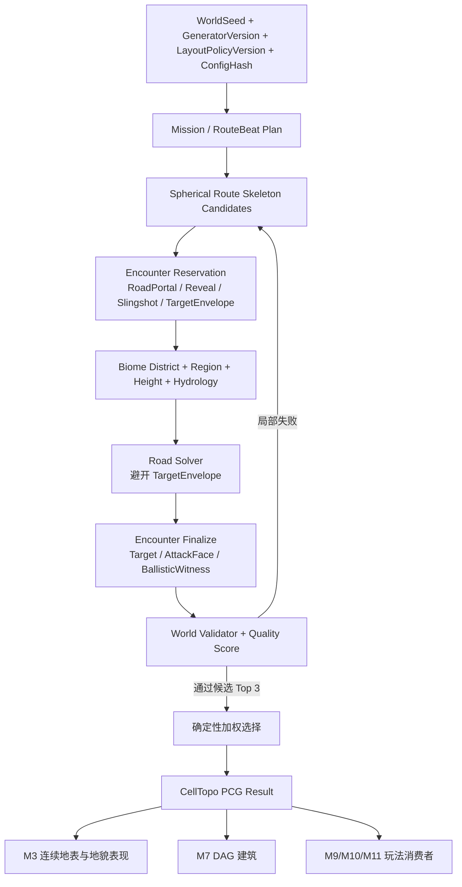
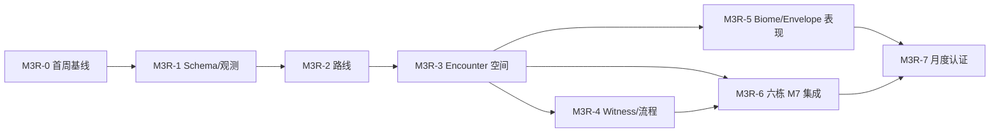

# M3R PCG 地图生成改进方案

> 状态：M3R-0 已完成视觉验收并合并；M3R-1、M3R-2 已完成 M3 所有权范围内实现与自动验收，状态为 M3LocalAccepted
> 日期：2026-07-29
> 范围：M3 TaskGraph/球面空间布局、道路、遭遇点、地貌职责，以及与 M7/M9/M10/M11.0 的接口  
> 本次更新：落地 M3R-2 多候选球面路线、状态化道路求解、确定性路线 fallback、200 Seed 冻结认证与 fresh runtime 终态探针

父文档：

- [AngryBirdsToSpaceGameDesign.md](AngryBirdsToSpaceGameDesign.md)
- [ABTSTaskGraphPCGDesign.md](ABTSTaskGraphPCGDesign.md)

直接下游：

- [M3TaskGraphTerrainPresentationDesign.md](M3TaskGraphTerrainPresentationDesign.md)
- [M52CollisionAndMovementDesign.md](M52CollisionAndMovementDesign.md)
- [M7TaskGraphSphericalBuildingIntegrationDesign.md](M7TaskGraphSphericalBuildingIntegrationDesign.md)
- [M10ScoutMinimapDesign.md](M10ScoutMinimapDesign.md)
- [M9SatelliteGravityDesign.md](M9SatelliteGravityDesign.md)
- [M110PreFinaleClosureDesign.md](M110PreFinaleClosureDesign.md)

---

## 1. 结论

当前系统不需要推翻 `CellTopo + TaskGraph + 确定性约束搜索 + Validator` 的基础。真正需要重构的是“空间节奏”这一层：

1. 把固定角度的九个 Task Seed 改为可评分、可回溯的球面路线骨架；
2. 把“流程 Task”“可攻击建筑 Encounter”“地貌 Biome”从同一个区域概念中拆开；
3. 在铺路前预留道路外目标包络，联合求解道路入口、侦察点、弹弓槽、建筑朝向和弹道；
4. 用沿主路的 `FlowS/ProgressDistance`、视距矩阵和明确的验收阈值控制节奏；
5. 默认采用清晰的线性流程。只有支线能提供独占奖励、替代解或真正的风险收益时才生成支线；
6. M3 继续输出确定性的逻辑布局；M7 DAG2.3/后续 DAG2.4 生成建筑，UE PCG Graph 只消费布局属性做地貌与装饰表现。

首周兼容版只解决核心玩法是否成立：保留现有九 Task、三栋普通建筑和 M7 `Expected=3`，延长路线，使 B1 可从开局看到、B2/B3 不可从开局看到，并让三栋建筑离开主路。该兼容版现已落地；月度版仍按本文后半部分继续演进。

月度 MVP 再引入独立的 Encounter 序列，固定生成恰好六栋相隔较远、难度递增、视觉签名不同的道路外可攻击建筑。未来扩容必须另起版本，不让本期 B1～B6 验收在“至少六栋”口径下产生未定义的 B7+。

---

## 2. 实施前基线（审计快照）

### 2.1 实际生成链路

本轮首周修改前的运行链路为：

```text
AABTSM2Planet::BeginPlay
  -> RebuildPlanet
  -> AABTSM3Planet::GenerateLogicalTerrain
  -> Mission
  -> Task Seed / Region
  -> Height
  -> Hydrology
  -> Road
  -> BuildingPad
  -> Validator
  -> M3 连续地表/HISM 表现
  -> M7 消费 BuildingSpawnSites
```

关键代码位置：

- `Source/ABTSRuntime/Private/Planet/ABTSM2Planet.cpp:42-50`
- `Source/ABTSRuntime/Private/Terrain/ABTSM3Planet.cpp:81-95,152-155`
- `Source/ABTSRuntime/Private/PCG/ABTSM3TaskGraphGenerator.cpp:41-100`

默认逻辑球为：

- `Subdivision=5`；
- `CellCount=10242`；
- `PlanetRadiusCM=10000`，即半径 100 m；
- `MaxAttempts=16`；
- `TaskTargetCells=280`；
- `BuildingPadClearanceRingCells=2`；
- 卫星与终局发射区最小角距 55°。

### 2.2 修改前展示 Seed 的量化结果

展示 Seed `312503` 的 V3 fresh 日志：

```text
Assigned=2361
Wilderness=7881
RoadEdges=93
BuildingPad Task=1 Seed=4281 Anchor=4281 Shifted=0
BuildingPad Task=3 Seed=4352 Anchor=4352 Shifted=0
BuildingPad Task=5 Seed=5709 Anchor=5709 Shifted=0
BuildingPad Task=6 Seed=99   Anchor=99   Shifted=0
```

证据位于：

- `Saved/Logs/M7DAG23FreshGame_DAG23Final60_20260728.log:1411-1423`

由真实 Cell 方向计算：

| 项目 | 当前结果 |
|---|---:|
| Start → Workshop | 15.30° / 26.71 m |
| Start → TargetBuilding | 40.68° / 70.99 m |
| Start → FurnaceRuins | 65.43° / 114.20 m |
| Start → LaunchSite | 79.02° / 137.91 m |
| 相邻三栋建筑 | 约 44.87 m / 44.36 m |
| 未分配 Task 的 Cell | `7881 / 10242 = 76.95%` |

`RoadEdges=93` 包含主路、Trail 和 LateShortcut，不能当成主路长度。当前系统也没有输出可信的主路累计长度。

---

## 3. 四个现象的实施前根因分类

本节保留首周修改前的审计证据；已修复项及现行链路以第 12.3 节为准。

| 现象 | 现行设计合同 | 当前实现 | 判定 |
|---|---|---|---|
| 主路短、直，Task 同时可见 | 主线不得使用单条归一化插值直连；应生成多条球面骨架并按曲率、拥挤、自接近评分 | `MainAngles={0,.22,.42,.64,.86,1.10,1.36}`，只有小幅正弦侧移；道路没有长度、曲率或视距门槛 | 既有合同未落实，同时设计缺少硬阈值 |
| 支线无聊 | 文档将 `SatelliteWindow` 画成分支，但它又提供终局所需进度条件 | `2→7→8` 硬编码；`LateShortcut` 随机接 5 或 6；`RequiredKey` 没有进入运行时道路状态与 Validator | 设计语义矛盾 + 实现未形成玩法选择 |
| 建筑在道路上 | `TargetBuildingPad` 要求道路外距离；道路不得穿越建筑 Footprint | Height 先压平建筑 Task Seed；道路以 Task Seed 为端点；Pad 再按离 Seed 最近排序且不排除 `bRoad` | 明确实现偏离，并存在阶段顺序循环 |
| 大部分地形是 Wild | 现稿允许玩法区只占球面一部分，剩余为 Wilderness | 九 Task 预算总和约 2460 Cell，达到预算就停止，剩余约 77% 无 TaskId | 当前代码符合旧设计，但旧设计不满足现在的地图体验 |

### 3.1 “短而直”的具体原因

`ABTSM3SpatialBuilder.cpp:69-87` 只生成一组固定里程点；没有候选路线，也没有对以下指标做硬门槛：

- 主路累计长度；
- 相邻 Encounter 的沿路距离；
- 最大连续直行长度；
- 累计转角和有效弯道数；
- 路线自接近；
- Start/Reveal 点对未来目标的可见性。

`ABTSM3RoadPlanner.cpp:18-88` 的 Dijkstra 只考虑地貌、坡度、建筑 Anchor 和道路复用。它没有 incoming-edge 状态，无法计算转角；已有道路还有 `-0.35` 复用奖励，容易让多条 Link 过度重叠。

更严重的是，当前 `ProgressDistance` 在 `ABTSM3RoadPlanner.cpp:170-174` 中是从 Start 对全部 Cell 邻接图做普通距离场，不是“沿接受后有序主路的静态累计进度”。这不能承担难度、建筑顺序或节奏的权威标尺。

### 3.2 “支线无意义”的具体原因

当前 `RequiredKey` 只被写进 `TaskLink`，没有运行时消费者。Validator 的可达性只检查 `bBlocksOnFoot`，不读取 Link 的 Key 或 Transport 状态。因此所谓 Branch/LateShortcut 目前主要是形状和日志元数据，不构成：

- 可选路线；
- 独占奖励；
- 能力门；
- 回程节省；
- 风险收益。

V3 又把“卫星必须远离 LaunchSite”的全局角距约束直接用于 Satellite Task Seed。展示 Seed 中 Launch→Satellite 已约 60.56°/105.69 m，于是一个终局隔离约束被意外转换成超长地表支路，却没有相应的内容。

### 3.3 “建筑在道路上”的确定性原因

目前不是偶发坏 Seed，而是管线会稳定地产生该结果：

1. Height 阶段把每个 Building Task 的 Seed 标为 Anchor 并压平；
2. Road 阶段把 Task Seed 当作 Link 的起终点，道路必然抵达 Seed；
3. BuildingPad 阶段清空 Anchor 后，按“与 Seed 方向最接近”排序；
4. Pad 只检查施工净空、可建和水域，不检查 `bRoad/MainRoadDistance`；
5. 所以 Seed 同时成为道路端点和建筑中心。

fresh 日志中四个 Pad 全部 `Shifted=0` 正是这个链路的结果。

不能只在现有 Pad 查找中补一个 `!bRoad`。这样会把建筑挪到未经预留与压平的位置，且水文和道路已经生成，仍会产生未平整、道路擦边或弹道无解。

### 3.4 “Wild 太多”的设计原因

`TaskId`、地貌主题与玩家是否处于有效玩法空间，目前被混成一个概念。剩余 Cell 虽然仍被噪声赋予 Plain/Forest/Highland/Mountain 外观，但在统计与任务职责上全部是 Wilderness。

月度版应拆成：

- `MissionOwnership`：哪些 Cell 属于 Task/Encounter/Room；
- `BiomeDistrict`：每个 Cell 的稳定视觉与资源主题；
- `PlayableEnvelope`：道路、观察点、弹弓槽和目标周边的玩家相关带；
- `BackgroundBiome`：球面背侧或远离流程的背景地貌。

全球可以保持稀疏的 MissionOwnership，但不应再让 77% 地表都以同一个“Wild”身份出现。

### 3.5 侦察答案还被调试 HUD 直接泄露

`AABTSM7GameMode` 当前默认：

```text
bShowTaskGraphPositionDebug=true
bDrawTaskGraphBuildingWorldLabels=true
```

对应位置：

- `Source/ABTSRuntime/Public/Game/ABTSM7GameMode.h:131-140`
- `Source/ABTSRuntime/Private/Game/ABTSM7GameMode.cpp:308-340`

它会把全部建筑经纬度写到屏幕，并在世界中绘制永久标签。即使 B2/B3 被球面和山脊遮挡，玩家仍会提前获得坐标。正式 PIE 与发行配置必须默认关闭；只允许通过 Editor-only CVar 显式开启。

### 3.6 文档—实现对照索引

| 合同 | 文档证据 | 实现证据 | 结论 |
|---|---|---|---|
| `CellTopo` 是唯一逻辑源，生成阶段分层 | `ABTSTaskGraphPCGDesign.md:29-50` | `ABTSM3TaskGraphGenerator.cpp:41-100` | 基础方向正确，应保留 |
| 主线不能用单条归一化直连，应候选化并评分 | `ABTSTaskGraphPCGDesign.md:198-220` | `ABTSM3SpatialBuilder.cpp:69-87` | 未落实 |
| 道路应区分 Main/Nearest/Progress Distance | `ABTSTaskGraphPCGDesign.md:304-310` | `ABTSM3RoadPlanner.cpp:160-174` | 字段存在，但 Progress 语义错误 |
| TargetBuilding 是道路外目标，Pad 含攻击正面与道路外距离 | `ABTSTaskGraphPCGDesign.md:120-131,143-153` | `ABTSM3BuildingPadPlanner.cpp:62-92` | 未落实 |
| 道路不得穿越建筑 Footprint | `ABTSTaskGraphPCGDesign.md:294-302,364-375` | Road 先到 Seed，Pad 后选 Seed | 未落实且生成顺序矛盾 |
| Slingshot/Target 必须联合求解弹道 Witness | `ABTSTaskGraphPCGDesign.md:326-336` | M3 Validator 无弹道接口 | 尚未实施，现稿状态段也承认 |
| Task 内应有 Room/SetPiece 原型 | `ABTSTaskGraphPCGDesign.md:120-131,226-239` | Region 只有轮询 BFS 预算增长 | 尚未实施 |
| 剩余地表允许成为 Wilderness | `ABTSTaskGraphPCGDesign.md:226-237` | 约 77% Cell 无 TaskId | 实现符合旧稿，但旧稿需适配新体验 |
| M3 只做连续地表与 BuildingSpawnSites 表现 | `M3TaskGraphTerrainPresentationDesign.md:9-26,239-252` | M7 从 SpawnSites 消费建筑位置 | 已落实，不应把新权威逻辑塞进表现层 |
| 当前生产世界固定三栋普通建筑 | `M7TaskGraphSphericalBuildingIntegrationDesign.md:82-123`、`ABTSProjectWorkflow.md:57` | M7 只消费 Workshop/Target/Furnace | 首周保留；月度六栋需要跨 M3/M7 改合同 |

### 3.7 需要从设计稿层面修改的内容

后续实施时应同步修订下列父子文档，而不是只改代码：

1. **`ABTSTaskGraphPCGDesign.md`**
   - 加入主路长度、相邻 Beat 间距、最大直行段、PVS 和路线自接近硬门槛；
   - 新增 `RouteBeat/EncounterContract/BiomeDistrict/PlayableEnvelope`；
   - 解决“Building Footprint 在道路前预留、SetPiece 又在道路后选择”的阶段循环；
   - 将 SatelliteWindow 明确为主线训练 Beat，或补完整 BranchUtility；
   - 把 V1 历史描述与 V3 当前实现分开，不能继续声称候选骨架、Room 和弹道均已落地。

2. **`AngryBirdsToSpaceGameDesign.md`**
   - 填写目前为空的第一周与第二至四周地图日程；
   - 把“一座目标建筑”的初版演示合同与“六个 Encounter”的月度合同明确分档；
   - 冻结“第一栋可见、其余按 Reveal 节奏隐藏”的玩家体验；
   - 明确线性主线是默认方案，支线不是 PCG 数量指标。

3. **`M3TaskGraphTerrainPresentationDesign.md`**
   - 继续保持只读表现职责；
   - 将旧的单一 `RoadDistance` 说明更新为 Main/Nearest/Progress/FlowS；
   - 只消费 BiomeDistrict、PlayableEnvelope 和 Encounter 属性，不决定任务布局；
   - 把旧稿的 HISM `NoCollision` 描述更新为当前生产基线 `QueryAndPhysics + ABTSDeveloperObstacleChannel + SimulatePhysics=false`，保留行走、可见性查询和 M6 动态代理碰撞。

4. **`M52CollisionAndMovementDesign.md`**
   - 把旧的树石 `QueryOnly + WorldStatic` 口径更新为 `QueryAndPhysics + ABTSDeveloperObstacleChannel + SimulatePhysics=false`；
   - 明确这里的“静态实例”只表示不模拟、不自主移动，不代表 UE Object Type 是 `WorldStatic`。

5. **`M7TaskGraphSphericalBuildingIntegrationDesign.md`**
   - 首周继续冻结 `Expected=3`；
   - 月度版改为动态 Accepted Encounter 数量；
   - 接入 DifficultyBand、VisualSignature、`ResolvedM7ProfileId`、`ProfileCatalogHash` 和 AttackFace；ProfileTags 仅作筛选诊断；
   - 加入六栋建筑的分批 IdleValidation、远端冻结和刚体预算。

6. **`ABTSProjectWorkflow.md`**
   - 首周加入 B1/B2/B3 可见性、主路里程、Road/Footprint 零重叠验收；
   - 月度加入 1000 Seed、六建筑、难度/形态、PVS、Biome 和弹道门槛；
   - 保留 M11.0 的 Launch 无建筑、唯一 Space 槽对和卫星隔离回归。

---

## 4. 案例调研及可迁移结论

### 4.1 Warframe：先有节奏模板，再连接空间块

Warframe 使用设计师制作的 Start、Connector、Intermediate、Objective、Exit 等空间块，再按程序模板、接口和回溯约束组合。其距离图沿实际拓扑计算，而不是使用直线距离；还维护 visibility/influence 等辅助图。[Daniel Brewer, “Managing Pacing in Procedural Levels in Warframe”](https://www.gameaipro.com/GameAIProOnlineEdition2021/GameAIProOnlineEdition2021_Chapter07_Managing_Pacing_in_Procedural_Levels_in_Warframe.pdf)

可迁移：

- 先冻结 Encounter 节奏序列，再解空间；
- 连接段和玩法段交替，避免连续空走或任务扎堆；
- 生成后计算真实 Flow Distance 和可见性；
- 多候选、回溯、失败原因统计和批量 Seed 测试。

不迁移：

- 不把球面切成 Warframe 式封闭房间；
- 不要求大量手工走廊模块。

### 4.2 Left 4 Dead：Flow Distance 与可见性比欧氏距离更有用

Left 4 Dead 的地图拓扑本身不是程序生成的，但 AI Director 依赖 NavMesh 的 Flow Distance、逃生路线、ahead/behind、potential visibility 和 active area 来控制节奏。[Valve AI Systems of Left 4 Dead](https://steamcdn-a.akamaihd.net/apps/valve/2009/ai_systems_of_l4d_mike_booth.pdf)、[Replayable Cooperative Game Design](https://steamcdn-a.akamaihd.net/apps/valve/2009/GDC2009_ReplayableCooperativeGameDesign_Left4Dead.pdf)

可迁移：

- 把 `FlowS` 作为路线进度的权威；
- 用 PVS/视距矩阵决定何时让玩家看到下一个目标；
- 由设计提供候选位置与节奏规则，程序在其中选择。

必须避免的误读：

- 不能声称 Left 4 Dead 程序生成地图；这里借鉴的是其流向和可见性建模。

### 4.3 Deep Rock Galactic：手工原型串珠 + 程序走廊/变体

Deep Rock Galactic 把经过验证的洞室原型当作“绳上的珍珠”，再以弯曲隧道连接，并根据任务长度、类型和难度施加变形、镜像和主题层。[Ghost Ship Games 官方开发文章](https://store.steampowered.com/news/app/548430/view/4593196713081471258)

可迁移：

- 六个建筑关是六颗“珍珠”，道路是连接节奏，不是把目标本身串在路面上；
- 局部 Encounter 使用少量可靠原型，整体路线与组合关系程序化；
- Biome/装饰在逻辑骨架之后覆盖，不反过来决定任务。

### 4.4 Hades、XCOM 2 与任务—空间分层：受控变化优于全局噪声

Hades 的经验是：完整手工房间加规则化变体，往往比随机摆放大量微型组件更容易保证质量。[Konsoll: Hand-Crafted Variance—Designing Hades’ Underworld](https://konsoll.org/talks/hand-crafted-variance-designing-hades-underworld/)

XCOM 2 用高层 Plot 决定结构、手工 Parcel 保证局部战术质量。[GDC Vault: Plot and Parcel](https://www.gdcvault.com/play/1025213/Plot-and-Parcel-Procedural-Level)

Joris Dormans 将 mission generation 与 space generation 明确拆成两个阶段，避免让地形随机过程反过来破坏任务结构。[“Generating Missions and Spaces for Adaptable Play Experiences”](https://research-portal.uu.nl/en/publications/generating-missions-and-spaces-for-adaptable-play-experiences/)

对应本项目：

- 先解主线与能力门；
- 再解 Encounter 入口、观察点、弹弓槽和目标；
- 最后填地貌、资源、植被和建筑形态；
- 不让噪声、WFC 或装饰节点决定主线可达性。

### 4.5 Unreal PCG 的合理边界

UE PCG 点可携带 Transform、Bounds、Density、Seed 和自定义 Attribute，适合消费已经确定的 `FlowS/EncounterId/Biome/Difficulty` 做道路边缘、地貌散布和装饰。[Epic PCG Overview](https://dev.epicgames.com/documentation/en-us/unreal-engine/procedural-content-generation-overview)、[PCG Generation Modes](https://dev.epicgames.com/documentation/en-us/unreal-engine/using-pcg-generation-modes-in-unreal-engine)、[Shape Grammar](https://dev.epicgames.com/documentation/en-us/unreal-engine/using-shape-grammar-with-pcg-in-unreal-engine)

结论：

- 宏观任务图、球面路线、视距、弹道和能力门继续由纯数据 C++ 权威生成；
- UE PCG Graph 只做消费者，不决定任务顺序；
- PCG Biome 插件仍标为 Experimental，不作为月度版本必须依赖。[Epic PCG Biome 文档](https://dev.epicgames.com/documentation/unreal-engine/procedural-content-generation-pcg-biome-core-and-sample-plugins-in-unreal-engine?lang=en-US)

---

## 5. 目标体验：线性但不透明

本项目不需要把地图变成开放世界。玩家应该始终理解“下一阶段大致往哪里走”，但不应在开局同时看到所有建筑和答案。

推荐的基础节拍：

```text
道路旅行
  -> 远景/地标提示
  -> 到达 Reveal/Scout 点
  -> 发现道路外目标及影响因素
  -> 准备材料与弹弓
  -> 发射并破坏
  -> 回收奖励/解锁能力
  -> 道路转折或地貌切换
  -> 下一 Encounter
```

关键区分：

- **引导不等于剧透**：道路、天际线和地貌告诉玩家前进方向；侦察才揭示精确目标和弹弓解。
- **道路外不等于随机远离道路**：每栋目标建筑都属于一个完整 Encounter，必须有 Reveal、Slingshot、Target 和 Exit 的空间关系。
- **线性不等于笔直**：主线可以没有路线选择，但应通过球面转折、山脊、河谷和目标揭示形成节奏。
- **第一栋可见是教学**：它建立“前进—建造—发射—破坏”的目标；后续建筑隐藏，才让青翎侦察与超视距弹道有意义。

---

## 6. 月度版权威架构



### 6.1 不再把所有职责塞回 M3 表现层

现有 M3 表现稿已经规定：`AABTSM3Planet` 只消费逻辑结果构建连续地表、道路/河流/地貌表现和 `BuildingSpawnSites`。月度重构可沿用 M3 里程碑名，但新增逻辑应继续拆为普通 C++ 数据模块：

```text
FABTSMissionBeatPlanner
FABTSSphericalRoutePlanner
FABTSEncounterPlanner
FABTSBiomeDistrictPlanner
FABTSVisibilityValidator
FABTSWorldQualityEvaluator
```

`FABTSM3TaskGraphGenerator` 只做 Orchestrator，不成为新的巨型 God Object。

### 6.2 Mission、Encounter、Room、Biome 的职责

| 概念 | 回答的问题 | 是否覆盖全球 |
|---|---|---:|
| Mission Task | 玩家先做什么、拿到什么 Key、何时解锁下一段 | 否 |
| Route Beat | 旅行、揭示、攻击、奖励等节拍在主路上的顺序 | 否 |
| Encounter | 一次可侦察、可发射、可破坏、可回收的建筑关 | 否 |
| Room/Pocket | 局部入口、观察、弹弓、目标、奖励空间 | 否 |
| Biome District | 该处视觉、资源和地形主题是什么 | 是 |
| Playable Envelope | 哪些 Cell 影响玩家路线和可见体验 | 否 |

不要再用 `TaskType==Workshop/Target/Furnace` 隐含“这里一定生成一栋同用途建筑”。

建议增加：

```text
EncounterRole:
  FacilityShell
  DestructibleTarget
  Landmark
  RewardCache

BuildingPurpose:
  Crafting
  ProgressionTarget
  ResourceTarget
  GravityTraining
  FinaleSupport
```

月度 MVP 中的“六栋 PCG 建筑”专指恰好六个 `DestructibleTarget`。Workbench/Furnace 等设施可以作为 Landmark/Facility，不计入六栋；LaunchSite 继续遵守 M11.0 的“无普通建筑”合同。

---

## 7. 路线骨架与 Flow

### 7.1 生成方法

每个 Seed 生成 4–8 条球面路线候选，每条由有序 Beat 控制点组成：

1. 选择 Start 方向和初始切向；
2. 按主路目标长度与 Beat 间距生成下一控制点；
3. 在当前切平面选择有限转向角，再用球面指数映射回单位球；
4. 拒绝近似回头、局部自交、过早接近旧路段和接近对跖点的不稳定候选；
5. 为每个控制点建立允许道路穿行的 Corridor Mask；
6. Height/Hydrology 完成后，在 Corridor 内使用带状态的 A*/Dijkstra 铺路；
7. 先保留最多三个通过路线硬门的 `RouteCandidate`；只有它们继续完成 Encounter/Biome/Height/Hydrology/Witness 后，才按完整世界质量做最终确定性选择。

这不是把固定 `MainAngles` 数组加长，而是从“单一路径一次通过”改为“路线候选池—Encounter/Biome 联合约束—完整世界评分—局部回溯”。R-2 只能产生 `RouteCandidateHash`，不能在六个 Encounter 尚未证明可放置时提前发布最终 `LayoutHash`。

### 7.2 Road Solver 状态

为了控制道路既不笔直也不锯齿，搜索状态应为：

```text
(CellId, IncomingEdgeId)
```

建议代价项：

```text
StepCost
  = Distance
  + TerrainCost
  + SlopeCost
  + OutsideSkeletonCorridorPenalty
  + SharpTurnPenalty
  + UTurnPenalty
  + ReservedEncounterPenalty
  + Water/CrossingCost
  + CappedRoadReuseBias
```

说明：

- Scenic 弯曲主要由骨架控制点提供；
- `SharpTurnPenalty` 只消除 Cell 级锯齿，不负责把路变直；
- 道路复用奖励必须封顶，避免不同 Link 全挤在同一段；
- Target Footprint 与 NoRoad Envelope 是硬禁止区，不是高代价软区。

### 7.3 静态路线坐标、侧向距离与动态通行状态

必须保留并正确区分：

- `NearestRoadDistanceCells`：到任意道路的静态拓扑距离；
- `MainRoadDistanceCells`：到主路的静态拓扑距离；
- `ProgressDistanceCM`：沿接受后的 Start→Launch 有序主路，从 Start 到最近主路投影点的静态纵向里程；
- `FlowS = ProgressDistanceCM / MainRouteTotalCM`：`[0,1]` 静态规范化主线进度；
- `TraversalCost/ReachableState`：由坡度、桥、Key 和当前解锁状态产生的动态通行代价/可达状态，不参与 `FlowS`。

主路上的 Cell 直接得到累计里程；主路外 Cell 继承最近主路投影点的纵向里程，侧向距离只写入 `NearestRoadDistanceCells/MainRoadDistanceCells`，不得加进 `ProgressDistanceCM`。同一接受布局的 `FlowS` 不能随桥门或 Key 状态变化，也不能因为路外侧向距离超过 1。动态流程验证读取 `TraversalCost/ReachableState`，不能再把从 Start 穿越任意地表 Cell 的 BFS 距离叫作 ProgressDistance。

### 7.4 `M3MonthlyAcceptanceProfileV1`：月度唯一数值源

以下是以当前 100 m 半径球和 6.2–6.8 m/s 地面速度为基准的首轮调参窗，不是永远不变的物理常量。实现、阶段测试、日志和第 15 节必须读取同一份 `M3MonthlyAcceptanceProfileV1`；本文其他位置重复的数值只是便于阅读的展开，不能形成第二份默认值。

| 指标 | 建议初始窗 |
|---|---:|
| Destructible Encounter 数 | 恰好 6 |
| 主路累计长度 | 280–360 m |
| 相邻建筑 Encounter 沿路间距 | 35–60 m |
| 最大无有效转折连续路段 | 45–55 m |
| 有效 Scenic Bend | 至少 3 个 |
| 同时从 Start 直接可见的可攻击建筑 | 恰好 1 |
| `BendSampleSpacingCM` | 250 cm |
| `BendWindowCM` | 1500 cm |
| `MinBendAngleDegrees` | 18° |
| `MinBendSeparationCM` | 2000 cm |
| `StraightTurnThresholdDegrees` | 8° |
| `MaxStraightCM` | 5500 cm |
| `SelfApproachIgnoreAlongRouteCM` | 3000 cm |
| `MinSelfApproachCells` | 4 Cell |
| `AllowedSelfApproachPairIds` | 月度 MVP 必须为空 |
| `RouteSolveP95MS / RouteSolveMaxMS` | 200 / 1000 ms·Seed⁻¹ |
| `EncounterSpatialP95MS / EncounterSpatialMaxMS` | 750 / 2000 ms·Seed⁻¹ |
| `MaxOptimizedPVSRaysPerWorld` | 1024 |
| `MaxWitnessEvaluationsPerEncounter` | 8192 |
| `WitnessWorldP95MS / WitnessWorldMaxMS` | 2000 / 5000 ms·World⁻¹ |
| `FullM3GenerationP95MS / FullM3GenerationMaxMS` | 4000 / 8000 ms·World⁻¹ |
| `WorldReadyP95Seconds / WorldReadyMaxSeconds` | 20 / 20 s |
| `PerfCaptureSeconds` | Ready 后 120 s |
| `FrameTimeP95Multiplier / FrameTimeP99Multiplier` | 1.10 / 1.50 × 目标帧预算 |
| `MaxSingleHitchMS / AllowedSingleHitches` | 100 ms / 0 |

280–360 m 对应约 41–58 秒纯步行；攻击、采集、侦察和桥梁玩法会显著扩展总关卡时长，而不会把时间主要浪费在跑图上。

路线指标按唯一算法计算：先按 `BendSampleSpacingCM` 对球面主路线等弧长重采样；在每个样本中心把前后各半个 `BendWindowCM` 的路线切向平行移动到同一切平面，计算有符号夹角。绝对夹角达到 `MinBendAngleDegrees` 才是 Bend 候选；中心间距小于 `MinBendSeparationCM` 的候选合并并只保留绝对夹角最大者。最长直段是连续样本中每个 Bend Window 的绝对转角都小于 `StraightTurnThresholdDegrees` 的最长弧长，必须不超过 `MaxStraightCM`。

自接近检查忽略沿路线里程差小于 `SelfApproachIgnoreAlongRouteCM` 的局部相邻段；其余任意两段的 CellTopo 最短距离小于 `MinSelfApproachCells` 即拒绝。月度 MVP 不设计有意回环，因此 `AllowedSelfApproachPairIds` 必须为空；未来若加入回环，必须使用稳定 PairId 白名单，不能用自由文本或运行时猜测豁免。

---

## 8. Encounter 联合求解

### 8.1 EncounterContract

每栋可攻击建筑至少输出：

```text
EncounterId
EncounterRole
FlowS / DifficultyBand
RequiredKeys / GrantedKeys

RoadArrivalPortal
ScoutRevealPocket
SlingshotPocket + SlingshotTier
TargetBuildingEnvelope
TargetAnchor
AttackFace / BuildingForward
RewardPocket
ExitPortal

Min/MaxMainRoadDistanceCells
StartVisibilityPolicy
RevealVisibilityPolicy
FutureTargetVisibilityPolicy
BallisticWitness
PriorTierInfeasibilityCertificate

TerrainArchetype
ResolvedM7ProfileId
ProfileCatalogHash
MaterialProfile
VisualSignature
```

### 8.2 两阶段放置，打破建筑—道路循环

**道路前：Encounter Reservation**

1. 在 Beat 的里程窗内选择 RoadArrival 候选；
2. 在其侧向选择 Target Envelope、Reveal 和 Slingshot 候选；
3. 预留建筑 Footprint 和 NoRoad Ring；
4. 由 Route/Pocket 生成 Playable Envelope 和 ActiveRole，再分配 BiomeDistrict 逻辑；
5. 把 Footprint 作为 Height 的硬平整锚；
6. Hydrology 必须尊重建筑、弹弓和必要攻击走廊。

随后 Road Solver 在 Corridor 内铺路并硬避让 NoRoad Envelope。

**道路后：Encounter Spatial Finalize（R-3）**

1. 在预留 Target Envelope 内选最终 Anchor；
2. 检查 Footprint 全圈可建、无水、无道路；
3. 使用只读 M7 ProfileDescriptor Bounds 检查实际包络、AttackFace 候选和 PVS；
4. 失败时只在预留 Pocket 内局部回溯，再回滚当前路线候选。

**玩法定稿：Encounter Gameplay Finalize（R-4）**

1. 从当前 `ProfileCatalogHash` 对应的只读目录中冻结 `ResolvedM7ProfileId` 与攻击正面；后续阶段不得重新选型；
2. 从 SlingshotPocket 调用 M6/M9 预测器生成 Ballistic Witness；
3. 检查侦察揭示、资源、能力门和 PriorTierInfeasibilityCertificate；
4. 对完整世界候选评分，最后才发布 CandidateId 与 LayoutHash。

### 8.3 道路外距离不是越大越好

目标偏离主路必须同时满足：

- 从道路不能直接读取完整攻击答案；
- 青翎侦察半径可以覆盖；
- 当前弹弓档位存在命中解；
- 上一档能力在需要时不存在命中解；
- 建筑 Footprint 不与道路重叠；
- 玩家不会因为不知道去哪里而迷路。

默认 2-ring Footprint 下，Anchor 中心到主路的离散安全下限已经是 3 Cell。正式下限必须先按
`Footprint 投影半径 + RoadHalfWidth + Pad/Road Blend + SafetyMargin`
计算物理厘米，再向上换算为 Cell；下表只是在满足该几何下限后的初始搜索窗，不得用固定 Cell 值覆盖连续几何认证：

| Encounter | 初始偏路窗 |
|---|---:|
| E1 教学 | 3–4 Cell |
| E2 | 3–5 Cell |
| E3 | 4–6 Cell |
| E4 | 4–7 Cell |
| E5 | 5–7 Cell |
| E6 | 6–9 Cell，且必须由 Ballistic/Scout Witness 进一步收紧 |

逻辑 Cell 的实际世界尺寸应在日志中输出，验收以厘米和 Cell 两种单位同时记录。

### 8.4 可见性矩阵

生成期不要用 HISM 渲染结果反推逻辑。PVS 不能只输出一个真假值，应冻结：

```text
VisibilityClass = Hidden | LandmarkOnly | AttackReadable
ScoutDetectable = true | false
EvaluationValid = true | false
CameraSampleSetVersion
```

`AttackReadable` 要求 Target 中心和 AttackFace 采样满足配置的可读聚合规则；仅有顶部/轮廓样本可见时是 `LandmarkOnly`；没有任何样本可见才是 `Hidden`。求值缺输入、越界或数值失败必须是 `EvaluationValid=false` 并拒绝候选，不能把失败当作 Hidden。`ScoutDetectable` 由 M10 侦察覆盖规则单独判定，不与物理视线混成一个布尔值。

为每个观察点和 Target 的代理 Bounds 建立确定性 PVS：

1. 观察点使用默认相机高度/最远 OrbitDistance 的保守样本；
2. Target 使用对应 M7 Profile 的顶部、中心和攻击面采样点；
3. 先解析判断理想球体遮挡；
4. 再沿视线采样 `CellTopo + TerrainVisualField` 高度包络；
5. PIE 中用真实连续地表 Trace 做二次回归验证。

每个 Encounter 显式选择 `DirectVisual` 或 `ScoutRequired` Reveal Policy，并至少输出以下矩阵：

```text
Start          -> B1 AttackReadable
Start          -> B2..B6 NotAttackReadable
PreReveal(Ei)  -> Bi NotAttackReadable
Reveal(Ei)     -> DirectVisual: AttackReadable
                  ScoutRequired: ScoutDetectable
Reveal(Ei)     -> B(i+2)..B6 NotAttackReadable
```

`NotAttackReadable` 可以是 Hidden 或 LandmarkOnly，但必须保留具体枚举供引导调参；正式门不能再写成含糊的“可见或侦察确认”。仅使用球面角距不够。当前相机默认 OrbitDistance 约 8.5–13 m，建筑高约 4.8–5.2 m，高机位和高建筑会扩大地平线视距。优化 PVS 必须在展示 Seed 和边界 Seed 上与独立暴力最近 Cell/连续地表 Trace 参考一致。

### 8.5 弹道 Witness

每个 Encounter 必须保存至少一条可复现的低成本发射解：

```text
SlingshotTransform
BirdClass / SlingshotTier
LaunchDirection
LaunchPower
PredictedImpact
Clearance
TargetProxy / AttackFace
SolverVersion / Hash
```

若该 Encounter 用于能力升级，还应保存上一档能力的 `PriorTierInfeasibilityCertificate`。单条失败轨迹不能证明“无解”；证书必须记录上一档完整输入域或经批准的自适应搜索覆盖、角度/功率分辨率、求解器版本及距成功岛的安全裕量。

M3 只保存验证结果和输入，不复制一套与 M6 不同的弹道公式。

---

## 9. 六建筑月度节奏建议

以下是空间与难度原型，不冻结美术题材名称：

| Encounter | 引导/机制 | 道路外关系 | 建筑形态方向 | 难度来源 |
|---|---|---|---|---|
| E1 可见教学仓 | 开局可见，建立首个长期目标 | 近侧袋形空间 | 低矮木框/单层仓 | 近距、宽攻击面、明显承重柱 |
| E2 林脊货仓 | 第一次必须侦察 | 山脊后方 | 偏置单塔/悬挑仓 | 遮挡、较窄攻击面 |
| E3 河岸工事 | 桥梁与水域射界 | 隔河或河湾侧面 | 双墩桥式/门洞 | 水面净空、落点回收风险 |
| E4 高地石堡 | 强化弹弓教学 | 高差侧袋 | 高塔/退台塔 | 射程、石材、弱点朝向 |
| E5 卫星观测站 | M9 引力直觉练习 | 主路上的练习窗口指向远端目标 | 非对称拱架/金属塔 | 卫星偏转、成功走廊 |
| E6 终局前中继堡 | 普通地图最终考试 | 深侧袋/陨石坑外缘 | 多层堡/单侧高塔 | 精确弹道、复合材质、最小净空 |

约束：

- 六栋均为普通 PCG `DestructibleTarget`；
- LaunchSite 不生成普通建筑；
- 至少四种明显 Silhouette Family；
- 六栋 `VisualSignature` 不完全相同；
- 相邻两栋不得使用相同的轮廓 + 主材质 + 弱点组合；
- `DifficultyBand` 非递减，且六栋中至少出现三次严格上升；
- 难度不能只由材料血量定义，必须综合射程、遮挡、弹弓档位、攻击面、结构和回收风险。

M7 现有 Workshop/Target/Furnace 三 Profile、`Budget=0` 和固定 `Expected=3` 无法直接满足此目标。月度版需要：

- `ExpectedBuildingCount = AcceptedDestructibleEncounterCount`；
- M3 向 M7 传递 `DifficultyBand/VisualSignature/ResolvedM7ProfileId/ProfileCatalogHash/AttackFace`；`ProfileTags` 只保留为筛选诊断，不能授权 M7 重新选型；
- 从 DAG2.4/WFC 研究中的已验证轮廓池选择，而不是在 M3 重写建筑算法；
- 六栋物理建筑分批 IdleValidation，验收后冻结远端建筑，仅激活当前/相邻 Encounter，遵守活跃刚体预算。

---

## 10. 支线决策

### 10.1 推荐默认：月度版不强制生成可选支线

本项目是按能力递进的 minigame。清晰、弯曲、有揭示节奏的主线，比“为了看起来像 PCG 而多一条无内容岔路”更合适。

当前 `SatelliteWindow` 建议改为主线上的**卫星训练 Beat**：

- 地面练习位置沿主路生成；
- 卫星天体方向由 M9/M11.0 的空间约束单独决定；
- “卫星远离终局 LaunchSite”不再自动生成一条通往卫星方向的地表道路；
- 删除没有运行时语义的 LateShortcut，或等真正实现 Branch Utility 后再恢复。

### 10.2 若保留支线，必须满足 BranchUtilityContract

支线只有同时满足以下条件才允许进入 Accepted Layout：

```text
Optional = true
UniqueReward 或 AlternativeAttackSolution 或 TrainingValue 至少一个成立
与主路空间分离 >= 4 Cell
支线深度 <= 1
有明确回接
取得对应 Key 前 Shortcut 不可通行
回接后至少节省 25% 的对应回程
不会绕过主线能力门
```

否则生成器应选择“无支线”模板，而不是保留装饰性分叉。

---

## 11. Biome 与 Playable Envelope

### 11.1 目标

不通过“把整个球面硬分给最近 Task”来消灭 Wild。正确做法是：

- 所有 Cell 都有 `BiomeDistrictId`；
- Task/Encounter Ownership 仍然稀疏；
- 主路和 Encounter 周边形成连续的 Playable Envelope；
- Playable Envelope 内另以 `ActiveRole` 标记 Route/Reveal/Slingshot/Target/Reward/Exit/Resource 等实际玩法职责；
- 球面背侧可以是低成本 BackgroundBiome；
- UI 不再把全部 `TaskId==None` 的 Cell 统一显示成 Wild。

### 11.2 月度初始验收值

| 指标 | 目标 |
|---|---:|
| BiomeDistrict 覆盖 | 100% Cell |
| Playable Envelope 内有明确 ActiveRole 职责 | ≥ 75% |
| Playable Envelope 内 DeepWild | ≤ 20% |
| 全局 MissionOwnership | 不设强制高比例 |
| 连续相同视觉节拍 | 建议 20–45 m，避免逐 Cell 碎片化 |
| 六 Encounter 的主地貌主题 | 至少 4 类 |

BiomeDistrict 的 100% 普遍覆盖不得计入 ActiveRole 覆盖率分子，否则该指标会恒为 100%。`DeepWild` 指 Playable Envelope 内既无上述 ActiveRole、又不属于经过批准的留白/过渡带的 Cell。“全局 Wilderness 比例”继续记录，但不再单独决定通过/失败。真正要验收的是玩家可见、可达、可侦察区域是否有清晰的玩法职责与视觉节奏。

---

## 12. 首周兼容小修方案

### 12.1 范围冻结

首周不做：

- 六建筑扩容；
- Mission Graph 重写；
- M7 DAG2.3 建筑算法修改；
- UE PCG Biome 接入；
- M11 终局布局修改。

首周保持：

- 九个现有 Task；
- 三栋普通 M7 建筑；
- `Expected=3`；
- LaunchSite 无普通建筑；
- M9 卫星与 LaunchSite 至少 55° 分离；
- 现有桥门、资源与 M11.0 合同。

### 12.2 建议实施顺序

1. **先补指标与日志**
   - 主路累计厘米；
   - 每个 Task/Building 的 `FlowS/ProgressDistanceCM`；
   - Anchor 到主路距离；
   - StartLOS；
   - Slingshot 到 Target 距离；
   - Ballistic Witness 结果；
   - 路线有效弯道、最长直行段。

2. **把固定角度改成可调里程窗**
   - 首轮展示 Seed 可从更保守的角度起点校准：

   ```text
   {0.00, 0.20, 0.78, 1.15, 1.38, 1.78, 2.10} rad
   ```

   - 对应 B1≈0.20 rad、B2≈1.15 rad、B3≈1.78 rad；
   - SlingshotRange≈0.78 rad，与 B2 相差约 0.37 rad/37 m；
   - Launch≈2.10 rad/210 m；
   - 该数组只是兼容补丁的初始猜测，是否通过以默认相机和真实地形 LoS 为准。

3. **拆开 RoadPortal 与 BuildingAnchor**
   - 道路仍连接 Task 的 `RoadPortalCellId`；
   - BuildingAnchor 在同一 Task 内侧向选择；
   - 默认施工净空为 2-ring，因此建筑中心到主路的安全下限不能小于 3 Cell；
   - B1/B2/B3 的默认最小偏路距离分别为 3/4/5 Cell，并各自允许再搜索 3 Cell；
   - Footprint 全圈禁路；
   - 预留/压平必须发生在道路前。

4. **加入最小可见性 Gate**
   - B1 从默认开局相机可见；
   - B2/B3 从默认开局相机不可见；
   - 不只按球面角距判断；
   - 禁止依赖植被作为唯一遮挡。

5. **关闭正式配置中的位置剧透**
   - TaskGraph 屏幕坐标和世界标签默认关闭；
   - 只保留 Editor-only CVar。

6. **回归现有系统**
   - 三栋仍走 M7 DAG2.3；
   - M7 三栋均通过 IdleValidation；
   - M9/M11.0 的 103 Seed 分离测试不回退；
   - 桥前锁、桥后通、资源与发射流程不回退。

### 12.3 已实现的首周链路（2026-07-28）

首周实现保持 `GeneratorVersion=3`，以维持 M11 已冻结的兼容身份；新增 `LayoutPolicyVersion=1` 区分本轮布局策略，`ConfigHash` 覆盖策略、Planet 实际几何输入和量化后的有序 `CellTopo`，`LayoutHash` 标识接受后的 Task/Portal/Anchor/Corridor 结果。世界生成合同签名和稳定枚举不变。

实际生成顺序已调整为：

```text
Mission
  -> Spatial Seed / Region
  -> BuildingPad Reserve
       RoadPortal / BuildingAnchor / NoRoad Ring
  -> Height（压平已预留 Anchor）
  -> Hydrology
  -> Road（硬避让普通建筑 NoRoad Ring）
  -> BuildingPad Certify（不得重选）
  -> World Validator（路线 / 间距 / 视距 / 跨阶段合同）
```

已实现：

- `FirstWeekMainRouteAngularSpanDegrees=120°`，七个主线 Beat 使用可调总跨度和冻结的首周归一化节奏；
- 每条 `TaskLink` 输出 `CorridorLengthCM`；
- Task/Cell 输出权威 `ProgressDistanceCM` 和 `FlowS`，旧整数 `ProgressDistance` 只保留为最近主路线序投影；
- 普通建筑的 `RoadPortalCellId` 与 `BuildingAnchorCellId` 分离，RoadPlanner 对 `bBuildingRoadExclusion` 做硬禁止；
- Workshop/TargetBuilding/FurnaceRuins 默认最小主路距离为 3/4/5 Cell；
- 候选 Anchor 的比较使用量化整数分数和 CellId 最终裁决，避免近似浮点比较破坏严格排序；
- `BuildingPad Certify` 除离散 NoRoad Ring 外，还使用 Planet 实际半径、平台半尺寸、边缘混合带、道路半宽与 25 cm 安全余量，拒绝连续道路带与施工台扩展矩形相交的候选；候选边预筛角由这些实际尺寸和边角跨度动态推导，不使用固定角度；
- LaunchSite 仍以 Seed 作为道路端点和唯一终局施工 Anchor，不生成普通道路禁入环，但在压平前必须证明 `SafeRings+1` 护环仍完整属于 LaunchSite Task；
- 普通建筑的生成朝向由 RoadPortal 指向 BuildingAnchor，M7 继续消费既有 `BuildingSpawnSites`；
- 纯数据视距验证使用当前 M4 默认/最大 OrbitDistance（850/1300 cm）、60° 仰角和 M7 建筑高度代理，要求 B1 两档均可见、B2/B3 两档均隐藏；
- Validator 拒绝不连续或非相邻重复 Cell 造成的主路自重叠；
- `[ABTS][PCG][Accepted]` 输出布局策略/配置/结果身份、主路厘米、相邻建筑最小沿路间距和 `11/00/00` 视距摘要。

展示 Seed `312503` 的 fresh 自动化结果为：

```text
LayoutPolicy=1
ConfigHash=2795535429
LayoutHash=2577447183
MainRouteCM=24583.4
BuildingGapCM=7736.8
Visibility=11/00/00
SatelliteLaunchSepDeg=90.30
```

21 个首周测试 Seed 的主路约为 230–263 m，最小相邻建筑沿路间距为 71.9 m，全部超过 180 m / 35 m 硬门槛；上端略高于最初 200–240 m 调参目标窗，但不会影响本轮“B2/B3 出视距”的核心合同，后续可在真实 PIE 步行节奏验收后决定是否收窄总跨度。

自动化门禁：

- `ABTS.M3.WeekOne`：2/2；
- `ABTS.Contracts.WorldGeneration`：2/2；
- `ABTS.M110.TaskGraphFinaleSeparation`：1/1，覆盖原有 103 个布局 Seed。

`M3R0AcceptanceManifest` 现已冻结为 `ManifestHash=F3CC08FCEB6D6FC8`、`WeekOneSeedManifestHash=3DE06FCA1D76EF0F`、`M110SeedManifestHash=D6D1C5BB00B49BB5`，并明确记录 WeekOne 21 Seed、Determinism 4 Seed、M11.0 既有 103 Seed、三个 automation 过滤器及其 `2/2/1` 预期、一次 `L_ABTS_M3` fresh runtime、一次 canonical `L_ABTS_M10` Visible PIE、展示 Seed 黄金指标和完整生成位点顺序：

```text
Launch(Task=6, Cell=7683)
  -> B1(Task=1, Cell=8864)
  -> B2(Task=3, Cell=9168)
  -> B3(Task=5, Cell=9763)
```

首周测试不直接复用 Summary 做自证：它独立重算每条 Corridor 球面弧长、多源 BFS 主路距离、主路线 Cell 唯一性，并对全部 21 个冻结 Seed 暴力搜索最近 Cell、复算默认与最大 OrbitDistance 下的六项视距结果；确定性用例还分别扰动布局配置、连续几何输入和 `CellTopo` 元数据，证明 `ConfigHash` 会响应全部三类输入。`-ABTSM3R0Smoke` 是显式启用、默认不改变游戏退出行为的 fresh-runtime 探针，它在真实 `L_ABTS_M3` TaskGraph 完成后核对生成身份、指标、视距、位点顺序、终局局部框架和玩家初始放置，再输出唯一终态并按结果返回进程状态。

2026-07-29 本轮 fresh-process 证据：

- 强制 Unity Development Editor：`-ForceUnity -DisableAdaptiveUnity`，全链接成功；
- `Saved/Logs/M3R0/WeekOne_FinalCert_20260729_045255.log`：精确发现 2 项，2 项 Success，`Terminal=21 Passed=21 Failed=0`；
- `Saved/Logs/M3R0/WorldGeneration_FinalCert_20260729_045338.log`：精确发现 2 项，2 项 Success；
- `Saved/Logs/M3R0/FinaleSeparation_FinalCert_20260729_045423.log`：精确发现 1 项，1 项 Success；
- `Saved/Logs/M3R0/Runtime_FinalCert_20260729_045512.log`：进程退出码 0，`AcceptanceManifest SelfValid=1`，唯一 `RuntimeCertification Terminal=1 Passed=1 Failed=0`，真实 M3 `Ready=1/MaterialReady=1`，ABTS Error/Fatal/Assert/Ensure/`WorldReadyBlocked` 计数均为 0。

正式 PIE 中默认关闭 M7 位置标签属于 M7/集成所有权，本 M3 工作树没有越权修改；集成时仍需按多工作树交接清单完成该项人工验收。

`ABTS.M110.TaskGraphFinaleSeparation` 及其源码仍归 Integration 所有；M3 清单冻结的是本阶段要求的 103 Seed 预期与 Hash，当前共享测试源码使用同一 `0..99 + 312503 + 20260727 + 8675309` 集合并已 fresh 通过。后续若 Integration 调整该集合，必须同步更新共享测试的终态诊断与本清单版本，不能只保持过滤器仍为 1/1。

### 12.4 首周是否调整 Wild

不建议把 `TaskTargetCells` 翻倍当成正式答案。将 280 临时提高到 560–600，理论上可把未分配比例降到约 49–52%，但会扩大 Task 区、改变水文与终局候选通过率，并没有解决 MissionOwnership 与 Biome 混用。

首周优先保证三栋建筑的路线、视距和弹弓闭环。若展示必须降低 Wild，可把 560–600 作为单独受控实验，并强制跑现有 103 Seed 回归；月度版仍应按第 11 节拆分 BiomeDistrict。

---

## 13. 首周正式验收门槛

固定展示 Seed 和至少 20 个布局 Seed 必须满足：

### 13.1 路线

- 主路累计长度 `>= 18000 cm`，目标调参窗 200–240 m；
- Start→Launch 的 `ProgressDistanceCM` 必须沿主路计算；
- 相邻三栋建筑的沿路间距 `>= 3500 cm`；
- 不再用 Start 到 Cell 的全地表 BFS 代替主路进度。

### 13.2 可见性与侦察

- `StartVisible(B1)=true`；
- `StartVisible(B2)=false`；
- `StartVisible(B3)=false`；
- 正式 PIE 中不得出现全部建筑经纬度或永久世界标签；
- B2/B3 必须在其预定 Reveal/Scout 点被发现；
- 验收使用默认与最大 OrbitDistance 两组相机样本。

### 13.3 道路外建筑

- 三栋建筑 Anchor 均不在 Road Cell；
- 建筑 Footprint/NoRoad Ring 与道路重叠数为 0；
- 以 Planet 实际几何参数展开后的平台矩形与连续道路带重叠数为 0；
- B1/B2/B3 的 `MainRoadDistanceCells` 分别不小于 `3 / 4 / 5`，并受各自最小值加 `BuildingAnchorSearchSlackCells` 的搜索上限约束；默认 2-ring Footprint 与道路零重叠；
- 每栋均有当前弹弓档位的 Ballistic Witness；
- RoadPortal、SlingshotPocket、TargetAnchor 三者不能是同一 Cell。

### 13.4 跨阶段回归

- 普通建筑仍恰好 3 栋；
- `BuildingContractSealed Expected=3 Registered=3 SetupRejected=0`；
- 三栋全部 `IdleValidation Accepted=1` 后才允许 `WorldReady=1`；
- LaunchSite 不生成普通建筑；
- 卫星与 LaunchSite 保持 `>=55°`；
- 现有 M11.0 103 Seed 自动化通过；
- 相同 Seed + GeneratorVersion + LayoutPolicyVersion + ConfigHash 输出相同布局 Hash。

---

## 14. 月度实施路线：按可验收阶段推进

月度路线不以“到了第几周”判断完成，而以阶段退出门判断完成。自然周只用于排期；任一阶段没有同时满足实现目标、自动化和对应运行时/PIE 验收，就保持在该阶段，不把未闭环内容带入正式默认路径。

建议状态统一为：

```text
NotStarted
  -> Implementing
  -> M3LocalAccepted
  -> IntegrationAccepted（仅跨工作树阶段需要）
  -> Complete
```

其中 `M3LocalAccepted` 只表示 M3 所有权范围内已通过，不能替代共享契约、M7 实体建筑、M6/M9 真实预测接口或联合 PIE。所有建议新增的自动化过滤器都必须在 fresh `UnrealEditor-Cmd` 进程运行；零匹配、只有进程退出码 0、或复用旧日志都不算通过。

### 14.1 阶段总览、依赖与四周映射

| 阶段 | 排期建议 | 当前状态与证据 | 核心交付 | 主要所有权 | 目标退出状态 |
|---|---|---|---|---|---|
| M3R-0 首周基线 | Week 1 开始前补齐 | **Complete**；Manifest、强制 Unity、2/2/1 fresh automation、M3 runtime 与 canonical Visible PIE 均已通过并合并 | 长路线、三栋道路外建筑、首周视距与确定性身份 | M3 + Integration/M7 | Complete |
| M3R-1 月度 Schema 与观测面 | Week 1 前半 | **M3LocalAccepted**；Schema 8/8、兼容 21/21、旧合同 2/2/1、fresh runtime 与强制 Unity 均通过 | RouteBeat、Encounter、Biome、质量报告的数据骨架 | M3；共享字段只提交需求 | M3LocalAccepted |
| M3R-2 多候选球面路线 | Week 1 后半 | **M3LocalAccepted**；RouteCore 7/7、Failure 1/1、200 Seed 200/200、旧回归与 fresh runtime 均通过；Editor-only 叠层保留人工可视抽查 | 候选骨架池、状态化道路搜索与月度路线 fallback | M3 | M3LocalAccepted |
| M3R-3 六 Encounter/地貌逻辑预留 | Week 2 前半 | **NotStarted** | 六个逻辑遭遇空间、Playable Envelope 与 Biome 逻辑 | M3 | M3LocalAccepted |
| M3R-4 可玩性 Witness 与流程闭环 | Week 2 后半 | **NotStarted** | 弹道、能力门、资源、桥门与卫星训练的可解证明 | M3 + Integration/M6/M9 | IntegrationAccepted |
| M3R-5 Biome/Envelope 表现 | Week 3，可与 R-4 后半并行 | **NotStarted** | 消费 R-3 逻辑结果的材质、HISM 和可见表现 | M3 | M3LocalAccepted |
| M3R-6 六栋 M7 实体建筑集成 | Week 3 | **NotStarted** | vNext 建筑合同、动态数量、难度/视觉路由与物理批处理 | Integration + M7，M3 只生产数据 | IntegrationAccepted |
| M3R-7 月度认证与调参冻结 | Week 4 | **NotStarted** | 1000 Seed、fresh runtime、联合 PIE、展示 Seed 与 fallback | Integration | Complete |



R-3 必须在 Height/Hydrology/Road 之前确定 Playable Envelope 与 BiomeDistrict 逻辑；R-5 只实现消费这些结果的表现，可以提前做原型，但最终必须重新消费 R-3 的正式结果。R-6 不得因为共享合同尚未就绪而让 M7 直接读取 M3 原始数组。

### 14.2 所有阶段共用的 Definition of Done

每个阶段退出前必须同时完成：

1. 新数据具有明确单位、有效域、默认值、失败策略和确定性排序最终裁决；
2. 所有影响生成的输入进入配置身份，包括 Route/Encounter/Biome 模板目录、M7 ProfileDescriptor CatalogHash 和 M6/M9 SolverVersion；最终布局身份覆盖 Beat、Pocket、Biome、`ResolvedM7ProfileId` 和 Witness；
3. Validator 有明确 `RejectReason`，失败不得静默换点、放宽硬门或回退到 Legacy 建筑链；
4. 阶段 `AcceptanceManifest` 冻结 Seed 清单/Hash、过滤器、预期测试数和预期 Terminal 数；fresh process 必须精确匹配这些数量、全部 Success，并出现本次唯一 `TEST COMPLETE. EXIT CODE: 0`，零匹配、少跑、跳过失败 Seed 或只有进程退出码 0 均失败；
5. 目标地图 fresh runtime 无 Fatal、Assert、Ensure、非法索引或 `WorldReadyBlocked`；
6. 本文更新阶段状态、实际测试数、展示 Seed 指标和唯一日志；
7. 只改本工作树所有文件。稳定契约、M6、M7、M9、共同地图和正式默认绑定一律形成集成交接项。

仅编译通过只能证明 C++ 门完成；包含视距、地貌、道路引导、建筑形态或物理稳定性的阶段仍必须完成对应可见 PIE。

### 14.3 M3R-0：冻结首周兼容基线

**实现目标**

- 把第 12～13 节已经实现的首周方案冻结为月度重构的对照组；
- 保留 `GeneratorVersion=3 + LayoutPolicyVersion=1` 的重放能力，不再向该策略追加月度功能；
- 固定展示 Seed、配置 Hash、布局 Hash、三栋站点顺序和 M11.0 分离结果；
- 把该结果命名为 `CompatibilityOracle Gen3/Policy1`：仅供回归和开发期安全恢复，不是月度发布 fallback，也不计入 `MonthlyAccepted`。

**退出验收**

- 冻结 `M3R0AcceptanceManifest` 与 ManifestHash：精确列出 `ABTS.M3.WeekOne=2`、`ABTS.Contracts.WorldGeneration=2`、`ABTS.M110.TaskGraphFinaleSeparation=1`、fresh runtime 1 次和 Visible PIE 1 次；少一项、零匹配或 Hash 不符均失败；
- 三个自动化过滤器分别为 2/2、2/2、1/1，其中 M11.0 用例覆盖既有 103 Seed；
- `L_ABTS_M3` fresh runtime 报告 `Terminal=1, Passed=1, Failed=0`，并发布 `Accepted=1`、`Ready=1`，无 ABTS Error；
- canonical `L_ABTS_M10` Visible PIE 报告 `Terminal=1, Passed=1, Failed=0`：B1 从 Start 可读，B2/B3 不可读且无坐标/永久标签泄露；沿路可找到 Reveal 点并依次揭示 B2/B3；三栋 M7 建筑通过 IdleValidation；
- 展示 Seed 指标与第 12.3 节一致，重复生成得到相同 `ConfigHash/LayoutHash`。

**2026-07-29 执行结果**

- `M3R0AcceptanceManifest` 已落地并自校验，冻结 `ManifestHash=F3CC08FCEB6D6FC8`、`WeekOneSeedManifestHash=3DE06FCA1D76EF0F`、`M110SeedManifestHash=D6D1C5BB00B49BB5`、展示 Seed 身份、三组 Seed 清单、四个生成位点和五项验收入口；
- `ABTS.M3.WeekOne`、`ABTS.Contracts.WorldGeneration`、`ABTS.M110.TaskGraphFinaleSeparation` 已在三个独立 fresh `UnrealEditor-Cmd` 进程中精确匹配 `2/2/1` 并全部 Success；
- 21 个首周 Seed 已全部独立复算通过；展示 Seed 继续得到 `ConfigHash=2795535429`、`LayoutHash=2577447183`、`MainRouteCM=24583.4`、`BuildingGapCM=7736.8`、`Visibility=11/00/00`、`SatelliteLaunchSepDeg=90.30`；
- `L_ABTS_M3 -ABTSM3R0Smoke` 已在独立命令行进程报告唯一 `Terminal=1 Passed=1 Failed=0`，退出码 0；
- Development Editor 已用 `-ForceUnity -DisableAdaptiveUnity` 验证成功。

2026-07-29，集成工作树已完成 canonical `L_ABTS_M10` Visible PIE、视觉验收和合并，故 R-0 状态由 **M3LocalAccepted（IntegrationPending）** 晋升为 **Complete**。后续阶段仍只能在显式 Compatibility 模式重放该 Oracle；月度默认路径失败时必须 fail closed，直到 R-7 完成恰有六关的 `MonthlyCertifiedWorldFallback` 三层认证。

### 14.4 M3R-1：建立月度 Schema、版本身份与观测面

**实现目标**

- 引入纯数据 `RouteBeatPlan`、`EncounterContract`、`BiomeDistrict`、`PlayableEnvelope` 和 `WorldQualityReport`；
- 明确 Mission Task、Route Beat、Encounter、Room/Pocket、Biome 的独立身份和引用方向；
- 复用首周已完成的 `ProgressDistanceCM/FlowS`，补齐候选路线、Reveal、Witness、Biome 和质量评分字段；
- 定义月度布局策略身份以及与 `CompatibilityOracle Gen3/Policy1` 的显式模式字段；在数值冻结前不复用旧策略版本号；
- 在 Integration 明确批准生成器版本升级前继续保持 `GeneratorVersion=3`，月度算法只用新的 `LayoutPolicyVersion` 区分；
- 提交只读 `M7ProfileDescriptor` 目录需求：`ProfileId/Bounds/AttackFaces/ProfileTags/CatalogHash`，供 R-3/R-4 在不实例化 Actor 的情况下做真实包络与 Witness；
- 先建立日志和 Editor-only Debug 数据，不在本阶段改变正式地图外观或建筑数量；
- 对需要进入 M3→M7/M6/M9 契约的字段只形成 vNext 需求表，不在 M3 分支直接修改共享合同。

**退出验收**

- 建议新增 `ABTS.M3.Monthly.Schema`：覆盖默认值、单位/有效域、稳定枚举、严格排序、配置 Hash 敏感性和布局 Hash 完整性；
- 相同 Seed/配置重复构建完整新 Schema，所有有序数组、ID、Hash 和 RejectReason 一致；
- 在 Compatibility 模式重放至少首周 21 Seed，Task、Link、Anchor、Corridor 与既有 `LayoutHash` 不变；
- `L_ABTS_M3` fresh runtime 仍只生成首周三栋站点，新增 Schema 为空时不得改变旧合同导出；
- 日志能单独输出 Route/Encounter/Biome/Quality 各层摘要，不再只输出一个总 `Accepted`；
- 默认 Development Editor Unity 全链接通过。

**2026-07-29 执行结果**

- 新增 `FABTSM3MonthlyWorldSchema` 与 `FABTSM3MonthlySchemaBuilder`。Schema 包含独立的 Mission Task、Beat、Encounter、Pocket、Biome 身份和显式引用，并携带候选路线、Reveal、Witness、目录、求解器、Playable Envelope 与质量报告预留字段；
- `CompatibilityOracle` 明确保持 `GeneratorVersion=3 + LayoutPolicyVersion=1`，只读投影已经接受的首周结果；`MonthlyDevelopment` 仅预留 `LayoutPolicyVersion=2`，R-1 的 `bMonthlyWorldAccepted` 始终为 0，不能成为发布 fallback；
- `SourceConfigHash/SourceLayoutHash` 保留旧 32-bit 身份；新 Schema 使用独立的 canonical FNV-1a 64-bit 身份。展示 Seed `312503` 冻结为 `SchemaConfigHash=1FC60A49D5354A32`、`SchemaLayoutHash=28AC8C67CCB595CD`；
- `M3R1AcceptanceManifest v2` 冻结 `ManifestHash=57AB73741D5B0629`、21 Seed 清单 Hash `3DE06FCA1D76EF0F`、4 个 Schema fixture Seed Hash `919267FB996F6A2C` 和完整 Compatibility Oracle 表 Hash `31D0B260C04BEB4F`；每个 Seed 的 Oracle 不仅保存旧 `ConfigHash/LayoutHash/Attempt`，还保存覆盖 Task、Link、Cell、Edge 和 Summary 全字段/有序数组/float bits 的独立 64-bit `SnapshotHash`；
- 展示 Seed 的观测结果为 1 个已接受兼容路线候选、9 Route Beats、3 Encounters、21 Pockets、5 个旧地形代理 Biome District 和 3 Playable Envelopes。稳定 ID 与数组 `OrderIndex` 已分离；它们仍是 R-1 观测结果，不是月度六关求解结果；
- `bBuildObservation=false` 会产生合法空观测 Schema；测试同时证明旧 Task/Link/Cell/Edge/Summary 和旧四站点导出不变；
- `ABTS.M3.Monthly.Schema` 在 fresh 进程精确 8/8 Success，其中 Compatibility Oracle 为 `Terminal=21 Passed=21 Failed=0`；`ABTS.M3.WeekOne`、`ABTS.Contracts.WorldGeneration`、`ABTS.M110.TaskGraphFinaleSeparation` 分别为 2/2、2/2、1/1；
- fresh `L_ABTS_M3 -ABTSM3R1Smoke` 输出 Route/Encounter/Biome/Quality 各一条摘要、`Ready=1`、`MaterialReady=1`、旧四站点不变，以及唯一 `RuntimeCertification ... Terminal=1 Passed=1 Failed=0`；没有 `LogABTSRuntime: Error`、Fatal、Assert、Ensure 或 `WorldReadyBlocked`；
- Development Editor 已用 `-ForceUnity -DisableAdaptiveUnity` 完成全链接，证明新增测试和运行时代码不存在 Unity TU 同名冲突。最终构建时另一个工作树 `9418` 的 Editor 持有 UE 5.8 过宽的全局 Live Coding 锁；读取进程命令行确认其未加载当前 `b1b6` 工作树后，按多工作树规范追加 `-NoHotReloadFromIDE`，未结束或改写其他工作树进程。

唯一证据日志：

- `Saved/Logs/M3R1/Schema_Final_Closed_20260729_141142.log`
- `Saved/Logs/M3R1/WeekOne_Final_Closed_20260729_141250.log`
- `Saved/Logs/M3R1/WorldGeneration_Final_Closed_20260729_141341.log`
- `Saved/Logs/M3R1/M110FinaleSeparation_Final_Closed_20260729_141428.log`
- `Saved/Logs/M3R1/Runtime_Final_Closed_20260729_141534.log`

**Integration/M7 vNext 只读目录需求**

| 字段 | M3 消费要求 | 所有权与失败策略 |
|---|---|---|
| `ProfileId` | 稳定、非空、全目录唯一的 `FName` | Integration/M7 定义；重复或缺失时 R-3/R-4 fail closed |
| `Bounds` | Profile 局部坐标、厘米单位、有限保守包络；每轴 `Min < Max` | M3 只读，不实例化 Actor 反查尺寸 |
| `AttackFaces` | 按稳定 `FaceId` 升序；局部目标位置、单位外法线和攻击包络均为有限数 | 非法或乱序目录拒绝，不在 M3 猜测攻击面 |
| `ProfileTags` | 规范化升序，仅用于候选筛选和诊断 | 不能代替 `ResolvedM7ProfileId`，M7 实例化时不能按 Tag 重选型 |
| `CatalogHash` | 非零 64-bit 身份，覆盖排序后的目录和量化字段 | 必须进入世界配置/布局身份；Hash 不匹配时 fail closed |

R-1 尚未获准修改共享合同，故 `M7ProfileCatalogHash/M6SolverVersion/M9SolverVersion` 默认均为 0、对应引用保持未解析；这是显式的后续输入缺口，不是已经通过真实 M7 Bounds、M6 弹道或 M9 引力验证。总工作流交接清单属于集成工作树，本分支不越权修改。

**阶段边界**

本阶段不生成多候选路线、不扩为六栋、不调用 M6/M9，也不修改 M7 `Expected=3`。退出后状态为 **M3LocalAccepted**。

### 14.5 M3R-2：实现多候选球面路线与道路求解

**实现目标**

- 每个 Seed 生成 4–8 条带有序 Beat 的球面路线骨架；
- 为骨架建立 Corridor Mask，并实现可在 R-3 注入正式 Terrain/Water/NoRoad 状态的 `(CellId, IncomingEdgeId)` 道路求解器；
- 实现转弯、自接近、回头、地形、水体、Encounter 预留和道路复用代价；
- 收集最多三个路线硬门通过候选，输出稳定有序的 `RouteCandidatePool/RouteCandidateHash`，不在本阶段产生最终 `LayoutHash`；
- 注入“全部候选失败”路径，验证只会产生确定性的 `MonthlyRouteFallback` 骨架；
- 输出路线长度、弯道、最长直段、自接近、尝试数、回溯数、分数和 RejectReason。

**退出验收**

- 建议新增 `ABTS.M3.Monthly.Route`；
- 对冻结的 200 Seed route-only manifest 及其 Hash，在中性地形/合成禁区 fixture 上报告 `Terminal=200, NormalAccepted=200, RouteFallback=0, Rejected=0`；每个 Seed 至少有一个正常候选，且无崩溃、非法索引、无限回溯或非相邻 Corridor；
- 每个正常接受候选满足：主路 280–360 m、有效 Scenic Bend `>=3`、最大无有效转折连续段 `<=55 m`；
- 按第 7.4 节唯一重采样/切向平行移动算法计算 Bend 与直段；非局部路线段满足 `MinSelfApproachCells=4`，月度 MVP 的 `AllowedSelfApproachPairIds` 为空，Start→Launch 主路线除 Link 接缝外没有重复 Cell；
- `ProgressDistanceCM` 严格沿有序主路累积，`FlowS` 单调且 Launch 为 1；
- 相同 Seed 的候选集合、排序、`RouteCandidateHash` 和 `MonthlyRouteFallback` 完全一致；
- 独立故障注入 manifest 报告 `Terminal=1, Passed=1, Failed=0`：令所有正常候选失败时，日志明确记录 Reject 汇总和 `bUsedRouteFallback=1`；该骨架仍须进入 R-3/R-4，不得直接标为月度世界 Accepted；
- 200 Seed sweep 的纯数据路线求解在冻结的同一验收机上满足 `RouteSolveP95MS<=200`、`RouteSolveMaxMS<=1000`；候选、节点扩展和回溯均不得超过配置硬上限；
- 在 Editor-only 路线叠层中，展示 Seed 至少出现三处可辨识转折，不出现 Cell 级左右锯齿。

**阶段边界**

R-2 只证明路线候选池和 Road Solver 机制，不在正式 Height/Hydrology/Encounter 之前铺设最终道路；本阶段记录的长度和 `FlowS` 必须在 R-3 对实际道路重算。六 Encounter 的 Pocket 和可见性不在本阶段求解。`MonthlyRouteFallback` 只是中间输入，不等于 `CompatibilityOracle` 或最终六关 `MonthlyCertifiedWorldFallback`。退出后状态为 **M3LocalAccepted**。

**2026-07-29 执行结果**

- 新增独立 `FABTSM3MonthlyRouteBuilder`、`FABTSM3MonthlyRoutePool` 和 `FABTSM3MonthlyRoadContext`。它们在 R-1 Schema 成功后以并行只读观测方式运行，不修改旧 `FABTSM3PCGConfig`、TaskGraph、旧 RoadPlanner、共享合同或首周四站点导出；
- 每个 Seed 固定尝试 8 个带 17 个控制点的球面骨架，建立 2 Cell 核心/4 Cell 允许走廊，并以 `(CellId, IncomingEdgeId)` 为状态执行确定性整数代价搜索。代价域已经覆盖走廊肩部、急转/U-turn、正式水体接口、Encounter 软预留、Terrain/Slope 和道路复用；R-3 可通过逐 Cell Context 注入正式场；
- Road Context 在 Build 与 Validate 两端绑定同一个 64-bit Hash：非法数组长度、负 Terrain/Slope 代价、Hard Block 或非法水体起终点均 fail closed；正常候选的完整路线必须属于严格升序 Corridor 且每个 Cell 对当前 Context 合法。复用奖励在逐段搜索前按剩余候选预算归一，实际使用量进入候选指标和 Hash，不能先用超额奖励选路再只修正最终分数；
- 所有接受候选用同一 `M3MonthlyAcceptanceProfileV1` 计算 280–360 m、Scenic Bend、最长直段、非局部自接近、严格累积 `ProgressDistanceCM` 与量化 `FlowQ/FlowS`。候选按硬门、量化分数、稳定 CandidateId 排序，最多保留 3 个；本阶段只冻结 `RouteCandidatePoolHash`，绝不发布月度 `LayoutHash`；
- 正常候选全部失败时，求解器只产生一个确定性的 `MonthlyRouteFallback` 中间骨架，并保持 `bMonthlyWorldAccepted=0`。故障注入冻结为 `FallbackHash=3E10F21BCB5E5700`、`PoolHash=A03845A65FEF0689`、`SnapshotHash=672BF5A0C3E91875`；
- `M3R2AcceptanceManifest v1` 冻结 `ManifestHash=3D33F37F4AD7A0E9`、200 Seed 清单 Hash `588930CEC3A71BF2`、验收参数 Hash `773EDEACA8B32025` 和全 Seed Oracle Hash `059A0EE7C1C288FE`；
- 展示 Seed `312503` 得到 `Attempted=8`、`NormalHardPass=8`、`Retained=3`，最佳路线长 `33537 cm`、12 个有效弯道、最长直段 `3500 cm`、最小非局部自接近 7 Cell；冻结 `PoolHash=E747FE054DD218F4`、`SnapshotHash=C5FCCEA6089DBAC0`；
- `ABTS.M3.Monthly.RouteCore` 在 fresh 进程精确 7/7 Success；200 Seed 报告 `Terminal=200 NormalAccepted=200 RouteFallback=0 Rejected=0`，同机预热后 `P95MS=104.062`、`MaxMS=145.613`，最大扩展 1468、最大松弛 8709、回溯 0，均低于硬预算；
- `ABTS.M3.Monthly.RouteFailure` 在独立 fresh 进程精确 1/1 Success。旧 `ABTS.M3.Monthly.Schema`、`ABTS.M3.WeekOne`、`ABTS.Contracts.WorldGeneration`、`ABTS.M110.TaskGraphFinaleSeparation` 分别为 8/8、2/2、2/2、1/1，兼容快照 21/21 未变化；
- fresh `L_ABTS_M3 -ABTSM3R2Smoke` 验证 Manifest、完整旧 Compatibility 快照、R-1 Schema、R-2 Pool、展示指标和旧四站点，输出唯一 `RuntimeCertification ... Terminal=1 Passed=1 Failed=0`；没有 `LogABTSRuntime: Error`、Fatal、Assert、Ensure 或 `WorldReadyBlocked`；
- `AABTSM3Planet` 提供默认关闭的 Editor-only 路线叠层：青色路线、黄色骨架控制点，只读取独立 Debug Snapshot，不修改 PMC、SDF、HISM 或正式道路。R-2 数据/运行时门已通过；该调试叠层仍应在后续可见 PIE 中做人工可读性抽查，不能替代 R-3 重新求解后的最终道路验收；
- Development Editor 已用 `-ForceUnity -DisableAdaptiveUnity` 完成全链接，新增实现使用命名命名空间，未重现跨 Unity TU 的同名函数冲突。

本次 fresh 证据日志：

- `Saved/Logs/M3R2-RouteCore-PostReview-Final-FreshAutomation.log`
- `Saved/Logs/M3R2-RouteFailure-PostReview-Final-FreshAutomation.log`
- `Saved/Logs/M3R2PostReviewFinal-Schema-20260729-180533221-FreshAutomation.log`
- `Saved/Logs/M3R2PostReviewFinal-WeekOne-20260729-180639394-FreshAutomation.log`
- `Saved/Logs/PostReviewFinal-Contracts-20260729-180543-649-FreshAutomation.log`
- `Saved/Logs/PostReviewFinal-M110Separation-20260729-180635-062-FreshAutomation.log`
- `Saved/Logs/M3R2-Runtime-PostReview-Final-FreshRuntime.log`

### 14.6 M3R-3：预留六个 Encounter 与地貌逻辑

**实现目标**

- 生成 E1～E6 六个有序 `DestructibleTarget` Encounter；
- 在铺路前联合预留 `RoadArrivalPortal / ScoutRevealPocket / SlingshotPocket / TargetEnvelope / RewardPocket / ExitPortal`；
- 由上述 ActiveRole 生成 Playable Envelope，再为 100% Cell 分配 BiomeDistrict 逻辑；两者都先于 Height/Hydrology/Road；
- Height/Hydrology 尊重 Target Footprint、NoRoad Ring、弹弓平台和必要攻击走廊；
- 对每个保留的路线候选注入正式 Terrain/Water/NoRoad 状态并调用 R-2 Road Solver，随后重算实际道路长度、转折、自接近和 `FlowS`；
- 道路完成后只在预留 Envelope 内做 Spatial Finalize，不允许为通过验证偷偷换到其他 Task；
- 建立 Start、PreReveal、Reveal 到六个 Target 代理 Bounds 的确定性 PVS；
- 默认不生成可选支线，把 SatelliteWindow 改为主线训练 Beat；只有 `BranchUtilityContract` 通过才允许支线；
- 月度六 Encounter 暂存于 M3 内部结果；共享 v1 建筑合同在 R-6 前继续导出首周兼容数据。

**退出验收**

- 建议新增 `ABTS.M3.Monthly.EncounterSpatial`；
- 对冻结的 100 Seed EncounterSpatial manifest 及其 Hash 报告 `Terminal=100, Accepted=100, Rejected=0`；每个结果均恰有六个有序 Destructible Encounter，`FlowS` 严格递增；
- 实际道路继续满足 `M3MonthlyAcceptanceProfileV1` 的 280–360 m、Scenic Bend `>=3`、最长直段 `<=55 m` 和自接近门；
- 相邻 Encounter 沿路间距 35–60 m，E1～E6 的偏路距离落入第 8.3 节对应窗口；
- 六个 Target Footprint/NoRoad Ring 与 Road Cell、连续道路带、水体和其他施工台重叠均为 0；
- 每个 Encounter 的六类 Pocket/Portal 身份有效、互不误用，且归属于自己的 Playable Envelope；
- 所有 PVS 条目均 `EvaluationValid=true`；Start 仅 B1 为 `AttackReadable`，PreReveal 的本关目标和 Reveal 处 E(i+2)+ 目标均 `NotAttackReadable`，本关 Reveal 严格满足自己的 `DirectVisual/ScoutRequired` Policy；
- 展示 Seed及至少 10 个地平线/高差边界 Seed 的优化 PVS 与独立暴力最近 Cell/连续地表 Trace 参考一致；
- 100 Seed 中“正式 Terrain/Water/NoRoad 注入 + 道路重算 + Encounter Spatial + 优化 PVS”的总耗时满足 `EncounterSpatialP95MS<=750`、`EncounterSpatialMaxMS<=2000`；每个世界优化 PVS 射线数 `<=1024`，超限或超时只能 Reject，不能按 Hidden 通过；
- LaunchSite 没有普通建筑，M9 卫星与 LaunchSite 仍满足 `>=55°`，桥前/桥后可达性不回退；
- 可见 PIE 中道路和地标持续指向下一 Beat，关闭 Debug Layer 后玩家不需要读取世界坐标寻找入口。

**阶段边界**

本阶段必须消费带 `CatalogHash` 的只读 M7 ProfileDescriptor；若 Integration 尚未提供，只能以冻结 fixture 达到 M3LocalAccepted，不能宣称真实 M7 形态、弹道或 Chaos 已通过。退出后状态为 **M3LocalAccepted**。

### 14.7 M3R-4：补齐 Ballistic Witness、能力门与流程闭环

**实现目标**

- Encounter Finalize 通过实际 M6 预测接口生成当前弹弓档位的 Positive Witness；
- 对能力升级关生成上一档弹弓的 `PriorTierInfeasibilityCertificate`，记录搜索输入域、分辨率、覆盖与安全裕量；
- Finalize 必须使用 R-1 的只读 M7 ProfileDescriptor Bounds/AttackFaces，`ProfileCatalogHash` 进入世界身份；
- R-4 从该目录冻结每关的 `ResolvedM7ProfileId + ProfileCatalogHash`；`ProfileTags` 仅用于候选筛选与诊断，不能成为 R-6 重新选型的授权；
- E5 使用 M9 引力查询验证卫星训练路径，但继续保证该卫星不进入 M11 终局四体数据；
- 把 RequiredKeys、GrantedKeys、资源来源、Reward/Exit 和桥门状态纳入有向流程验证；
- 支线仅在 `BranchUtilityContract` 成立时进入候选，否则确定性选择无支线模板；
- Witness 保存输入、求解器版本、Hash、净空和命中代理；M3 不复制 M6/M9 的公式；
- 只有 Route、六 Encounter、Biome 逻辑、PVS、Witness 和流程都通过的完整世界候选才能进入 Top 3，再按量化质量分和稳定 ID 选择最终 CandidateId 并生成 `LayoutHash`。

**退出验收**

- 建议新增 `ABTS.M3.Monthly.EncounterWitness`；冻结的 100 Seed Witness manifest 及其 Hash 必须报告 `Terminal=100, Accepted=100, Rejected=0`，共享接口部分在集成候选运行；
- 六个 Encounter 均有可重复的 Positive Witness，命中自己的 TargetProxy/AttackFace，且轨迹不穿禁止体积；
- 所有能力门 Encounter 的 `PriorTierInfeasibilityCertificate` 覆盖批准的上一档输入域；不需要能力门的 Encounter 明确标记 `NotRequired`；
- 固定输入重复验证得到相同 Witness Hash、终止原因、落点和净空量化值；
- 六关冻结的 `ResolvedM7ProfileId/ProfileCatalogHash/AttackFace` 重复求解完全一致；目录 Hash 不匹配或 ProfileId 不存在时必须 fail closed；
- 每个 Encounter 的当前档与上一档搜索合计 `<=8192` 次轨迹求值；完整六关 Witness 阶段满足 `WitnessWorldP95MS<=2000`、`WitnessWorldMaxMS<=5000`，达到样本或时间上限必须输出明确 RejectReason，不能把未完成搜索当作无解证书；
- E5 的成功 Witness 确实经过 M9 引力查询；M11 Finale Contract 仍只含主星和三颗终局行星；
- 从 Start 到 Launch 的资源/Key 状态搜索无软锁，桥前不可绕过、桥后可达；
- 若存在支线，其独占收益/替代解/训练价值、回接和能力门均通过第 10.2 节；否则支线数量为 0；
- 相同 Seed 的完整候选 Top 3、最终 CandidateId、`LayoutHash` 和逻辑 `MonthlyWorldFallbackCandidate` 完全一致；
- 可见 PIE 至少对 E1、一个能力门 Encounter 和 E5 各重放一次保存 Witness，预测轨迹与实际落点在冻结容差内。

**阶段边界**

M6/M9 是共享或其他阶段所有权。本阶段只有在集成工作树完成接口适配和联合验证后才能从 **M3LocalAccepted** 晋升为 **IntegrationAccepted**。

### 14.8 M3R-5：实现 BiomeDistrict 与 Playable Envelope 表现

**实现目标**

- 消费 R-3 已冻结的 `BiomeDistrictId/PlayableEnvelope/ActiveRole`，不在表现阶段重选或改写逻辑身份；
- 用最小面积和 20–45 m 视觉节拍表现 District，避免逐 Cell 碎片；
- 至少四种主地貌主题参与六个 Encounter，球面背侧可使用低成本 BackgroundBiome；
- UE PCG Graph 或现有 HISM 只消费逻辑属性生成装饰，不决定 Mission、道路、可见性或 Witness；
- 调试层分别显示 Biome、Envelope、DeepWild 和职责覆盖，不再把 `TaskId==None` 全部显示为 Wild。

**退出验收**

- 建议新增 `ABTS.M3.Monthly.Biome`；冻结的 100 Seed Biome manifest 及其 Hash 必须报告 `Terminal=100, Accepted=100, Rejected=0`；
- 100% Cell 有有效 BiomeDistrict；同 Seed 的 DistrictId、边界和统计 Hash 完全一致；
- Playable Envelope 内具有 Route/Reveal/Slingshot/Target/Reward/Exit/Resource 等 `ActiveRole` 的 Cell 覆盖 `>=75%`，DeepWild `<=20%`；普遍存在的 BiomeDistrict 不得计入该覆盖率分子；
- 六个 Encounter 至少使用四种主地貌主题，连续相同视觉节拍主要落在 20–45 m；
- 无一 Cell 大小的孤立 District；大面积单一 Wild 和棋盘式碎片均不允许进入展示 Seed；
- 开关 UE PCG/HISM 表现不改变 Task、Route、Encounter、`QuerySurface`、PVS、Witness 或布局 Hash；
- 树石 HISM 保持当前生产基线 `QueryAndPhysics + ABTSDeveloperObstacleChannel + SimulatePhysics=false`，不得退回旧表现稿的 `NoCollision`，也不得让全图实例成为刚体；这里的“静态实例”只表示不模拟、不自主移动，不代表 UE Object Type 是 `WorldStatic`。Character Sweep、Visibility Query、M9 开发者穿行和 M6 动态代理撞击静态实例均须回归通过。实例数不超过既有每 Cell 配额；地表材质增量仍以 `<=2 ms @ 1080p` 为正式目标；
- 同一验收机的 fresh Commandlet 中，Sub=7 逻辑生成、低频网格、碰撞与无材质资源重建保持 `<=8 s`，进程峰值物理内存不超过冻结基线 `2.25 GB` 的 115%；
- `L_ABTS_M3` fresh runtime 发布 `Ready=1/MaterialReady=1`，可见 PIE 检查 Lit/Unlit 和地貌边界。

**阶段边界**

R-5 可以与 R-4 的集成等待并行，但最终必须对 R-3 正式六 Encounter 结果重跑，不得只在临时路线样本上验收。退出后状态为 **M3LocalAccepted**。

### 14.9 M3R-6：通过稳定合同接入六栋 M7 实体建筑

**实现目标**

- M3 提交 vNext 字段需求：有序六站点、EncounterId、DifficultyBand、VisualSignature、`ResolvedM7ProfileId`、`ProfileCatalogHash` 和 AttackFace；`ProfileTags` 只作为诊断字段；
- Integration 维护向后兼容的稳定合同和双版本自动化，M3/M7 分别实现生产与消费；
- M7 `ExpectedBuildingCount` 改为 Accepted Destructible Encounter 数；月度 MVP 该值必须恰好为 6，不再固定为首周的 3；
- R-4 已从匹配 `ProfileCatalogHash` 的已验证目录冻结六个 `ResolvedM7ProfileId`；M7 只按精确 ID 实例化，不再按 Tag、难度或轮廓重选；冻结结果至少覆盖四种 Silhouette Family，且相邻组合不重复；
- 建筑按距离分批生成和 IdleValidation，认证后冻结远端建筑，只激活当前/相邻 Encounter；
- LaunchSite 仍只导出 `FinaleLaunchReserved`，M7 不生成普通建筑。

**退出验收**

- `ABTS.Contracts.WorldGeneration` 的 v1/vNext 双版本用例全部通过，未知版本和非法站点 fail closed；
- M3 导出恰好六个有序 Destructible 站点和一个 Finale Reserved 站点，M7 保序消费；
- M7 对每站输出的实例化 `ProfileId/CatalogHash/AttackFace` 必须与 M3 冻结值逐项相同；目录 Hash 不匹配、ID 缺失或被重选均 fail closed；
- M7 Routing/DAG2.3 回归全部通过，不允许回到 M3 Legacy 建筑链；
- 运行时日志满足 `BuildingContractSealed Expected=6 Registered=6 SetupRejected=0`；
- 六栋分别输出 `IdleValidation ... Accepted=1`，且 `WorldReady=1` 晚于第六栋接受；
- `DifficultyBand` 非递减且至少三次严格上升；至少四种轮廓族，六个 VisualSignature 不完全相同，相邻轮廓+主材质+弱点组合不同；
- LaunchSite 普通建筑数为 0；站点 WorldTransform 的 +X 与 M3 AttackFace 一致；
- 30/60/120 FPS 实时门中不出现 `BuildingGateRejected`；远端冻结后同时活跃刚体 `<=50`，单栋仍为 12–25 刚体和 1–3 个连锁装置。

**阶段边界**

该阶段不能在 M3 工作树单独宣告完成。共享合同由 Integration 修改，实体建筑与物理策略由 M7 修改；只有联合候选通过后状态才是 **IntegrationAccepted**。

### 14.10 M3R-7：大规模认证、PIE 调参与发布冻结

**实现目标**

- 把 R-1～R-6 的 RejectReason、质量评分和运行时指标汇总进统一认证报告；
- 对候选成功率、fallback 率、GenerationMS、路线节奏、PVS、Witness、Biome 和物理门做大样本调参；
- 将一个通过六关逻辑与 M7 Profile/物理门的 `MonthlyWorldFallbackCandidate` 晋升为 `MonthlyCertifiedWorldFallback`，冻结其版本、配置、布局、Witness 与 Profile CatalogHash；
- 删除正式配置中的位置剧透，只保留 Editor-only Debug Layer；
- 完成 M3→M7→M9/M10→M11.0 的串行联合回归。

**退出验收**

- 建议新增 `ABTS.M3.Monthly.Certification.Data`，对固定 Data Seed 清单和 ManifestHash 执行恰好 1000 个纯数据案例，不得跳过失败 Seed；
- 数据结果必须满足 `Terminal=1000, Accepted=1000, Rejected=0`，且逐 Seed 通过第 15 节标为 Data 的门槛；无崩溃、非法索引、无限回溯或非确定性；
- 在 Manifest 冻结的同一验收机/构建/设置上，1000 Seed 的纯 M3 完整生成满足 `FullM3GenerationP95MS<=4000`、`FullM3GenerationMaxMS<=8000`；超时 Seed 计入 Rejected，不能切换到未认证路径后仍算正常候选；
- 固定 20 Seed RuntimeManifest，在 20 次独立 fresh headless runtime 中逐一出现该 Seed 的 `Accepted/Ready/WorldReady` 终态和正常退出，报告 `Terminal=20, Passed=20, Failed=0`；从进入固定 Seed 到六栋建筑完成门禁并发布可控 `WorldReady`，`WorldReadyP95Seconds<=20` 且 `WorldReadyMaxSeconds<=20`，不得把远端建筑延迟到 Ready 后再补验证；
- 固定 3 Seed PIEManifest：展示 Seed、正常候选最差质量 Seed、fallback/地平线边界 Seed；逐一完成人工清单并保存截图/日志，报告 `Terminal=3, Passed=3, Failed=0`；
- 正常候选与 `MonthlyCertifiedWorldFallback` 分开统计；fallback 必须同样具有恰好六关，并在对应 Data/Runtime/PIE 层通过门槛；
- 输出每阶段尝试/回溯/RejectReason 分布、候选接受率、fallback 率和生成耗时 P50/P95/Max，并逐项对照第 7.4 节的硬预算；
- 正常配置的 1000 Seed sweep 中 `MonthlyCertifiedWorldFallback` 比例 `<=1%`；超过时视为候选生成质量失败，不得通过扩大 fallback 使用率掩盖；
- Development Editor 全链接和强制 Unity 构建均成功；
- fresh automation manifest 必须列出 Monthly Schema/Route/EncounterSpatial/EncounterWitness/Biome/Certification.Data、WorldGeneration、M7 DAG/稳定性、M11.0 各过滤器的精确预期测试数；逐项匹配且全部成功；
- fresh `L_ABTS_M3` 和 canonical `L_ABTS_M10` 无生成或建筑门禁错误；
- canonical `L_ABTS_M10` 完成 30/60/120 FPS D3D12 运行，并串行完成一次可见 PIE：道路引导、六次 Reveal、六次发射、奖励回收、卫星训练和终局入口均可完成；
- 在 Manifest 冻结的 1080p 画质、机器和 D3D12 构建上，每档 FPS 都在 `WorldReady` 后采集 120 s：`FrameTimeP95 <= 1.10 × (1000/FPS) ms`、`FrameTimeP99 <= 1.50 × (1000/FPS) ms`，单帧 `>100 ms` 的 hitch 数必须为 0；统计必须排除启动/着色器预热，但不得排除游玩中的 Reveal、发射、建筑激活或冻结事件；
- 正式 UI 不显示未侦察建筑坐标、Task 标签、NoRoad Ring 或 RejectReason；
- 展示 Seed 的完整认证报告、截图、日志、版本 Hash 和已知限制写回本文。

完成 R-7 后，月度路线才从“实现完成”升级为“月度正式验收完成”。第 15 节是 R-7 的最终硬门，任何早期阶段验收都不能替代它。

---

## 15. 月度正式验收门槛

本节是 M3R-7 的整体验收集合；M3R-1～M3R-6 的阶段门用于缩小问题范围，不降低或替代以下要求。

第 15 节是三层门槛的并集，不是“每个纯数据 Seed 都证明所有运行时体验”。最终报告必须按下表分别给出 Terminal/Passed/Failed，不能用一层结果代替另一层：

| 验收层 | 固定清单 | 能证明什么 | 不能证明什么 |
|---|---:|---|---|
| Data | 1000 Seed + ManifestHash | 确定性、候选/回溯、路线、六 Encounter、PVS 分类、Witness 数据、Biome/ActiveRole、流程状态图 | Chaos 沉降、真实画面、HUD 泄露、实际操作感 |
| Runtime | 20 Seed + ManifestHash | fresh 世界生成、合同路由、M6/M9 运行接口、M7 注册/IdleValidation/冻结、Ready 时序 | 玩家是否看懂道路、真实 Reveal 节奏和视觉差异 |
| Visible PIE | 3 Seed + ManifestHash | 道路引导、侦察、六次发射/回收、建筑形态、Biome 画面、HUD 保密和帧率/卡顿 | 大样本确定性和低概率搜索失败 |

以下条目中的逻辑数值默认属于 Data 门；明确提到 M7 Actor、IdleValidation、fresh 地图或真实预测接口的条目属于 Runtime 门；涉及“玩家可见/理解”、正式 UI、材质画面和实际操作的条目属于 Visible PIE 门。跨层条目必须分别留证。

### 15.1 确定性与搜索

- 相同 Seed + GeneratorVersion + LayoutPolicyVersion + ConfigHash + 各目录/求解器版本得到完全一致的完整 `LayoutHash`；
- 固定 Seed 清单及其清单 Hash，纯数据 sweep 必须报告 `Terminal=1000, Accepted=1000, Rejected=0`，不得跳过或只统计成功案例；
- 输出每阶段尝试数、回溯数、RejectReason、正常候选成功率、三类 fallback 身份和 GenerationMS P50/P95/Max；
- 不再默认“Attempt 0 第一个硬通过结果即 Accepted”；最多三个完整世界候选进入最终确定性选择；
- `CompatibilityOracle Gen3/Policy1` 不计入月度接受；`MonthlyRouteFallback` 必须继续完成六关求解；只有 `MonthlyCertifiedWorldFallback` 可以进入发布结果；
- 正常配置 fallback 比例 `<=1%`，且 fallback 与普通结果一样通过第 15 节全部门槛；不回退到旧 M3 建筑生成链。

### 15.2 路线节奏

- 主路累计长度 280–360 m；
- 恰好六个普通 Destructible Encounter；
- 相邻 Encounter 沿路间距 35–60 m；
- 使用第 7.4 节 `M3MonthlyAcceptanceProfileV1` 的唯一算法和参数计算路线指标：有效 Scenic Bend 至少 3 个，最大无有效转折连续路段不超过 55 m；
- 月度 MVP 的 `AllowedSelfApproachPairIds` 为空；忽略沿路里程差小于 30 m 的局部相邻段后，其余路线段 CellTopo 距离不得小于 4 Cell；
- Start 的 `AttackReadable` 可攻击建筑恰好 1。

### 15.3 可见性与引导

- 所有 PVS 条目 `EvaluationValid=true`，并记录冻结的 `CameraSampleSetVersion`；
- B1 从 Start 为 `AttackReadable`，B2–B6 从 Start 均为 `NotAttackReadable`；
- 每个 Encounter 显式选择 Reveal Policy：`DirectVisual` 必须在 Reveal 点 `AttackReadable`，`ScoutRequired` 必须 `ScoutDetectable=true`；
- 在 Ei 的 Reveal 点，E(i+2) 以后目标均为 `NotAttackReadable`；
- 展示/边界 Seed 的优化 PVS 与独立暴力参考和连续地表 Trace 一致；
- 道路/地标始终给出下一阶段方向，不要求玩家盲搜全球；
- 正式 UI 不显示未侦察建筑坐标。

### 15.4 遭遇与弹道

- 六栋 Target Footprint 与道路重叠为 0；
- 每栋均有合法 RoadArrival、Reveal、Slingshot、Target、Reward、Exit；
- 每栋均有当前档位 Ballistic Witness；
- 需要能力门的关卡具有覆盖批准输入域的上一档 `PriorTierInfeasibilityCertificate`；
- 攻击轨迹不穿禁止体积，目标落点与材料回收不造成主线软锁；
- 所有 Witness 都由实际 M6/M9 预测接口验证。

### 15.5 难度与视觉

- `DifficultyBand` 非递减，至少三次严格提升；
- 至少四个 Silhouette Family；
- 六栋 VisualSignature 均不完全相同；
- 相邻建筑不得使用相同的轮廓 + 主材质 + 弱点组合；
- M7 实例化的 `ProfileId/ProfileCatalogHash/AttackFace` 与 M3 冻结的 `ResolvedM7ProfileId/ProfileCatalogHash/AttackFace` 逐项一致；
- 难度评分同时包含射程、遮挡、弹弓档位、攻击面、结构和风险，不能只看材料。

### 15.6 地貌

- 100% Cell 拥有 BiomeDistrict；
- Playable Envelope 内非 Biome 的 `ActiveRole` 职责覆盖 `>=75%`；
- Playable Envelope 内 DeepWild `<=20%`；
- 至少四种主地貌参与六个 Encounter；
- 不出现大面积单一 Wild 视觉，也不出现逐 Cell 棋盘式碎片。

### 15.7 跨系统

- LaunchSite 无普通建筑，唯一 Space 槽对合同不变；
- 卫星练习与终局区域保持 M11.0 分离，M11 数据端仍排除该卫星；
- 桥前不可绕过，桥后主路可达；
- 资源/配方顺序无软锁；
- M7 `ExpectedBuildingCount` 等于 Accepted Destructible Encounter 数，月度 MVP 必须为 6；
- 所有建筑完成分批 IdleValidation，远端冻结后活跃刚体预算符合主设计；
- M10 侦察地图只揭示已覆盖范围。

### 15.8 性能、Ready 与卡顿

- 验收 Manifest 冻结机器、分辨率、画质、RHI、构建配置和是否预热；换机或换设置的结果不能混算；
- 路线、EncounterSpatial、Witness、完整 M3 生成和 WorldReady 分别满足第 7.4 节的 P95/Max 硬预算，超时必须计为失败；
- 优化 PVS 每世界不超过 1024 条射线；每 Encounter 的 Witness 搜索不超过 8192 次轨迹求值，未完成搜索不得伪装成 Hidden 或无解；
- 20 Seed fresh runtime 从进入固定 Seed 到六栋建筑完成门禁并发布可控 `WorldReady`，满足 `WorldReadyP95Seconds<=20`、`WorldReadyMaxSeconds<=20`；
- 30/60/120 FPS 各自在 Ready 后采集 120 s，满足 `P95<=1.10×`、`P99<=1.50×` 目标帧预算，且单帧 `>100 ms` 的 hitch 为 0；
- 地表材质增量 `<=2 ms @ 1080p`；远端冻结后活跃刚体 `<=50`，不得以禁用碰撞、跳过建筑验证或减少 Encounter 数换取性能通过。

---

## 16. 日志与调试可视化

新增建议日志：

```text
[ABTS][PCG][RouteCandidate]
Seed Version LayoutPolicy Candidate RouteCandidateHash MainLengthCM EndpointAngleDeg
BendCount MaxStraightCM SelfApproachCM RouteSolveMS HardPass Score RejectReason

[ABTS][PCG][Encounter]
Id FlowS Role Difficulty RoadPortal Reveal Slingshot Target
MainRoadDistanceCells StartVisibilityClass RevealPolicy RevealVisibilityClass
ScoutDetectable EvaluationValid CameraSampleSetVersion
BallisticWitness PriorTierCertificate WitnessEvaluations WitnessMS
ResolvedM7ProfileId ProfileCatalogHash VisualSignature

[ABTS][PCG][Visibility]
Observer Target CameraSampleSet EvaluationValid
IdealSphereBlocked TerrainBlocked VisibilityClass ScoutDetectable PVSRays SpatialMS

[ABTS][PCG][Biome]
Districts PlayableCells ActiveRoleCells DeepWildCells
ActiveRoleCoverage DeepWildRatio

[ABTS][PCG][Accepted]
Seed Version LayoutPolicy ConfigHash LayoutHash Candidate
RouteCatalogHash EncounterCatalogHash BiomeCatalogHash
ProfileCatalogHash M6SolverVersion M9SolverVersion
MainLengthCM Buildings Encounters StartAttackReadableTargets
UsedRouteFallback UsedWorldFallback Backtracks
RouteSolveMS EncounterSpatialMS WitnessMS FullGenerationMS OptimizedPVSRays

[ABTS][PCG][Certification]
SeedManifestHash Terminal Accepted Rejected
NormalAccepted RouteFallback WorldFallback
RejectHistogram GenerationP50MS GenerationP95MS GenerationMaxMS
WorldReadyP95Seconds WorldReadyMaxSeconds
FrameTimeP95MS FrameTimeP99MS MaxSingleHitchMS
```

Editor-only Debug Layer：

- 主路按 `FlowS` 渐变；
- RoadPortal 白点；
- Reveal 青点；
- Slingshot 黄点；
- TargetEnvelope 红圈；
- NoRoad Ring 红色网格；
- Start PVS 绿色/灰色连线；
- Ballistic Witness 轨迹；
- Playable Envelope 与 BiomeDistrict 边界；
- RejectReason 叠层。

正式 PIE 默认全部关闭，仅保留玩家应见的 M10 侦察/轨迹 UI。

---

## 17. 风险与回退

| 风险 | 早期信号 | 处理 |
|---|---|---|
| 路更长但只是空走 | 步行占比过高、Encounter 间无资源/视觉变化 | 用 Route Beat 控制 20–45 m 视觉节拍；缩短而非继续加弯 |
| 目标偏路后弹弓无解 | Pad 合法但 Witness 失败率高 | Reservation 阶段联合 Slingshot/Target；先换朝向和 Pocket |
| 遮挡只在某个相机距离成立 | 最大 OrbitDistance 可看见 B2/B3 | 用相机样本集和 Target Bounds 做保守 PVS |
| 六栋物理预算过高 | WorldReady 慢、Idle 超时 | 分批验证、远端冻结、近邻激活，不降低稳定门槛 |
| Biome 全覆盖导致碎片噪声 | 地貌像彩色棋盘 | District 有最小面积/长度，局部样式由原型而非逐 Cell 随机 |
| 支线再次变成装饰 | 没有独占奖励或状态变化 | BranchUtility 不通过则不生成支线 |
| 路线候选全部失败 | RejectReason 集中在同一约束 | 局部放宽软窗；硬门槛不放宽，先使用 `MonthlyRouteFallback` 继续六关求解；只有最终 `MonthlyCertifiedWorldFallback` 可发布 |
| M11.0 回归 | Satellite/Launch 角距或 Space 槽合同失败 | 将天体方向与地面训练 Beat 拆开，保留 103 Seed 门禁 |

---

## 18. 明确禁止的“伪修复”

- 只把 `MainAngles` 全部乘一个倍数；
- 只提高 `TaskTargetCells`，把更多地表硬塞给 Task；
- 用直线/经纬度距离代替沿路 Flow Distance；
- 在现有 PadPlanner 中只补 `!bRoad`，却不调整预留与压平顺序；
- 让道路直接抵达可攻击建筑中心；
- 为了“有 PCG 感”强制保留无奖励支线；
- 让噪声、UE PCG Graph 或 WFC 决定 Mission Graph；
- 用植被或 HISM 作为唯一视线遮挡和逻辑权威；
- 只换建筑颜色/材质就宣称视觉形态不同；
- 只增加材料血量就宣称难度递增；
- 在正式 PIE 中继续显示所有 Task/建筑世界标签；
- 为六栋建筑重新启用不再维护的 M3 Legacy 建筑链。

---

## 19. 最终建议

先做首周兼容修补，但把它冻结为 `GeneratorVersion=3 / LayoutPolicyVersion=1` 的兼容策略，而不是继续扩展固定角度模板：

1. 延长展示路线；
2. 以真实相机 LoS 冻结“B1 可见、B2/B3 不可见”；
3. 拆 RoadPortal 与 BuildingAnchor；
4. 建筑 Footprint 在道路前预留；
5. 关闭位置调试剧透；
6. 用现有 M7/M9/M11.0 门槛回归。

随后按第 14 节的 M3R-1～M3R-7 依次引入 `RouteBeat + EncounterContract + FlowS + BiomeDistrict`，并在稳定合同之后才接入六栋 M7 实体建筑。这能保留项目已有的确定性 CellTopo 基础，同时把 PCG 的价值从“随机铺一条路、分几块地”提升为“持续生成可通关、可侦察、可理解、可发射且节奏稳定的线性关卡”。
