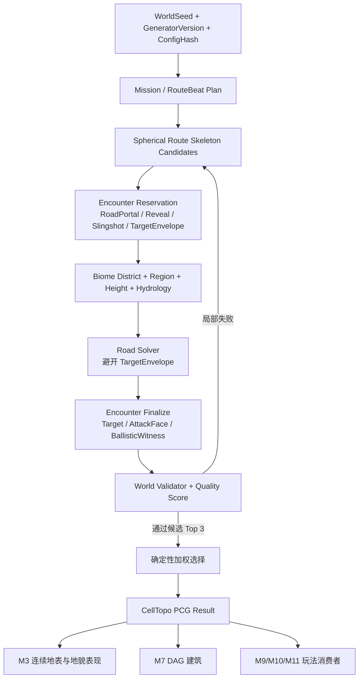

# M3R PCG 地图生成改进方案

> 状态：首周兼容方案已实现并通过自动化；月度重构仍待实施
> 日期：2026-07-28  
> 范围：M3 TaskGraph/球面空间布局、道路、遭遇点、地貌职责，以及与 M7/M9/M10/M11.0 的接口  
> 本次实现：只修改 M3 所属 C++ 与本文列出的 M3 文档；不修改蓝图、地图、资产或集成工作流

父文档：

- [AngryBirdsToSpaceGameDesign.md](AngryBirdsToSpaceGameDesign.md)
- [ABTSTaskGraphPCGDesign.md](ABTSTaskGraphPCGDesign.md)

直接下游：

- [M3TaskGraphTerrainPresentationDesign.md](M3TaskGraphTerrainPresentationDesign.md)
- [M7TaskGraphSphericalBuildingIntegrationDesign.md](M7TaskGraphSphericalBuildingIntegrationDesign.md)
- [M10ScoutMinimapDesign.md](M10ScoutMinimapDesign.md)
- [M9SatelliteGravityDesign.md](M9SatelliteGravityDesign.md)
- [M110PreFinaleClosureDesign.md](M110PreFinaleClosureDesign.md)

---

## 1. 结论

当前系统不需要推翻 `CellTopo + TaskGraph + 确定性约束搜索 + Validator` 的基础。真正需要重构的是“空间节奏”这一层：

1. 把固定角度的九个 Task Seed 改为可评分、可回溯的球面路线骨架；
2. 把“流程 Task”“可攻击建筑 Encounter”“地貌 Biome”从同一个区域概念中拆开；
3. 在铺路前预留道路外目标包络，联合求解道路入口、侦察点、弹弓槽、建筑朝向和弹道；
4. 用沿主路的 `FlowS/ProgressDistance`、视距矩阵和明确的验收阈值控制节奏；
5. 默认采用清晰的线性流程。只有支线能提供独占奖励、替代解或真正的风险收益时才生成支线；
6. M3 继续输出确定性的逻辑布局；M7 DAG2.3/后续 DAG2.4 生成建筑，UE PCG Graph 只消费布局属性做地貌与装饰表现。

首周兼容版只解决核心玩法是否成立：保留现有九 Task、三栋普通建筑和 M7 `Expected=3`，延长路线，使 B1 可从开局看到、B2/B3 不可从开局看到，并让三栋建筑离开主路。该兼容版现已落地；月度版仍按本文后半部分继续演进。

月度版再引入独立的 Encounter 序列，生成至少六栋相隔较远、难度递增、视觉签名不同的道路外可攻击建筑。

---

## 2. 实施前基线（审计快照）

### 2.1 实际生成链路

本轮首周修改前的运行链路为：

```text
AABTSM2Planet::BeginPlay
  -> RebuildPlanet
  -> AABTSM3Planet::GenerateLogicalTerrain
  -> Mission
  -> Task Seed / Region
  -> Height
  -> Hydrology
  -> Road
  -> BuildingPad
  -> Validator
  -> M3 连续地表/HISM 表现
  -> M7 消费 BuildingSpawnSites
```

关键代码位置：

- `Source/ABTSRuntime/Private/Planet/ABTSM2Planet.cpp:42-50`
- `Source/ABTSRuntime/Private/Terrain/ABTSM3Planet.cpp:81-95,152-155`
- `Source/ABTSRuntime/Private/PCG/ABTSM3TaskGraphGenerator.cpp:41-100`

默认逻辑球为：

- `Subdivision=5`；
- `CellCount=10242`；
- `PlanetRadiusCM=10000`，即半径 100 m；
- `MaxAttempts=16`；
- `TaskTargetCells=280`；
- `BuildingPadClearanceRingCells=2`；
- 卫星与终局发射区最小角距 55°。

### 2.2 修改前展示 Seed 的量化结果

展示 Seed `312503` 的 V3 fresh 日志：

```text
Assigned=2361
Wilderness=7881
RoadEdges=93
BuildingPad Task=1 Seed=4281 Anchor=4281 Shifted=0
BuildingPad Task=3 Seed=4352 Anchor=4352 Shifted=0
BuildingPad Task=5 Seed=5709 Anchor=5709 Shifted=0
BuildingPad Task=6 Seed=99   Anchor=99   Shifted=0
```

证据位于：

- `Saved/Logs/M7DAG23FreshGame_DAG23Final60_20260728.log:1411-1423`

由真实 Cell 方向计算：

| 项目 | 当前结果 |
|---|---:|
| Start → Workshop | 15.30° / 26.71 m |
| Start → TargetBuilding | 40.68° / 70.99 m |
| Start → FurnaceRuins | 65.43° / 114.20 m |
| Start → LaunchSite | 79.02° / 137.91 m |
| 相邻三栋建筑 | 约 44.87 m / 44.36 m |
| 未分配 Task 的 Cell | `7881 / 10242 = 76.95%` |

`RoadEdges=93` 包含主路、Trail 和 LateShortcut，不能当成主路长度。当前系统也没有输出可信的主路累计长度。

---

## 3. 四个现象的实施前根因分类

本节保留首周修改前的审计证据；已修复项及现行链路以第 12.4 节为准。

| 现象 | 现行设计合同 | 当前实现 | 判定 |
|---|---|---|---|
| 主路短、直，Task 同时可见 | 主线不得使用单条归一化插值直连；应生成多条球面骨架并按曲率、拥挤、自接近评分 | `MainAngles={0,.22,.42,.64,.86,1.10,1.36}`，只有小幅正弦侧移；道路没有长度、曲率或视距门槛 | 既有合同未落实，同时设计缺少硬阈值 |
| 支线无聊 | 文档将 `SatelliteWindow` 画成分支，但它又提供终局所需进度条件 | `2→7→8` 硬编码；`LateShortcut` 随机接 5 或 6；`RequiredKey` 没有进入运行时道路状态与 Validator | 设计语义矛盾 + 实现未形成玩法选择 |
| 建筑在道路上 | `TargetBuildingPad` 要求道路外距离；道路不得穿越建筑 Footprint | Height 先压平建筑 Task Seed；道路以 Task Seed 为端点；Pad 再按离 Seed 最近排序且不排除 `bRoad` | 明确实现偏离，并存在阶段顺序循环 |
| 大部分地形是 Wild | 现稿允许玩法区只占球面一部分，剩余为 Wilderness | 九 Task 预算总和约 2460 Cell，达到预算就停止，剩余约 77% 无 TaskId | 当前代码符合旧设计，但旧设计不满足现在的地图体验 |

### 3.1 “短而直”的具体原因

`ABTSM3SpatialBuilder.cpp:69-87` 只生成一组固定里程点；没有候选路线，也没有对以下指标做硬门槛：

- 主路累计长度；
- 相邻 Encounter 的沿路距离；
- 最大连续直行长度；
- 累计转角和有效弯道数；
- 路线自接近；
- Start/Reveal 点对未来目标的可见性。

`ABTSM3RoadPlanner.cpp:18-88` 的 Dijkstra 只考虑地貌、坡度、建筑 Anchor 和道路复用。它没有 incoming-edge 状态，无法计算转角；已有道路还有 `-0.35` 复用奖励，容易让多条 Link 过度重叠。

更严重的是，当前 `ProgressDistance` 在 `ABTSM3RoadPlanner.cpp:170-174` 中是从 Start 对全部 Cell 邻接图做普通距离场，不是“沿已解锁主路的累计进度”。这不能承担难度、建筑顺序或节奏的权威标尺。

### 3.2 “支线无意义”的具体原因

当前 `RequiredKey` 只被写进 `TaskLink`，没有运行时消费者。Validator 的可达性只检查 `bBlocksOnFoot`，不读取 Link 的 Key 或 Transport 状态。因此所谓 Branch/LateShortcut 目前主要是形状和日志元数据，不构成：

- 可选路线；
- 独占奖励；
- 能力门；
- 回程节省；
- 风险收益。

V3 又把“卫星必须远离 LaunchSite”的全局角距约束直接用于 Satellite Task Seed。展示 Seed 中 Launch→Satellite 已约 60.56°/105.69 m，于是一个终局隔离约束被意外转换成超长地表支路，却没有相应的内容。

### 3.3 “建筑在道路上”的确定性原因

目前不是偶发坏 Seed，而是管线会稳定地产生该结果：

1. Height 阶段把每个 Building Task 的 Seed 标为 Anchor 并压平；
2. Road 阶段把 Task Seed 当作 Link 的起终点，道路必然抵达 Seed；
3. BuildingPad 阶段清空 Anchor 后，按“与 Seed 方向最接近”排序；
4. Pad 只检查施工净空、可建和水域，不检查 `bRoad/MainRoadDistance`；
5. 所以 Seed 同时成为道路端点和建筑中心。

fresh 日志中四个 Pad 全部 `Shifted=0` 正是这个链路的结果。

不能只在现有 Pad 查找中补一个 `!bRoad`。这样会把建筑挪到未经预留与压平的位置，且水文和道路已经生成，仍会产生未平整、道路擦边或弹道无解。

### 3.4 “Wild 太多”的设计原因

`TaskId`、地貌主题与玩家是否处于有效玩法空间，目前被混成一个概念。剩余 Cell 虽然仍被噪声赋予 Plain/Forest/Highland/Mountain 外观，但在统计与任务职责上全部是 Wilderness。

月度版应拆成：

- `MissionOwnership`：哪些 Cell 属于 Task/Encounter/Room；
- `BiomeDistrict`：每个 Cell 的稳定视觉与资源主题；
- `PlayableEnvelope`：道路、观察点、弹弓槽和目标周边的玩家相关带；
- `BackgroundBiome`：球面背侧或远离流程的背景地貌。

全球可以保持稀疏的 MissionOwnership，但不应再让 77% 地表都以同一个“Wild”身份出现。

### 3.5 侦察答案还被调试 HUD 直接泄露

`AABTSM7GameMode` 当前默认：

```text
bShowTaskGraphPositionDebug=true
bDrawTaskGraphBuildingWorldLabels=true
```

对应位置：

- `Source/ABTSRuntime/Public/Game/ABTSM7GameMode.h:131-140`
- `Source/ABTSRuntime/Private/Game/ABTSM7GameMode.cpp:308-340`

它会把全部建筑经纬度写到屏幕，并在世界中绘制永久标签。即使 B2/B3 被球面和山脊遮挡，玩家仍会提前获得坐标。正式 PIE 与发行配置必须默认关闭；只允许通过 Editor-only CVar 显式开启。

### 3.6 文档—实现对照索引

| 合同 | 文档证据 | 实现证据 | 结论 |
|---|---|---|---|
| `CellTopo` 是唯一逻辑源，生成阶段分层 | `ABTSTaskGraphPCGDesign.md:29-50` | `ABTSM3TaskGraphGenerator.cpp:41-100` | 基础方向正确，应保留 |
| 主线不能用单条归一化直连，应候选化并评分 | `ABTSTaskGraphPCGDesign.md:198-220` | `ABTSM3SpatialBuilder.cpp:69-87` | 未落实 |
| 道路应区分 Main/Nearest/Progress Distance | `ABTSTaskGraphPCGDesign.md:304-310` | `ABTSM3RoadPlanner.cpp:160-174` | 字段存在，但 Progress 语义错误 |
| TargetBuilding 是道路外目标，Pad 含攻击正面与道路外距离 | `ABTSTaskGraphPCGDesign.md:120-131,143-153` | `ABTSM3BuildingPadPlanner.cpp:62-92` | 未落实 |
| 道路不得穿越建筑 Footprint | `ABTSTaskGraphPCGDesign.md:294-302,364-375` | Road 先到 Seed，Pad 后选 Seed | 未落实且生成顺序矛盾 |
| Slingshot/Target 必须联合求解弹道 Witness | `ABTSTaskGraphPCGDesign.md:326-336` | M3 Validator 无弹道接口 | 尚未实施，现稿状态段也承认 |
| Task 内应有 Room/SetPiece 原型 | `ABTSTaskGraphPCGDesign.md:120-131,226-239` | Region 只有轮询 BFS 预算增长 | 尚未实施 |
| 剩余地表允许成为 Wilderness | `ABTSTaskGraphPCGDesign.md:226-237` | 约 77% Cell 无 TaskId | 实现符合旧稿，但旧稿需适配新体验 |
| M3 只做连续地表与 BuildingSpawnSites 表现 | `M3TaskGraphTerrainPresentationDesign.md:9-26,239-252` | M7 从 SpawnSites 消费建筑位置 | 已落实，不应把新权威逻辑塞进表现层 |
| 当前生产世界固定三栋普通建筑 | `M7TaskGraphSphericalBuildingIntegrationDesign.md:82-123`、`ABTSProjectWorkflow.md:57` | M7 只消费 Workshop/Target/Furnace | 首周保留；月度六栋需要跨 M3/M7 改合同 |

### 3.7 需要从设计稿层面修改的内容

后续实施时应同步修订下列父子文档，而不是只改代码：

1. **`ABTSTaskGraphPCGDesign.md`**
   - 加入主路长度、相邻 Beat 间距、最大直行段、PVS 和路线自接近硬门槛；
   - 新增 `RouteBeat/EncounterContract/BiomeDistrict/PlayableEnvelope`；
   - 解决“Building Footprint 在道路前预留、SetPiece 又在道路后选择”的阶段循环；
   - 将 SatelliteWindow 明确为主线训练 Beat，或补完整 BranchUtility；
   - 把 V1 历史描述与 V3 当前实现分开，不能继续声称候选骨架、Room 和弹道均已落地。

2. **`AngryBirdsToSpaceGameDesign.md`**
   - 填写目前为空的第一周与第二至四周地图日程；
   - 把“一座目标建筑”的初版演示合同与“六个 Encounter”的月度合同明确分档；
   - 冻结“第一栋可见、其余按 Reveal 节奏隐藏”的玩家体验；
   - 明确线性主线是默认方案，支线不是 PCG 数量指标。

3. **`M3TaskGraphTerrainPresentationDesign.md`**
   - 继续保持只读表现职责；
   - 将旧的单一 `RoadDistance` 说明更新为 Main/Nearest/Progress/FlowS；
   - 只消费 BiomeDistrict、PlayableEnvelope 和 Encounter 属性，不决定任务布局。

4. **`M7TaskGraphSphericalBuildingIntegrationDesign.md`**
   - 首周继续冻结 `Expected=3`；
   - 月度版改为动态 Accepted Encounter 数量；
   - 接入 DifficultyBand、VisualSignature、ProfileTags 和 AttackFace；
   - 加入六栋建筑的分批 IdleValidation、远端冻结和刚体预算。

5. **`ABTSProjectWorkflow.md`**
   - 首周加入 B1/B2/B3 可见性、主路里程、Road/Footprint 零重叠验收；
   - 月度加入 1000 Seed、六建筑、难度/形态、PVS、Biome 和弹道门槛；
   - 保留 M11.0 的 Launch 无建筑、唯一 Space 槽对和卫星隔离回归。

---

## 4. 案例调研及可迁移结论

### 4.1 Warframe：先有节奏模板，再连接空间块

Warframe 使用设计师制作的 Start、Connector、Intermediate、Objective、Exit 等空间块，再按程序模板、接口和回溯约束组合。其距离图沿实际拓扑计算，而不是使用直线距离；还维护 visibility/influence 等辅助图。[Daniel Brewer, “Managing Pacing in Procedural Levels in Warframe”](https://www.gameaipro.com/GameAIProOnlineEdition2021/GameAIProOnlineEdition2021_Chapter07_Managing_Pacing_in_Procedural_Levels_in_Warframe.pdf)

可迁移：

- 先冻结 Encounter 节奏序列，再解空间；
- 连接段和玩法段交替，避免连续空走或任务扎堆；
- 生成后计算真实 Flow Distance 和可见性；
- 多候选、回溯、失败原因统计和批量 Seed 测试。

不迁移：

- 不把球面切成 Warframe 式封闭房间；
- 不要求大量手工走廊模块。

### 4.2 Left 4 Dead：Flow Distance 与可见性比欧氏距离更有用

Left 4 Dead 的地图拓扑本身不是程序生成的，但 AI Director 依赖 NavMesh 的 Flow Distance、逃生路线、ahead/behind、potential visibility 和 active area 来控制节奏。[Valve AI Systems of Left 4 Dead](https://steamcdn-a.akamaihd.net/apps/valve/2009/ai_systems_of_l4d_mike_booth.pdf)、[Replayable Cooperative Game Design](https://steamcdn-a.akamaihd.net/apps/valve/2009/GDC2009_ReplayableCooperativeGameDesign_Left4Dead.pdf)

可迁移：

- 把 `FlowS` 作为路线进度的权威；
- 用 PVS/视距矩阵决定何时让玩家看到下一个目标；
- 由设计提供候选位置与节奏规则，程序在其中选择。

必须避免的误读：

- 不能声称 Left 4 Dead 程序生成地图；这里借鉴的是其流向和可见性建模。

### 4.3 Deep Rock Galactic：手工原型串珠 + 程序走廊/变体

Deep Rock Galactic 把经过验证的洞室原型当作“绳上的珍珠”，再以弯曲隧道连接，并根据任务长度、类型和难度施加变形、镜像和主题层。[Ghost Ship Games 官方开发文章](https://store.steampowered.com/news/app/548430/view/4593196713081471258)

可迁移：

- 六个建筑关是六颗“珍珠”，道路是连接节奏，不是把目标本身串在路面上；
- 局部 Encounter 使用少量可靠原型，整体路线与组合关系程序化；
- Biome/装饰在逻辑骨架之后覆盖，不反过来决定任务。

### 4.4 Hades、XCOM 2 与任务—空间分层：受控变化优于全局噪声

Hades 的经验是：完整手工房间加规则化变体，往往比随机摆放大量微型组件更容易保证质量。[Konsoll: Hand-Crafted Variance—Designing Hades’ Underworld](https://konsoll.org/talks/hand-crafted-variance-designing-hades-underworld/)

XCOM 2 用高层 Plot 决定结构、手工 Parcel 保证局部战术质量。[GDC Vault: Plot and Parcel](https://www.gdcvault.com/play/1025213/Plot-and-Parcel-Procedural-Level)

Joris Dormans 将 mission generation 与 space generation 明确拆成两个阶段，避免让地形随机过程反过来破坏任务结构。[“Generating Missions and Spaces for Adaptable Play Experiences”](https://research-portal.uu.nl/en/publications/generating-missions-and-spaces-for-adaptable-play-experiences/)

对应本项目：

- 先解主线与能力门；
- 再解 Encounter 入口、观察点、弹弓槽和目标；
- 最后填地貌、资源、植被和建筑形态；
- 不让噪声、WFC 或装饰节点决定主线可达性。

### 4.5 Unreal PCG 的合理边界

UE PCG 点可携带 Transform、Bounds、Density、Seed 和自定义 Attribute，适合消费已经确定的 `FlowS/EncounterId/Biome/Difficulty` 做道路边缘、地貌散布和装饰。[Epic PCG Overview](https://dev.epicgames.com/documentation/en-us/unreal-engine/procedural-content-generation-overview)、[PCG Generation Modes](https://dev.epicgames.com/documentation/en-us/unreal-engine/using-pcg-generation-modes-in-unreal-engine)、[Shape Grammar](https://dev.epicgames.com/documentation/en-us/unreal-engine/using-shape-grammar-with-pcg-in-unreal-engine)

结论：

- 宏观任务图、球面路线、视距、弹道和能力门继续由纯数据 C++ 权威生成；
- UE PCG Graph 只做消费者，不决定任务顺序；
- PCG Biome 插件仍标为 Experimental，不作为月度版本必须依赖。[Epic PCG Biome 文档](https://dev.epicgames.com/documentation/unreal-engine/procedural-content-generation-pcg-biome-core-and-sample-plugins-in-unreal-engine?lang=en-US)

---

## 5. 目标体验：线性但不透明

本项目不需要把地图变成开放世界。玩家应该始终理解“下一阶段大致往哪里走”，但不应在开局同时看到所有建筑和答案。

推荐的基础节拍：

```text
道路旅行
  -> 远景/地标提示
  -> 到达 Reveal/Scout 点
  -> 发现道路外目标及影响因素
  -> 准备材料与弹弓
  -> 发射并破坏
  -> 回收奖励/解锁能力
  -> 道路转折或地貌切换
  -> 下一 Encounter
```

关键区分：

- **引导不等于剧透**：道路、天际线和地貌告诉玩家前进方向；侦察才揭示精确目标和弹弓解。
- **道路外不等于随机远离道路**：每栋目标建筑都属于一个完整 Encounter，必须有 Reveal、Slingshot、Target 和 Exit 的空间关系。
- **线性不等于笔直**：主线可以没有路线选择，但应通过球面转折、山脊、河谷和目标揭示形成节奏。
- **第一栋可见是教学**：它建立“前进—建造—发射—破坏”的目标；后续建筑隐藏，才让青翎侦察与超视距弹道有意义。

---

## 6. 月度版权威架构



### 6.1 不再把所有职责塞回 M3 表现层

现有 M3 表现稿已经规定：`AABTSM3Planet` 只消费逻辑结果构建连续地表、道路/河流/地貌表现和 `BuildingSpawnSites`。月度重构可沿用 M3 里程碑名，但新增逻辑应继续拆为普通 C++ 数据模块：

```text
FABTSMissionBeatPlanner
FABTSSphericalRoutePlanner
FABTSEncounterPlanner
FABTSBiomeDistrictPlanner
FABTSVisibilityValidator
FABTSWorldQualityEvaluator
```

`FABTSM3TaskGraphGenerator` 只做 Orchestrator，不成为新的巨型 God Object。

### 6.2 Mission、Encounter、Room、Biome 的职责

| 概念 | 回答的问题 | 是否覆盖全球 |
|---|---|---:|
| Mission Task | 玩家先做什么、拿到什么 Key、何时解锁下一段 | 否 |
| Route Beat | 旅行、揭示、攻击、奖励等节拍在主路上的顺序 | 否 |
| Encounter | 一次可侦察、可发射、可破坏、可回收的建筑关 | 否 |
| Room/Pocket | 局部入口、观察、弹弓、目标、奖励空间 | 否 |
| Biome District | 该处视觉、资源和地形主题是什么 | 是 |
| Playable Envelope | 哪些 Cell 影响玩家路线和可见体验 | 否 |

不要再用 `TaskType==Workshop/Target/Furnace` 隐含“这里一定生成一栋同用途建筑”。

建议增加：

```text
EncounterRole:
  FacilityShell
  DestructibleTarget
  Landmark
  RewardCache

BuildingPurpose:
  Crafting
  ProgressionTarget
  ResourceTarget
  GravityTraining
  FinaleSupport
```

月度验收中的“至少六栋 PCG 建筑”专指六个 `DestructibleTarget`。Workbench/Furnace 等设施可以作为 Landmark/Facility，不计入六栋；LaunchSite 继续遵守 M11.0 的“无普通建筑”合同。

---

## 7. 路线骨架与 Flow

### 7.1 生成方法

每个 Seed 生成 4–8 条球面路线候选，每条由有序 Beat 控制点组成：

1. 选择 Start 方向和初始切向；
2. 按主路目标长度与 Beat 间距生成下一控制点；
3. 在当前切平面选择有限转向角，再用球面指数映射回单位球；
4. 拒绝近似回头、局部自交、过早接近旧路段和接近对跖点的不稳定候选；
5. 为每个控制点建立允许道路穿行的 Corridor Mask；
6. Height/Hydrology 完成后，在 Corridor 内使用带状态的 A*/Dijkstra 铺路；
7. 收集最多三个硬约束通过的候选，再按归一化质量权重做确定性选择。

这不是把固定 `MainAngles` 数组加长，而是从“单一路径一次通过”改为“候选—约束—评分—局部回溯”。

### 7.2 Road Solver 状态

为了控制道路既不笔直也不锯齿，搜索状态应为：

```text
(CellId, IncomingEdgeId)
```

建议代价项：

```text
StepCost
  = Distance
  + TerrainCost
  + SlopeCost
  + OutsideSkeletonCorridorPenalty
  + SharpTurnPenalty
  + UTurnPenalty
  + ReservedEncounterPenalty
  + Water/CrossingCost
  + CappedRoadReuseBias
```

说明：

- Scenic 弯曲主要由骨架控制点提供；
- `SharpTurnPenalty` 只消除 Cell 级锯齿，不负责把路变直；
- 道路复用奖励必须封顶，避免不同 Link 全挤在同一段；
- Target Footprint 与 NoRoad Envelope 是硬禁止区，不是高代价软区。

### 7.3 三种距离与新增 FlowS

必须保留并正确区分：

- `NearestRoadDistance`：到任意道路的拓扑距离；
- `MainRoadDistance`：到主路的拓扑距离；
- `ProgressDistanceCM`：从 Start 沿当前已解锁主路/交通图的累计代价；
- `FlowS = ProgressDistanceCM / MainRouteTotalCM`：`[0,1]` 规范化主线进度。

主路上的 Cell 直接得到累计里程；主路外 Cell 由最近主路投影点的累计里程加侧向代价派生。不能再把从 Start 穿越任意地表 Cell 的 BFS 距离叫作 ProgressDistance。

### 7.4 月度初始参数窗

以下是以当前 100 m 半径球和 6.2–6.8 m/s 地面速度为基准的首轮调参窗，不是永远不变的物理常量：

| 指标 | 建议初始窗 |
|---|---:|
| 主路累计长度 | 280–360 m |
| 相邻建筑 Encounter 沿路间距 | 35–60 m |
| 最大无有效转折连续路段 | 45–55 m |
| 有效 Scenic Bend | 至少 3 个 |
| 同时从 Start 直接可见的可攻击建筑 | 恰好 1 |
| 路线自接近 | 非有意回环段不得小于 3–4 Cell |

280–360 m 对应约 41–58 秒纯步行；攻击、采集、侦察和桥梁玩法会显著扩展总关卡时长，而不会把时间主要浪费在跑图上。

---

## 8. Encounter 联合求解

### 8.1 EncounterContract

每栋可攻击建筑至少输出：

```text
EncounterId
EncounterRole
FlowS / DifficultyBand
RequiredKeys / GrantedKeys

RoadArrivalPortal
ScoutRevealPocket
SlingshotPocket + SlingshotTier
TargetBuildingEnvelope
TargetAnchor
AttackFace / BuildingForward
RewardPocket
ExitPortal

Min/MaxMainRoadDistanceCells
StartVisibilityPolicy
RevealVisibilityPolicy
FutureTargetVisibilityPolicy
BallisticWitness
NegativeWitnessForPreviousTier

TerrainArchetype
M7StructureProfile
MaterialProfile
VisualSignature
```

### 8.2 两阶段放置，打破建筑—道路循环

**道路前：Encounter Reservation**

1. 在 Beat 的里程窗内选择 RoadArrival 候选；
2. 在其侧向选择 Target Envelope、Reveal 和 Slingshot 候选；
3. 预留建筑 Footprint 和 NoRoad Ring；
4. 把 Footprint 作为 Height 的硬平整锚；
5. Hydrology 必须尊重建筑、弹弓和必要攻击走廊。

**道路后：Encounter Finalize**

1. 在预留 Target Envelope 内选最终 Anchor；
2. 检查 Footprint 全圈可建、无水、无道路；
3. 选择 M7 Profile 与攻击正面；
4. 从 SlingshotPocket 调用 M6 预测器生成 Ballistic Witness；
5. 检查侦察揭示、可见性、资源和能力门；
6. 失败时先换局部 Pocket/Profile/朝向，再回滚当前路线候选。

### 8.3 道路外距离不是越大越好

目标偏离主路必须同时满足：

- 从道路不能直接读取完整攻击答案；
- 青翎侦察半径可以覆盖；
- 当前弹弓档位存在命中解；
- 上一档能力在需要时不存在命中解；
- 建筑 Footprint 不与道路重叠；
- 玩家不会因为不知道去哪里而迷路。

建议随阶段逐步扩大侧向距离：

| Encounter | 初始偏路窗 |
|---|---:|
| E1 教学 | 1–2 Cell |
| E2 | 2–4 Cell |
| E3 | 3–5 Cell |
| E4 | 4–6 Cell |
| E5 | 5–7 Cell |
| E6 | 6 Cell 以上，但仍需 Ballistic/Scout Witness |

逻辑 Cell 的实际世界尺寸应在日志中输出，验收以厘米和 Cell 两种单位同时记录。

### 8.4 可见性矩阵

生成期不要用 HISM 渲染结果反推逻辑。为每个观察点和 Target 的代理 Bounds 建立确定性 PVS：

1. 观察点使用默认相机高度/最远 OrbitDistance 的保守样本；
2. Target 使用对应 M7 Profile 的顶部、中心和攻击面采样点；
3. 先解析判断理想球体遮挡；
4. 再沿视线采样 `CellTopo + TerrainVisualField` 高度包络；
5. PIE 中用真实连续地表 Trace 做二次回归验证。

至少输出以下矩阵：

```text
Start          -> B1 Visible
Start          -> B2..B6 Hidden
Reveal(Ei)     -> Bi Visible
PreReveal(Ei)  -> Bi Hidden 或仅显示模糊地标
Reveal(Ei)     -> B(i+2)..B6 Hidden
```

仅使用球面角距不够。当前相机默认 OrbitDistance 约 8.5–13 m，建筑高约 4.8–5.2 m，高机位和高建筑会扩大地平线视距。

### 8.5 弹道 Witness

每个 Encounter 必须保存至少一条可复现的低成本发射解：

```text
SlingshotTransform
BirdClass / SlingshotTier
LaunchDirection
LaunchPower
PredictedImpact
Clearance
TargetProxy / AttackFace
SolverVersion / Hash
```

若该 Encounter 用于能力升级，还应保存上一档能力的 Negative Witness，证明旧弹弓不能轻易绕过阶段。

M3 只保存验证结果和输入，不复制一套与 M6 不同的弹道公式。

---

## 9. 六建筑月度节奏建议

以下是空间与难度原型，不冻结美术题材名称：

| Encounter | 引导/机制 | 道路外关系 | 建筑形态方向 | 难度来源 |
|---|---|---|---|---|
| E1 可见教学仓 | 开局可见，建立首个长期目标 | 近侧袋形空间 | 低矮木框/单层仓 | 近距、宽攻击面、明显承重柱 |
| E2 林脊货仓 | 第一次必须侦察 | 山脊后方 | 偏置单塔/悬挑仓 | 遮挡、较窄攻击面 |
| E3 河岸工事 | 桥梁与水域射界 | 隔河或河湾侧面 | 双墩桥式/门洞 | 水面净空、落点回收风险 |
| E4 高地石堡 | 强化弹弓教学 | 高差侧袋 | 高塔/退台塔 | 射程、石材、弱点朝向 |
| E5 卫星观测站 | M9 引力直觉练习 | 主路上的练习窗口指向远端目标 | 非对称拱架/金属塔 | 卫星偏转、成功走廊 |
| E6 终局前中继堡 | 普通地图最终考试 | 深侧袋/陨石坑外缘 | 多层堡/单侧高塔 | 精确弹道、复合材质、最小净空 |

约束：

- 六栋均为普通 PCG `DestructibleTarget`；
- LaunchSite 不生成普通建筑；
- 至少四种明显 Silhouette Family；
- 六栋 `VisualSignature` 不完全相同；
- 相邻两栋不得使用相同的轮廓 + 主材质 + 弱点组合；
- `DifficultyBand` 非递减，且六栋中至少出现三次严格上升；
- 难度不能只由材料血量定义，必须综合射程、遮挡、弹弓档位、攻击面、结构和回收风险。

M7 现有 Workshop/Target/Furnace 三 Profile、`Budget=0` 和固定 `Expected=3` 无法直接满足此目标。月度版需要：

- `ExpectedBuildingCount = AcceptedDestructibleEncounterCount`；
- M3 向 M7 传递 `DifficultyBand/VisualSignature/ProfileTags/AttackFace`；
- 从 DAG2.4/WFC 研究中的已验证轮廓池选择，而不是在 M3 重写建筑算法；
- 六栋物理建筑分批 IdleValidation，验收后冻结远端建筑，仅激活当前/相邻 Encounter，遵守活跃刚体预算。

---

## 10. 支线决策

### 10.1 推荐默认：月度版不强制生成可选支线

本项目是按能力递进的 minigame。清晰、弯曲、有揭示节奏的主线，比“为了看起来像 PCG 而多一条无内容岔路”更合适。

当前 `SatelliteWindow` 建议改为主线上的**卫星训练 Beat**：

- 地面练习位置沿主路生成；
- 卫星天体方向由 M9/M11.0 的空间约束单独决定；
- “卫星远离终局 LaunchSite”不再自动生成一条通往卫星方向的地表道路；
- 删除没有运行时语义的 LateShortcut，或等真正实现 Branch Utility 后再恢复。

### 10.2 若保留支线，必须满足 BranchUtilityContract

支线只有同时满足以下条件才允许进入 Accepted Layout：

```text
Optional = true
UniqueReward 或 AlternativeAttackSolution 或 TrainingValue 至少一个成立
与主路空间分离 >= 4 Cell
支线深度 <= 1
有明确回接
取得对应 Key 前 Shortcut 不可通行
回接后至少节省 25% 的对应回程
不会绕过主线能力门
```

否则生成器应选择“无支线”模板，而不是保留装饰性分叉。

---

## 11. Biome 与 Playable Envelope

### 11.1 目标

不通过“把整个球面硬分给最近 Task”来消灭 Wild。正确做法是：

- 所有 Cell 都有 `BiomeDistrictId`；
- Task/Encounter Ownership 仍然稀疏；
- 主路和 Encounter 周边形成连续的 Playable Envelope；
- 球面背侧可以是低成本 BackgroundBiome；
- UI 不再把全部 `TaskId==None` 的 Cell 统一显示成 Wild。

### 11.2 月度初始验收值

| 指标 | 目标 |
|---|---:|
| BiomeDistrict 覆盖 | 100% Cell |
| Playable Envelope 内有明确 Route/Room/Biome 职责 | ≥ 75% |
| Playable Envelope 内 DeepWild | ≤ 20% |
| 全局 MissionOwnership | 不设强制高比例 |
| 连续相同视觉节拍 | 建议 20–45 m，避免逐 Cell 碎片化 |
| 六 Encounter 的主地貌主题 | 至少 4 类 |

“全局 Wilderness 比例”继续记录，但不再单独决定通过/失败。真正要验收的是玩家可见、可达、可侦察区域是否有清晰的地貌职责与视觉节奏。

---

## 12. 首周兼容小修方案

### 12.1 范围冻结

首周不做：

- 六建筑扩容；
- Mission Graph 重写；
- M7 DAG2.3 建筑算法修改；
- UE PCG Biome 接入；
- M11 终局布局修改。

首周保持：

- 九个现有 Task；
- 三栋普通 M7 建筑；
- `Expected=3`；
- LaunchSite 无普通建筑；
- M9 卫星与 LaunchSite 至少 55° 分离；
- 现有桥门、资源与 M11.0 合同。

### 12.2 建议实施顺序

1. **先补指标与日志**
   - 主路累计厘米；
   - 每个 Task/Building 的 `FlowS/ProgressDistanceCM`；
   - Anchor 到主路距离；
   - StartLOS；
   - Slingshot 到 Target 距离；
   - Ballistic Witness 结果；
   - 路线有效弯道、最长直行段。

2. **把固定角度改成可调里程窗**
   - 首轮展示 Seed 可从更保守的角度起点校准：

   ```text
   {0.00, 0.20, 0.78, 1.15, 1.38, 1.78, 2.10} rad
   ```

   - 对应 B1≈0.20 rad、B2≈1.15 rad、B3≈1.78 rad；
   - SlingshotRange≈0.78 rad，与 B2 相差约 0.37 rad/37 m；
   - Launch≈2.10 rad/210 m；
   - 该数组只是兼容补丁的初始猜测，是否通过以默认相机和真实地形 LoS 为准。

3. **拆开 RoadPortal 与 BuildingAnchor**
   - 道路仍连接 Task 的 `RoadPortalCellId`；
   - BuildingAnchor 在同一 Task 内侧向选择；
   - 默认施工净空为 2-ring，因此建筑中心到主路的安全下限不能小于 3 Cell；
   - B1/B2/B3 的默认最小偏路距离分别为 3/4/5 Cell，并各自允许再搜索 3 Cell；
   - Footprint 全圈禁路；
   - 预留/压平必须发生在道路前。

4. **加入最小可见性 Gate**
   - B1 从默认开局相机可见；
   - B2/B3 从默认开局相机不可见；
   - 不只按球面角距判断；
   - 禁止依赖植被作为唯一遮挡。

5. **关闭正式配置中的位置剧透**
   - TaskGraph 屏幕坐标和世界标签默认关闭；
   - 只保留 Editor-only CVar。

6. **回归现有系统**
   - 三栋仍走 M7 DAG2.3；
   - M7 三栋均通过 IdleValidation；
   - M9/M11.0 的 103 Seed 分离测试不回退；
   - 桥前锁、桥后通、资源与发射流程不回退。

### 12.3 已实现的首周链路（2026-07-28）

首周实现保持 `GeneratorVersion=3`，以维持 M11 已冻结的兼容身份；新增 `LayoutPolicyVersion=1` 区分本轮布局策略，`ConfigHash` 覆盖策略、Planet 实际几何输入和量化后的有序 `CellTopo`，`LayoutHash` 标识接受后的 Task/Portal/Anchor/Corridor 结果。世界生成合同签名和稳定枚举不变。

实际生成顺序已调整为：

```text
Mission
  -> Spatial Seed / Region
  -> BuildingPad Reserve
       RoadPortal / BuildingAnchor / NoRoad Ring
  -> Height（压平已预留 Anchor）
  -> Hydrology
  -> Road（硬避让普通建筑 NoRoad Ring）
  -> BuildingPad Certify（不得重选）
  -> World Validator（路线 / 间距 / 视距 / 跨阶段合同）
```

已实现：

- `FirstWeekMainRouteAngularSpanDegrees=120°`，七个主线 Beat 使用可调总跨度和冻结的首周归一化节奏；
- 每条 `TaskLink` 输出 `CorridorLengthCM`；
- Task/Cell 输出权威 `ProgressDistanceCM` 和 `FlowS`，旧整数 `ProgressDistance` 只保留为最近主路线序投影；
- 普通建筑的 `RoadPortalCellId` 与 `BuildingAnchorCellId` 分离，RoadPlanner 对 `bBuildingRoadExclusion` 做硬禁止；
- Workshop/TargetBuilding/FurnaceRuins 默认最小主路距离为 3/4/5 Cell；
- 候选 Anchor 的比较使用量化整数分数和 CellId 最终裁决，避免近似浮点比较破坏严格排序；
- `BuildingPad Certify` 除离散 NoRoad Ring 外，还使用 Planet 实际半径、平台半尺寸、边缘混合带、道路半宽与 25 cm 安全余量，拒绝连续道路带与施工台扩展矩形相交的候选；候选边预筛角由这些实际尺寸和边角跨度动态推导，不使用固定角度；
- LaunchSite 仍以 Seed 作为道路端点和唯一终局施工 Anchor，不生成普通道路禁入环，但在压平前必须证明 `SafeRings+1` 护环仍完整属于 LaunchSite Task；
- 普通建筑的生成朝向由 RoadPortal 指向 BuildingAnchor，M7 继续消费既有 `BuildingSpawnSites`；
- 纯数据视距验证使用当前 M4 默认/最大 OrbitDistance（850/1300 cm）、60° 仰角和 M7 建筑高度代理，要求 B1 两档均可见、B2/B3 两档均隐藏；
- Validator 拒绝不连续或非相邻重复 Cell 造成的主路自重叠；
- `[ABTS][PCG][Accepted]` 输出布局策略/配置/结果身份、主路厘米、相邻建筑最小沿路间距和 `11/00/00` 视距摘要。

展示 Seed `312503` 的 fresh 自动化结果为：

```text
LayoutPolicy=1
ConfigHash=2795535429
LayoutHash=2577447183
MainRouteCM=24583.4
BuildingGapCM=7736.8
Visibility=11/00/00
SatelliteLaunchSepDeg=90.30
```

21 个首周测试 Seed 的主路约为 230–263 m，最小相邻建筑沿路间距为 71.9 m，全部超过 180 m / 35 m 硬门槛；上端略高于最初 200–240 m 调参目标窗，但不会影响本轮“B2/B3 出视距”的核心合同，后续可在真实 PIE 步行节奏验收后决定是否收窄总跨度。

自动化门禁：

- `ABTS.M3.WeekOne`：2/2；
- `ABTS.Contracts.WorldGeneration`：2/2；
- `ABTS.M110.TaskGraphFinaleSeparation`：1/1，覆盖原有 103 个布局 Seed。

首周测试不直接复用 Summary 做自证：它独立重算每条 Corridor 球面弧长、多源 BFS 主路距离、主路线 Cell 唯一性，并对展示 Seed 暴力搜索最近 Cell 复算六项视距结果；确定性用例还分别扰动布局配置、连续几何输入和 `CellTopo` 元数据，证明 `ConfigHash` 会响应全部三类输入。Fresh-process 证据位于 `Saved/Logs/M3WeekOne-20260729-001224-FreshAutomation-NoMessaging.log`、`M3-WorldContracts-20260729-001305-FreshAutomation-NoMessaging.log`、`M3-M110Separation-20260729-001527-FreshAutomation-NoMessaging.log` 与 `M3-LABTSM3-20260729-001627-FreshRuntime-NoMessaging.log`。

正式 PIE 中默认关闭 M7 位置标签属于 M7/集成所有权，本 M3 工作树没有越权修改；集成时仍需按多工作树交接清单完成该项人工验收。

### 12.4 首周是否调整 Wild

不建议把 `TaskTargetCells` 翻倍当成正式答案。将 280 临时提高到 560–600，理论上可把未分配比例降到约 49–52%，但会扩大 Task 区、改变水文与终局候选通过率，并没有解决 MissionOwnership 与 Biome 混用。

首周优先保证三栋建筑的路线、视距和弹弓闭环。若展示必须降低 Wild，可把 560–600 作为单独受控实验，并强制跑现有 103 Seed 回归；月度版仍应按第 11 节拆分 BiomeDistrict。

---

## 13. 首周正式验收门槛

固定展示 Seed 和至少 20 个布局 Seed 必须满足：

### 13.1 路线

- 主路累计长度 `>= 18000 cm`，目标调参窗 200–240 m；
- Start→Launch 的 `ProgressDistanceCM` 必须沿主路计算；
- 相邻三栋建筑的沿路间距 `>= 3500 cm`；
- 不再用 Start 到 Cell 的全地表 BFS 代替主路进度。

### 13.2 可见性与侦察

- `StartVisible(B1)=true`；
- `StartVisible(B2)=false`；
- `StartVisible(B3)=false`；
- 正式 PIE 中不得出现全部建筑经纬度或永久世界标签；
- B2/B3 必须在其预定 Reveal/Scout 点被发现；
- 验收使用默认与最大 OrbitDistance 两组相机样本。

### 13.3 道路外建筑

- 三栋建筑 Anchor 均不在 Road Cell；
- 建筑 Footprint/NoRoad Ring 与道路重叠数为 0；
- 以 Planet 实际几何参数展开后的平台矩形与连续道路带重叠数为 0；
- B1/B2/B3 的 `MainRoadDistanceCells` 分别不小于 `3 / 4 / 5`，并受各自最小值加 `BuildingAnchorSearchSlackCells` 的搜索上限约束；默认 2-ring Footprint 与道路零重叠；
- 每栋均有当前弹弓档位的 Ballistic Witness；
- RoadPortal、SlingshotPocket、TargetAnchor 三者不能是同一 Cell。

### 13.4 跨阶段回归

- 普通建筑仍恰好 3 栋；
- `BuildingContractSealed Expected=3 Registered=3 SetupRejected=0`；
- 三栋全部 `IdleValidation Accepted=1` 后才允许 `WorldReady=1`；
- LaunchSite 不生成普通建筑；
- 卫星与 LaunchSite 保持 `>=55°`；
- 现有 M11.0 103 Seed 自动化通过；
- 相同 Seed + GeneratorVersion + LayoutPolicyVersion + ConfigHash 输出相同布局 Hash。

---

## 14. 月度实施路线

### Week 1：Schema 与质量度量

- 引入 `RouteBeatPlan/EncounterContract/BiomeDistrict`；
- 修正 `ProgressDistance` 并增加 `FlowS`；
- 建立视距矩阵和路线质量日志；
- 建立 V3 基线与新版本 Hash；
- 保留 V3 fallback 仅用于回归，不继续扩功能。

### Week 2：球面路线与 Encounter Solver

- 4–8 条球面骨架候选；
- Corridor Mask + 带 incoming-edge 的道路搜索；
- Encounter Reservation/Finalize 两阶段；
- RoadPortal、Reveal、Slingshot、Target 联合求解；
- 完成六个 Encounter 的资源/能力顺序。

### Week 3：六建筑与地貌表现

- M3→M7 传递 Difficulty/Visual/Profile/AttackFace；
- `Expected` 改为 Accepted Encounter 动态数量；
- 至少四种轮廓族与六个不同 VisualSignature；
- BiomeDistrict 100% 覆盖；
- UE PCG Graph 或现有 HISM 消费逻辑属性做道路边缘和局部装饰；
- 远端建筑分批物理验收与冻结。

### Week 4：自动化、PIE 与调参

- 大规模 Seed sweep；
- PVS/弹道/资源/桥门/分支状态验证；
- 30/60/120 FPS fresh PIE；
- 路线长度、步行时长、侦察揭示和六关难度调参；
- 固化展示 Seed 和失败回退模板。

---

## 15. 月度正式验收门槛

### 15.1 确定性与搜索

- 相同 Seed + GeneratorVersion + LayoutPolicyVersion + ConfigHash 的结果 Hash 完全一致；
- 至少 1000 Seed 的纯数据 sweep 无崩溃、无非法索引、无无限回溯；
- 输出每阶段尝试数、回溯数和 RejectReason；
- 不再默认“Attempt 0 第一个硬通过结果即 Accepted”；
- 失败时使用经过认证的线性 fallback，不回退到旧 M3 建筑生成链。

### 15.2 路线节奏

- 主路累计长度 280–360 m；
- 至少六个普通建筑 Encounter；
- 相邻 Encounter 沿路间距 35–60 m；
- 有效 Scenic Bend 至少 3 个；
- 最大无有效转折连续路段不超过 55 m；
- 非有意回环不发生近距离自接近；
- Start 同时直接可见的可攻击建筑恰好 1。

### 15.3 可见性与引导

- B2–B6 不得从 Start 完整可见；
- 每个 Bi 在自己的 Reveal 点可见或可由青翎侦察确认；
- 在 Ei 的 Reveal 点，不提前完整暴露 E(i+2) 以后的目标；
- 道路/地标始终给出下一阶段方向，不要求玩家盲搜全球；
- 正式 UI 不显示未侦察建筑坐标。

### 15.4 遭遇与弹道

- 六栋 Target Footprint 与道路重叠为 0；
- 每栋均有合法 RoadArrival、Reveal、Slingshot、Target、Reward、Exit；
- 每栋均有当前档位 Ballistic Witness；
- 需要能力门的关卡具有上一档 Negative Witness；
- 攻击轨迹不穿禁止体积，目标落点与材料回收不造成主线软锁；
- 所有 Witness 都由实际 M6/M9 预测接口验证。

### 15.5 难度与视觉

- `DifficultyBand` 非递减，至少三次严格提升；
- 至少四个 Silhouette Family；
- 六栋 VisualSignature 均不完全相同；
- 相邻建筑不得使用相同的轮廓 + 主材质 + 弱点组合；
- 难度评分同时包含射程、遮挡、弹弓档位、攻击面、结构和风险，不能只看材料。

### 15.6 地貌

- 100% Cell 拥有 BiomeDistrict；
- Playable Envelope 内职责覆盖 `>=75%`；
- Playable Envelope 内 DeepWild `<=20%`；
- 至少四种主地貌参与六个 Encounter；
- 不出现大面积单一 Wild 视觉，也不出现逐 Cell 棋盘式碎片。

### 15.7 跨系统

- LaunchSite 无普通建筑，唯一 Space 槽对合同不变；
- 卫星练习与终局区域保持 M11.0 分离，M11 数据端仍排除该卫星；
- 桥前不可绕过，桥后主路可达；
- 资源/配方顺序无软锁；
- M7 `ExpectedBuildingCount` 等于 Accepted Destructible Encounter 数；
- 所有建筑完成分批 IdleValidation，远端冻结后活跃刚体预算符合主设计；
- M10 侦察地图只揭示已覆盖范围。

---

## 16. 日志与调试可视化

新增建议日志：

```text
[ABTS][PCG][RouteCandidate]
Seed Version Candidate MainLengthCM EndpointAngleDeg
BendCount MaxStraightCM SelfApproachCM HardPass Score RejectReason

[ABTS][PCG][Encounter]
Id FlowS Role Difficulty RoadPortal Reveal Slingshot Target
MainRoadDistanceCells StartVisible RevealVisible
BallisticWitness NegativeWitness Profile VisualSignature

[ABTS][PCG][Visibility]
Observer Target IdealSphereBlocked TerrainBlocked Visible

[ABTS][PCG][Biome]
Districts PlayableCells ResponsibleCells DeepWildCells
PlayableCoverage DeepWildRatio

[ABTS][PCG][Accepted]
Seed Version ConfigHash LayoutHash Candidate
MainLengthCM Buildings Encounters StartVisibleTargets
Backtracks GenerationMS
```

Editor-only Debug Layer：

- 主路按 `FlowS` 渐变；
- RoadPortal 白点；
- Reveal 青点；
- Slingshot 黄点；
- TargetEnvelope 红圈；
- NoRoad Ring 红色网格；
- Start PVS 绿色/灰色连线；
- Ballistic Witness 轨迹；
- Playable Envelope 与 BiomeDistrict 边界；
- RejectReason 叠层。

正式 PIE 默认全部关闭，仅保留玩家应见的 M10 侦察/轨迹 UI。

---

## 17. 风险与回退

| 风险 | 早期信号 | 处理 |
|---|---|---|
| 路更长但只是空走 | 步行占比过高、Encounter 间无资源/视觉变化 | 用 Route Beat 控制 20–45 m 视觉节拍；缩短而非继续加弯 |
| 目标偏路后弹弓无解 | Pad 合法但 Witness 失败率高 | Reservation 阶段联合 Slingshot/Target；先换朝向和 Pocket |
| 遮挡只在某个相机距离成立 | 最大 OrbitDistance 可看见 B2/B3 | 用相机样本集和 Target Bounds 做保守 PVS |
| 六栋物理预算过高 | WorldReady 慢、Idle 超时 | 分批验证、远端冻结、近邻激活，不降低稳定门槛 |
| Biome 全覆盖导致碎片噪声 | 地貌像彩色棋盘 | District 有最小面积/长度，局部样式由原型而非逐 Cell 随机 |
| 支线再次变成装饰 | 没有独占奖励或状态变化 | BranchUtility 不通过则不生成支线 |
| 路线候选全部失败 | RejectReason 集中在同一约束 | 局部放宽软窗；硬门槛不放宽，使用认证 fallback |
| M11.0 回归 | Satellite/Launch 角距或 Space 槽合同失败 | 将天体方向与地面训练 Beat 拆开，保留 103 Seed 门禁 |

---

## 18. 明确禁止的“伪修复”

- 只把 `MainAngles` 全部乘一个倍数；
- 只提高 `TaskTargetCells`，把更多地表硬塞给 Task；
- 用直线/经纬度距离代替沿路 Flow Distance；
- 在现有 PadPlanner 中只补 `!bRoad`，却不调整预留与压平顺序；
- 让道路直接抵达可攻击建筑中心；
- 为了“有 PCG 感”强制保留无奖励支线；
- 让噪声、UE PCG Graph 或 WFC 决定 Mission Graph；
- 用植被或 HISM 作为唯一视线遮挡和逻辑权威；
- 只换建筑颜色/材质就宣称视觉形态不同；
- 只增加材料血量就宣称难度递增；
- 在正式 PIE 中继续显示所有 Task/建筑世界标签；
- 为六栋建筑重新启用不再维护的 M3 Legacy 建筑链。

---

## 19. 最终建议

先做首周兼容修补，但把它当成可丢弃的 V4 Layout Policy，而不是继续扩展固定角度模板：

1. 延长展示路线；
2. 以真实相机 LoS 冻结“B1 可见、B2/B3 不可见”；
3. 拆 RoadPortal 与 BuildingAnchor；
4. 建筑 Footprint 在道路前预留；
5. 关闭位置调试剧透；
6. 用现有 M7/M9/M11.0 门槛回归。

随后按月度架构引入 `RouteBeat + EncounterContract + FlowS + BiomeDistrict`。这能保留项目已有的确定性 CellTopo 基础，同时把 PCG 的价值从“随机铺一条路、分几块地”提升为“持续生成可通关、可侦察、可理解、可发射且节奏稳定的线性关卡”。
