<div align="center">

# Angry Birds To Space

### 从球面拓扑到引力终局：受约束 PCG、结构生成与物理破坏驱动的 UE 5.8 3D Minigame


**球面 CellTopo × 受约束世界生成 × 程序化建筑 × Chaos 破坏 × 同源轨道交互 × 工程 AI**

</div>

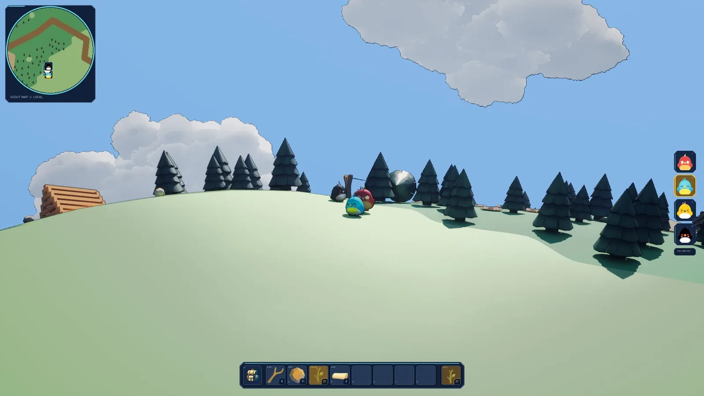

## 项目简介

`Angry Birds To Space` 是一款以 **PCG 和物理交互** 为核心的第三人称 3D
Minigame。四只具有不同撞击特性的原创小鸟被困在一颗程序化生成的小行星上，
需要沿道路探索、收集材料、组装弹弓、摧毁结构化建筑并完成能力升级，最终利用
三颗助推行星的连续引力偏转命中 UFO，救回被抓走的白色小鸟。

本项目并非对既有弹弓游戏的复刻。角色设计、任务叙事、世界结构、轨道交互与工程实现
均围绕“**在球面环境中弹射同伴，解决采集、建造、破坏和救援问题**”重新设计。

```text
探索道路与资源
→ 制作工作台、熔炉与弹弓组件
→ 两桩一弦组装弹弓
→ 发射不同能力的小鸟攻击建筑
→ 建筑坍塌并回收升级材料
→ 学习卫星引力造成的轨迹偏转
→ 完成太空弹弓
→ 调整 Yaw / Pitch / Power
→ 依次经过三颗行星并命中 UFO
```

> 最终交付基线：`12b556e`，Windows Shipping 包已归档并完成项目交付。

## 游戏演示

GitHub 的 Markdown 页面通常不会把仓库相对路径的 MP4 渲染为内嵌播放器，因此下面
使用**可点击视频封面**打开仓库视频文件；克隆仓库后也可以在本地直接播放。

### 世界、建筑与终局

<div align="center">
  <a href="Docs/Media/README/building_overview.mp4">
    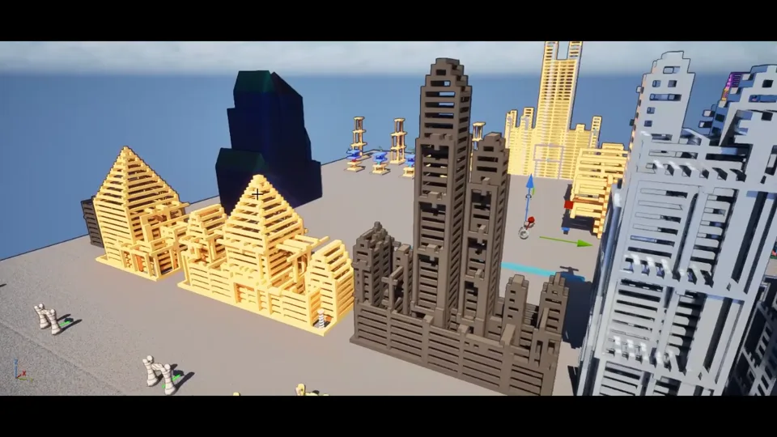
  </a>
  <a href="Docs/Media/README/impact_wood.mp4">
    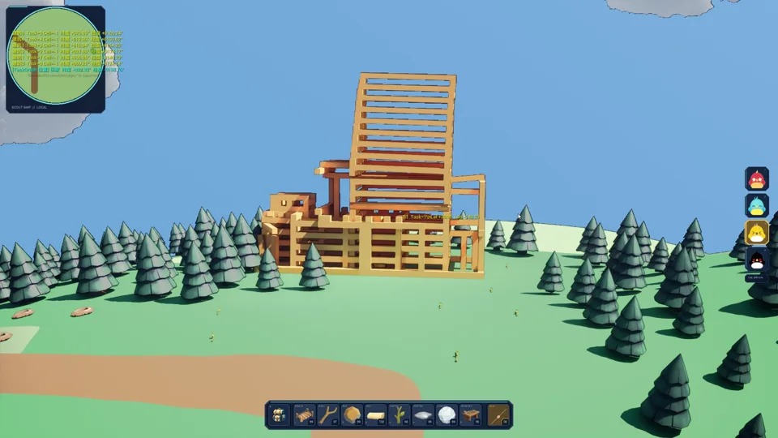
  </a>
  <a href="Docs/Media/README/finale_hud_adjustment.mp4">
    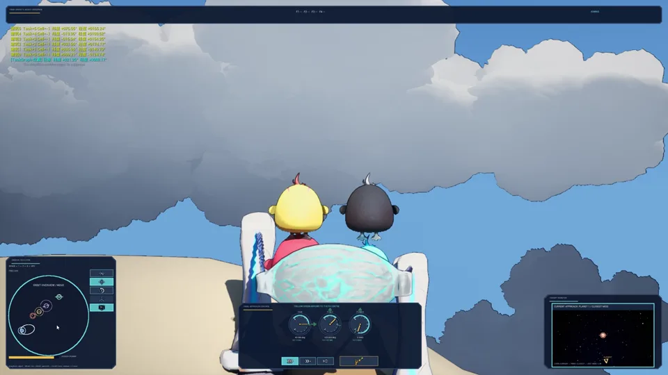
  </a>
</div>

<div align="center">
  <a href="Docs/Media/README/finale_flight.mp4">
    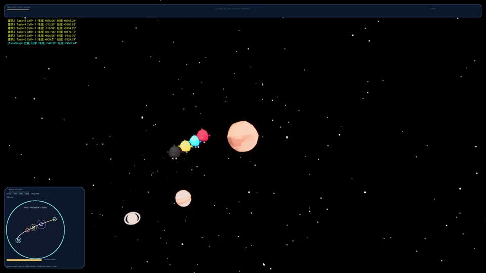
  </a>
  <a href="Docs/Media/README/finale_cinematic.mp4">
    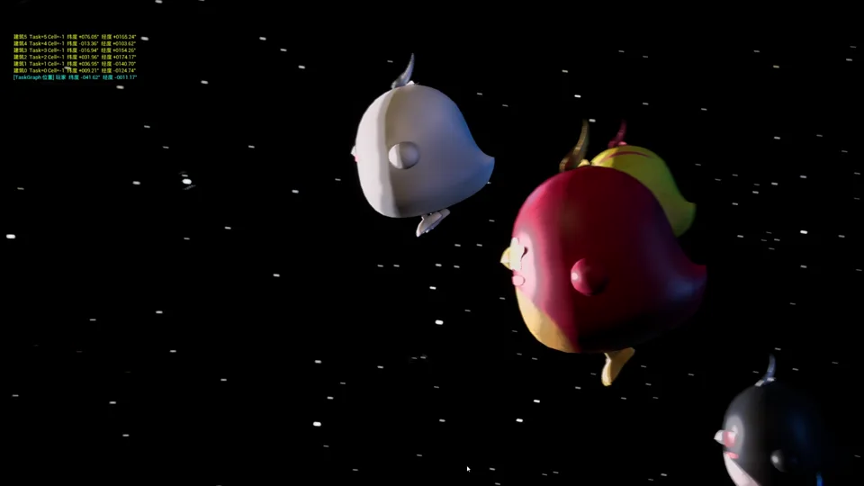
  </a>
</div>

| 文件 | 演示内容 |
| --- | --- |
| [`building_overview.mp4`](Docs/Media/README/building_overview.mp4) | 建筑轮廓、材料与结构组合 |
| [`impact_wood.mp4`](Docs/Media/README/impact_wood.mp4) | 鸟体撞击、损伤传播与 Chaos 坍塌 |
| [`finale_hud_adjustment.mp4`](Docs/Media/README/finale_hud_adjustment.mp4) | 调整终局参数并观察轨迹变化 |
| [`finale_flight.mp4`](Docs/Media/README/finale_flight.mp4) | 四鸟编队依次近掠三颗助推行星 |
| [`finale_cinematic.mp4`](Docs/Media/README/finale_cinematic.mp4) | 命中 UFO 后的救援演出 |

> 视频文件使用 Git LFS 管理。若 GitHub 页面只显示 LFS 下载入口，请点击文件名下载，
> 或克隆仓库后本地播放。README 末尾给出了远端上传与网页播放建议。

## 核心玩法

### 四鸟协作

| 小鸟 | 核心能力 | 玩法职责 |
| --- | --- | --- |
| 绯翼（红） | 均衡冲击与稳定回收 | 通用建筑破坏、建造与基础弹道 |
| 青翎（蓝） | 近距离发射、侦察与拍照 | 教学、发现道路外目标、更新侦察地图 |
| 棱喙（黄） | 高速穿透与木结构伤害 | 切断木柱、横梁和木制支撑 |
| 玄爪（黑） | 爆破冲击与范围推力 | 摧毁金属结构并触发连锁坍塌 |

### 资源与升级

- **树枝、石料**：地图上的基础保底资源；
- **木材、金属部件**：主要由建筑坍塌产出；
- **晶体核心**：终局组件所需的高价值资源；
- **工作台、熔炉**：制作普通、强化和太空弹弓组件；
- **弹弓组装**：弹弓不是一个预制 Actor，而是由两根同级桩和一根匹配弹弓弦组成。

### 球面移动与侦察

- 小鸟在连续球面上行走、跳跃并受到径向重力；
- 主控鸟使用相机相对的球面切向移动；
- 非主控鸟按照无环队列与 CellTopo 路径历史跟随；
- 青翎可通过发射更新侦察地图，显示道路、资源区和关键目标。

## 关键技术

### 1. 双分辨率球面拓扑

项目没有使用经纬度规则网格，而是从正二十面体递归细分得到更均匀的球面拓扑：

| 层级 | 规模 | 职责 |
| --- | ---: | --- |
| `CellTopo Sub=5` | 10,242 个逻辑 Cell | 任务、道路、水网、可达性、建筑站点与 Gameplay 状态 |
| `Continuous Surface Sub=7` | 327,680 个三角形 | 高度插值、法线、渲染与碰撞表现 |

```text
CellCount(N)     = 10 × 4^N + 2
TriangleCount(N) = 20 × 4^N
```

逻辑层只处理五/六邻接图；表现层可以提高精度，而不改变任务、道路、存档或生成身份。

<div align="center">
  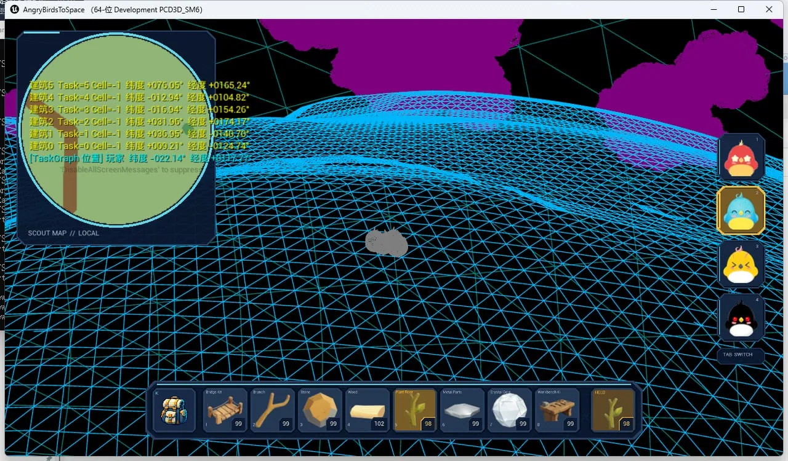
  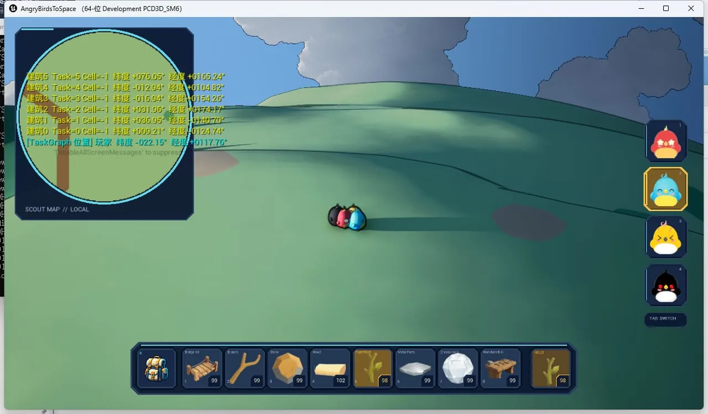
</div>

### 2. 受约束 PCG 与世界冻结

世界生成不是简单地更换噪声 Seed，而是一个有限候选搜索、验证和接受流程：

```text
Mission / Encounter
→ 球面路线候选
→ Region / Height / Hydrology
→ Road / Bridge / Building Pad / Slingshot Slot
→ 可见性、距离、可达性与消费合同验证
→ Accepted Candidate + Layout Hash
→ HISM / SDF / Actor 表现
```

重要原则：

- 任务结构先于地貌噪声；
- 道路、水域、桥和槽位都是 CellTopo 上的显式数据；
- 结果身份同时包含 Seed、Version、Profile、Candidate 与 Hash；
- 非法版本、空站点、错误坐标或未接受的候选会 `fail closed`；
- 为答辩冻结一个演示世界，是将 PCG 结果变成可重复验收的产品候选，而不是取消 PCG。

### 3. 语义建筑生成与 Chaos 破坏

建筑不是随机堆叠砖块，而是先产生结构语义，再编译为真实几何：

```text
Semantic Envelope
→ Skeleton / Core Plan
→ Support Plane / Station
→ Floor / Column / Span / Roof
→ Static Audit + Identity Hash
→ Grounded Startup Gate
→ First Hit
→ Damage Epoch / Support Closure
→ Independent Chaos Bricks
```

- 六栋冻结建筑在生产站点注册；
- 使用木、石、钢、玻璃四种材质族；
- 未受击时以静态/HISM 方式控制成本；
- 首次受击后，在同一个 Damage Epoch 聚合伤害并只求一次支撑闭包；
- 所有失去支撑的真实砖立即提升为独立 Chaos 刚体；
- 静态与动态模块保持同一材料身份；
- 发行版不要求精确命中高亮弱点，攻击任意真实结构砖即可进入正常损伤链。

### 4. 同源轨道预测与终局播放

卫星教学阶段帮助玩家理解引力会改变轨迹方向；深空终局使用独立的
`Finale Local Frame` 和固定步长求解器：

```text
Yaw / Pitch / Power
→ Fixed-step Solver / Gravity Snapshot
→ Candidate Trajectory + Identity
→ 近端预测 / 远端 PIP / 轨道全景图
→ Release
→ Authoritative Playback
→ PhysicalTargetHit
→ Finale
```

- HUD、画中画和轨道全景消费同一只读轨迹计划；
- 连续拖动参数时只允许 latest-only 候选更新界面；
- Release 时冻结 Candidate Identity，避免“看到 A、实际飞 B”；
- M9 练习卫星不进入 M11 四体求解；
- UFO 命中要求真实终端接触，不能用 Canvas 假圆弧或普通位置插值伪造。

## 工程架构

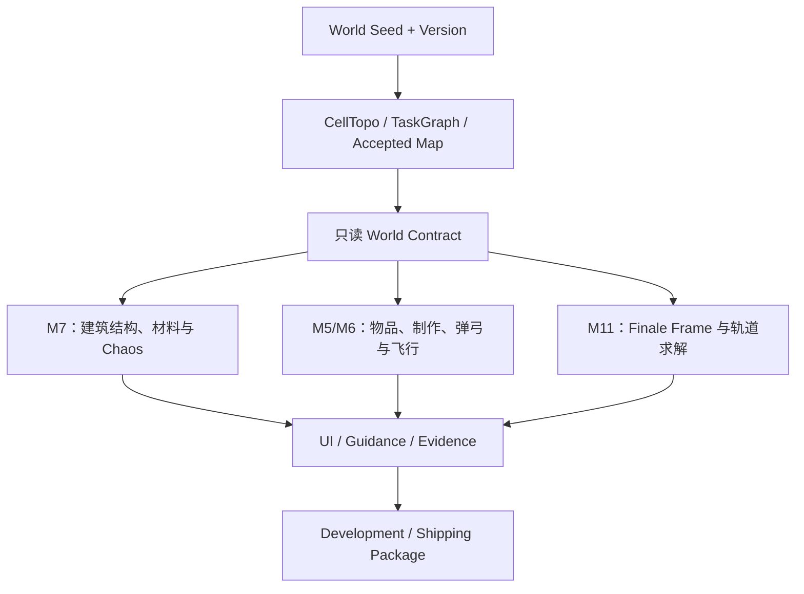

项目围绕四条原则组织：

1. **Single Source of Truth**：CellTopo 管理地表逻辑，终局使用独立局部坐标；
2. **稳定只读合同**：下游消费快照，不读取生产者内部数组；
3. **身份可追溯**：Seed、Version、Profile、Candidate/Result Hash；
4. **Fail Closed**：身份、Authority 或生命周期不一致时拒绝进入生产。

### 多工作树协作

后半程采用一个原始集成工作树和三个功能工作树：

| 工作树 | 核心职责 |
| --- | --- |
| Integration | 共享合同、共同地图、Config、打包与联合验收 |
| M3 | CellTopo、TaskGraph、道路水网、站点与 Finale Frame |
| M7 | 建筑结构、材料、Damage Epoch、Chaos 与建筑门 |
| M11 | 引力求解、候选认证、HUD、权威播放与终局表现 |

UE 二进制资产采用单一写入者规则；功能线按精确提交交接，不直接互相合并。

## AI 辅助开发

AI 覆盖了调研、设计结构化、代码实现、自动化测试、日志诊断、资产候选和文档交接，
但不拥有 Gameplay 权威，也不能单独宣布功能完成。

```text
人：定义研究问题、玩法目标、范围、所有权和验收门
↓
AI：调研 → 设计 → 实现 → 测试 → 诊断 → 文档
↓
工程证据：Diff → Compile → Automation → Fresh Process → Package Trace
↓
人：可见验收、手感判断、范围取舍和最终责任
```

### AI 资产生产示例

AI 资产只作为候选，必须经过人工低模化、拓扑、Pivot、Socket、碰撞、材质和 UE 接入：

| 概念参考 | 高模候选 | 低模线框 | 纹理与收口 |
| --- | --- | --- | --- |
| 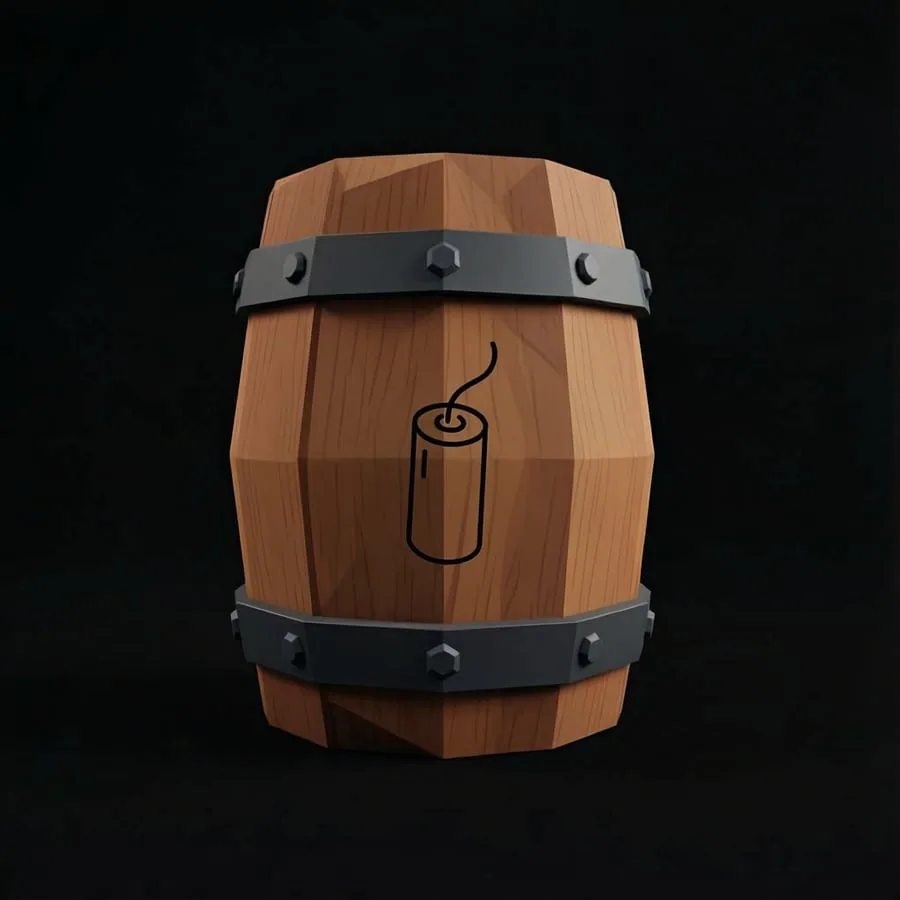 | 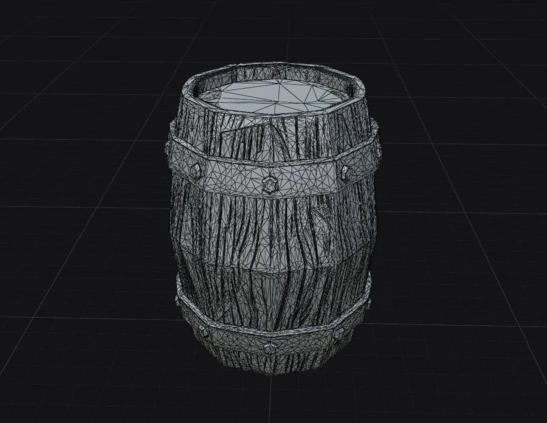 | 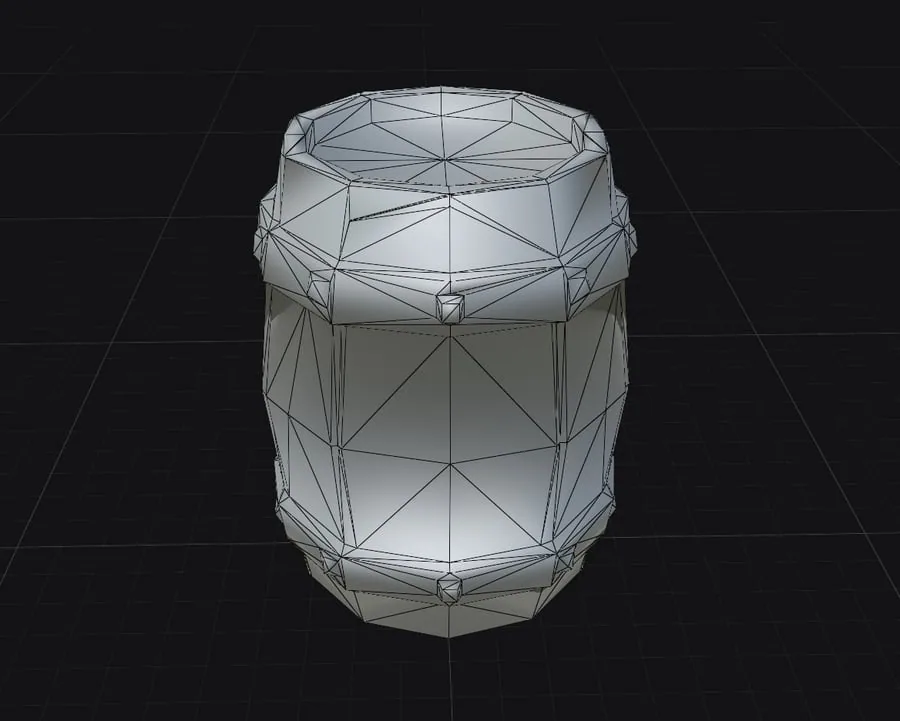 | 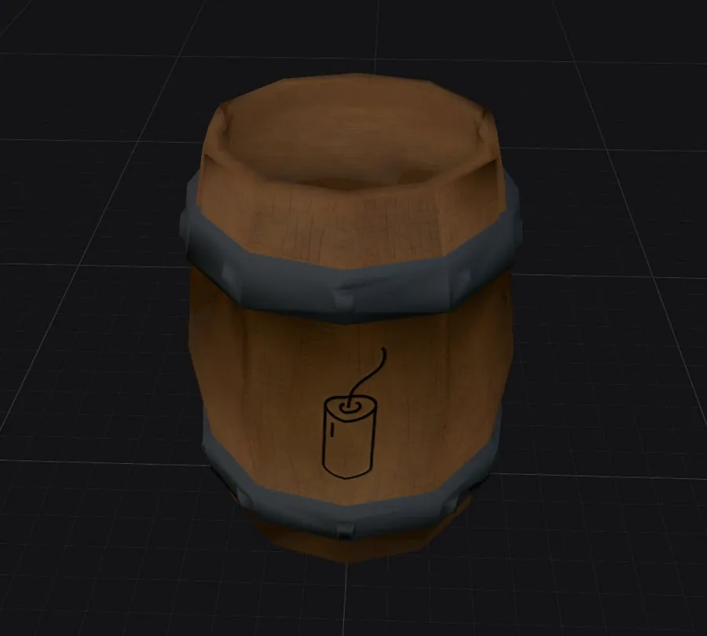 |

> 上图展示的是 AI 辅助资产工作流案例，不表示该资产一定进入最终 Shipping。

## 验证与交付

项目把不同证据层明确分开：

| 证据层 | 主要证明 |
| --- | --- |
| Development / ForceUnity 编译 | C++、UHT、链接与 Unity 分桶 |
| Fresh NullRHI 自动化 | 合同、确定性、状态机和失败负例 |
| 真实 RHI / 实时 Chaos | 材质、SceneCapture、实时物理和性能 |
| Packaged Development / Shipping | Cooked 资产、默认配置、启动生命周期和 Shipping 分支 |
| 玩家可见验收 | 画面、输入、手感、引导和完整玩家路径 |

编译、NullRHI、PIE、Package Trace 和玩家验收不能互相替代。

最终 Windows Shipping 制品约 `0.96 GiB`，对应代码基线 `12b556e`。
构建产物不直接纳入本仓库；仓库只保留源码、内容资产、工程文档和 README 展示媒体。

## 构建环境

- **Unreal Engine**：5.8
- **目标平台**：Windows 64-bit
- **主要语言**：C++
- **项目模块**：
  - `AngryBirdsToSpace`
  - `ABTSRuntime`
  - `ABTSRender`
  - `ABTSLoadingScreen`
- **主要插件**：
  - `ProceduralMeshComponent`
  - `ModelingToolsEditorMode`（Editor）
  - `StaticMeshEditorModeling`

本项目开发时使用的唯一引擎安装为：

```text
C:\Program Files\Epic Games\UE_5.8
```

生成项目文件后，可以使用 UE 5.8 打开：

```text
AngryBirdsToSpace.uproject
```

编译 Editor Target：

```powershell
$EngineRoot = 'C:\Program Files\Epic Games\UE_5.8'
$ProjectRoot = (git rev-parse --show-toplevel).Trim()

& "$EngineRoot\Engine\Build\BatchFiles\Build.bat" `
  AngryBirdsToSpaceEditor Win64 Development `
  "-Project=$ProjectRoot\AngryBirdsToSpace.uproject" `
  -WaitMutex -NoHotReload
```

> 由于项目包含大量 UE 二进制资产，请使用支持 Git LFS 的 Git 客户端，并在首次
> Checkout 前执行 `git lfs install` 与 `git lfs pull`。

## 基础操作

| 操作 | 默认输入 |
| --- | --- |
| 移动 | `W A S D` |
| 跳跃 | `Space` |
| 环绕视角 | 按住鼠标右键 |
| 缩放 | 鼠标滚轮 |
| 镜头回正 | `R` |
| 切换小鸟 | `Tab` |
| 直接选择四鸟 | `1` / `2` / `3` / `4` |
| 主要交互 | 鼠标左键 |
| 制作界面 | `K` |

具体弹弓、终局和界面操作会由游戏内事件驱动引导提示。

## 仓库导航

| 内容 | 入口 |
| --- | --- |
| 全局玩法与阶段状态 | [`Docs/AngryBirdsToSpaceGameDesign.md`](Docs/AngryBirdsToSpaceGameDesign.md) |
| 项目工作流 | [`Docs/ABTSProjectWorkflow.md`](Docs/ABTSProjectWorkflow.md) |
| 多工作树规范 | [`Docs/ABTSMultiWorktreeDevelopmentGuide.md`](Docs/ABTSMultiWorktreeDevelopmentGuide.md) |
| TaskGraph 球面 PCG | [`Docs/ABTSTaskGraphPCGDesign.md`](Docs/ABTSTaskGraphPCGDesign.md) |
| M7 建筑路线 | [`Docs/M7BuildingDevelopmentRoadmap.md`](Docs/M7BuildingDevelopmentRoadmap.md) |
| M11 终局交互与播放 | [`Docs/M11CFinaleInteractionAndPlaybackDesign.md`](Docs/M11CFinaleInteractionAndPlaybackDesign.md) |
| 风格化渲染 | [`Docs/ABTSToonStylizedRenderingDesign.md`](Docs/ABTSToonStylizedRenderingDesign.md) |
| 开发排错总账 | [`Docs/DevelopmentTroubleshooting.md`](Docs/DevelopmentTroubleshooting.md) |
| 项目全过程复盘 | [`Docs/ABTSProjectRetrospectiveTimeline20260720-20260818.md`](Docs/ABTSProjectRetrospectiveTimeline20260720-20260818.md) |
| 第三方音频许可 | [`Docs/ThirdPartyAudio.md`](Docs/ThirdPartyAudio.md) |

## 已知边界

- 本仓库是一次性课程/评审 Minigame 的交付工程，不是长期运营产品；
- 最终演示冻结了固定 Seed 与接受候选，不代表所有 Seed 都具有相同体验质量；
- Chaos 实时结果不承诺逐位确定，确定性来自生成合同、纯数据求解和身份 Hash；
- 正式发行不包含“唯一高亮弱点”玩法；
- M11 v1 是生产认证基线，后续 Rank 候选主要用于研究和表现验证；
- 新手引导、数值平衡、多 Seed 质量评价和性能仍有继续产品化的空间。

## 项目复盘

本项目最大的组织收益来自四工作树并行，它使世界生成、建筑和终局能够同时推进。
主要教训则是：

- 模块集成不能替代发行级垂直集成；
- 第一个可玩闭环形成后就应尽早打 Development 包；
- Shipping 应在中期开始周期性验证，而不是 DDL 前才成为反馈系统；
- 候选研究必须同时具备技术门、玩家价值门和明确止损点；
- 公共合同应冻结消费者真正需要的语义，而不是传播所有内部 Hash；
- AI 自治程度必须与项目维护周期匹配。

完整时间轴、量化证据和改进方案见
[`Docs/ABTSProjectRetrospectiveTimeline20260720-20260818.md`](Docs/ABTSProjectRetrospectiveTimeline20260720-20260818.md)。

## 许可与素材

- 项目源码和自制资产的再使用许可尚未单独声明；除非仓库所有者另行授权，请勿默认
  将本仓库内容视为开源许可。
- 第三方音频、音乐和字体的来源与许可见
  [`Docs/ThirdPartyAudio.md`](Docs/ThirdPartyAudio.md)。
- AI 辅助生成资产不等于直接交付资产，原始候选与最终 UE 资产之间包含人工重构和
  技术验收。

---

<div align="center">

**PCG 在球面上出题，物理给出真实后果，界面帮助玩家理解结果，AI 加速从问题到证据的循环。**

</div>
